# Database

<!-- Generated by scripts/gen_schema_docs.py from docs/schema/model.py. Do not edit by hand. -->

111 tables in 12 areas. 39 are needed for the foundation milestone (marked ★). This is the design; once migrations exist they become the truth and this file is regenerated from them.

## Conventions every table follows

- **Clinic-scoped tables** also have `org_id uuid -> organizations`, `id uuid`, a primary key of `(org_id, id)`, `created_at`, `created_by`, `updated_at`, `updated_by`, and `deleted_at` where rows can be removed. Foreign keys include `org_id`, so a row can never point at another clinic's row. Row-level security limits every query to `org_id = app.tenant_id()`.
- **Platform tables** have `id uuid` as the primary key and no row-level tenant filter; only the console and the system write them.
- **User tables** belong to one signed-in user.
- IDs are UUIDv7. Money is `bigint` paise. Times are `timestamptz` in UTC. Enums are Postgres enum types.
- Readable numbers (`SC-1042`, `SC/26-27/000318`) come from `number_sequences`.
- Tables marked *partitioned* are split by month.
- **Immutable once final:** signed notes (corrections are addenda), issued prescriptions (cancel and reissue), issued bills (void and replace), and observations (a correction supersedes). Readable numbers are assigned by the server at issue, never on a device.
- **Clinical codes are optional:** free text always works; `code_system`, `code`, `code_display` and `code_version` leave room for ICD, SNOMED and LOINC when interoperability needs them.
- **Provenance:** important clinical rows record `source` (clinician, assistant, patient, import, device, AI draft, ABDM) and who verified it.
- **Sensitivity** (public, internal, personal, financial, health) decides what may be logged, exported, sent to analytics, shown to support, or given to AI. **Offline** says whether phones may write a table, only read it, or never hold it.
- **Schema checks in CI:** every clinic table must have `org_id`, a composite key, tenant-aware foreign keys, row-level security with a policy, and an audit trigger. A test fails the build otherwise.

## How the areas connect

Arrows show foreign keys between areas (links to `organizations` omitted). The number is how many.

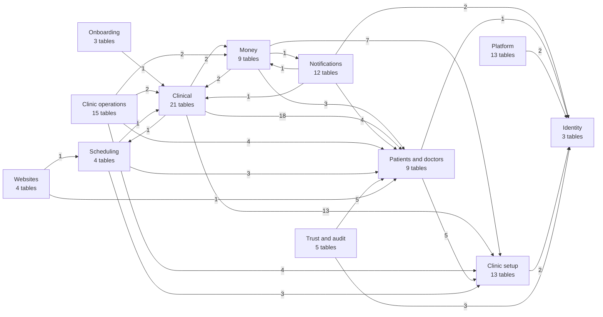

## Journeys: which tables a real task touches

### A new clinic signs up

1. **Sakalya console**: Clinic created on a trial plan with its subdomain. (`organizations`, `org_domains`, `subscriptions`)
2. **Owner**: Owner accepts the invite and becomes a member with the owner role. (`invitations`, `users`, `memberships`, `roles`)
3. **Wizard**: Specialty, branding, prices and hours set up from defaults. (`onboarding_progress`, `org_modules`, `org_settings`, `price_items`, `working_hours`, `practitioners`)
4. **Website**: Site generated from answers, repository created, built and deployed. (`sites`, `site_versions`, `org_domains`)
5. **Import**: Patients brought in from the old software, keeping file numbers. (`imports`, `import_rows`, `patients`, `patient_identifiers`)

### A patient visits the dentist

1. **Front desk**: New patient registered as SC-1042, or found by name, phone or ID. (`patients`, `patient_identifiers`, `referral_sources`, `number_sequences`)
2. **Front desk**: Appointment marked arrived; token shown on the waiting screen. (`appointments`, `appointment_events`, `queue_tokens`)
3. **Assistant**: Visit opened; vitals and intake note recorded. (`encounters`, `observations`, `clinical_notes`)
4. **Doctor**: Dictates a note, adds an X-ray, updates the tooth chart; every view is logged. (`voice_notes`, `attachments`, `specialty_records`, `clinical_notes`, `access_log`)
5. **Doctor**: Root canal done on tooth 36: stock deducted, crown sent to the lab, prescription issued. (`procedures`, `stock_movements`, `lab_orders`, `prescriptions`, `prescription_items`)
6. **Doctor**: Prescription printed on the clinic letterhead with the Aarogyam footer and QR; the patient gets an expiring WhatsApp link. (`document_templates`, `share_links`, `access_log`)
7. **Front desk**: Bill SC/26-27/000318 issued and paid by UPI. (`invoices`, `invoice_items`, `payments`, `payment_allocations`)
8. **System**: Receipt sent on WhatsApp, a follow-up recall created, all changes audited. (`outbox_events`, `messages`, `recalls`, `audit_events`)

### Reminders, birthdays and recalls

1. **Rules**: Clinic has reminder, birthday and recall rules switched on. (`notification_rules`, `message_templates`)
2. **Scheduler**: Due messages created with a dedupe key, e.g. reminder:appt:24h. (`appointments`, `patients`, `recalls`, `messages`)
3. **Worker**: Consent, quiet hours and quota checked; message sent or skipped with a reason. (`contact_preferences`, `usage_counters`, `messages`)
4. **Provider**: Delivery and read receipts recorded; cost metered per clinic. (`message_events`, `messages`)

### Month-end finance report

1. **Money in**: Collections by doctor, treatment, referral source and payment method. (`payments`, `refunds`, `payment_allocations`, `invoices`)
2. **Money out**: Spending by category, lab, staff and consultant. (`expenses`, `lab_payments`, `payroll_entries`, `consultant_payouts`)
3. **Report**: A ledger view joins both sides; exported to Excel by the worker. (`daily_closings`)

### A request checks access

1. **Host**: smilecatchers.aarogyam.app resolves to the clinic. (`org_domains`, `organizations`)
2. **Session**: JWT verified, session still active. (`users`, `sessions`)
3. **Membership**: User is an active member whose role allows patients.read. (`memberships`, `roles`, `role_permissions`)
4. **Plan and flags**: Feature is in the plan and released to this clinic. (`subscriptions`, `plan_features`, `entitlement_overrides`, `feature_flags`, `flag_rules`)
5. **Database**: Row-level security limits every query to this clinic. (`patients`)

### Phase 3: a patient sees all their clinics

1. **Patient**: Patient signs in with their phone and verifies records at each clinic. (`users`, `patient_links`)
2. **Patient**: Patient lets their new cardiologist see their dental and GP records. (`consents`)
3. **Cardiologist**: Reads the shared records; the patient sees who looked. (`encounters`, `prescriptions`, `attachments`, `access_log`)

## Offline

What the phone apps may do without a connection.

- **Read and write on devices:** `patients`, `patient_identifiers`, `medical_history_items`, `appointments`, `appointment_events`, `queue_tokens`, `encounters`, `clinical_notes`, `observations`, `conditions`, `allergies`, `prescriptions`, `prescription_items`, `procedures`, `attachments`, `voice_notes`, `specialty_records`

- **Read-only on devices:** `organizations`, `branches`, `rooms`, `org_modules`, `org_settings`, `roles`, `role_permissions`, `memberships`, `referral_sources`, `practitioners`, `working_hours`, `drug_catalog`, `document_templates`, `drug_interactions`, `price_items`, `message_templates`

- **Server only:** everything else, including bill and prescription numbers, payments, share links, audit and access logs, permissions and plans.

## Platform (`platform`)

Run by Sakalya: plans, billing clinics, feature rollout, support, platform analytics. Console only.

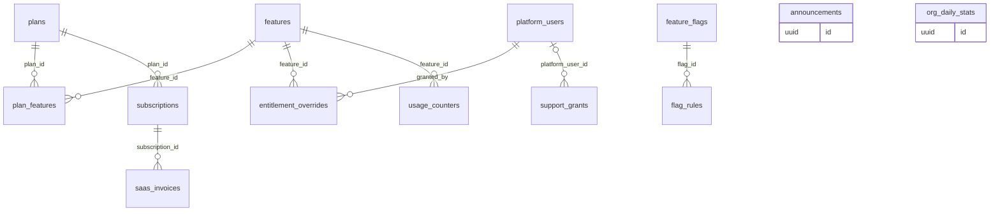

### `plans`

Subscription plans clinics can buy (Solo, Clinic, Pro, Enterprise).

*Platform-wide: no tenant, written by Sakalya or the system · sensitivity: internal · offline: server only*

| Column | Type | Notes |
|---|---|---|
| `code` | `text` | unique: solo, clinic, pro, enterprise |
| `name` | `text` |  |
| `monthly_price_paise` | `bigint` |  |
| `yearly_price_paise` | `bigint` |  |
| `is_public` | `bool` | hidden plans for custom deals |
| `sort_order` | `int` |  |

Referenced by: `plan_features.plan_id`, `subscriptions.plan_id`

### `features`

Every feature that a plan can include or limit.

*Platform-wide: no tenant, written by Sakalya or the system · sensitivity: internal · offline: server only*

| Column | Type | Notes |
|---|---|---|
| `key` | `text` | unique, e.g. website_builder, whatsapp_campaigns |
| `name` | `text` |  |
| `kind` | `feature_kind` | boolean or limit |
| `description` | `text` |  |

Referenced by: `entitlement_overrides.feature_id`, `plan_features.feature_id`, `usage_counters.feature_id`

### `plan_features`

What each plan includes, and its limits.

*Platform-wide: no tenant, written by Sakalya or the system · sensitivity: internal · offline: server only*

| Column | Type | Notes |
|---|---|---|
| `plan_id` | `uuid` | → `plans` |
| `feature_id` | `uuid` | → `features` |
| `included` | `bool` |  |
| `limit_value` | `int?` | e.g. 2000 messages a month |

Primary key (plan_id, feature_id).

### `subscriptions`

Which plan a clinic is on and whether it is paid up.

*Platform-wide: no tenant, written by Sakalya or the system · sensitivity: internal · offline: server only*

| Column | Type | Notes |
|---|---|---|
| `org_id` | `uuid` | → `organizations` |
| `plan_id` | `uuid` | → `plans` |
| `status` | `subscription_status` | trialing, active, past_due, paused, canceled |
| `period_start` | `date` |  |
| `period_end` | `date` |  |
| `trial_ends_at` | `timestamptz?` |  |
| `razorpay_subscription_id` | `text?` |  |
| `canceled_at` | `timestamptz?` |  |

Referenced by: `saas_invoices.subscription_id`

### `saas_invoices`

Sakalya's own GST invoices to clinics for the subscription.

*Platform-wide: no tenant, written by Sakalya or the system · sensitivity: financial · offline: server only*

| Column | Type | Notes |
|---|---|---|
| `org_id` | `uuid` | → `organizations` |
| `subscription_id` | `uuid` | → `subscriptions` |
| `number` | `text` | Sakalya's invoice series |
| `amount_paise` | `bigint` |  |
| `gst_paise` | `bigint` |  |
| `status` | `saas_invoice_status` | issued, paid, void |
| `razorpay_payment_id` | `text?` |  |
| `issued_at` | `timestamptz` |  |

### `entitlement_overrides`

Per-clinic exceptions to the plan: promos, grandfathering, custom deals.

*Platform-wide: no tenant, written by Sakalya or the system · sensitivity: internal · offline: server only*

| Column | Type | Notes |
|---|---|---|
| `org_id` | `uuid` | → `organizations` |
| `feature_id` | `uuid` | → `features` |
| `included` | `bool` |  |
| `limit_value` | `int?` |  |
| `reason` | `text` |  |
| `expires_at` | `timestamptz?` |  |
| `granted_by` | `uuid` | → `platform_users` |

### `usage_counters`

How much of each limited feature a clinic used this month.

*Platform-wide: no tenant, written by Sakalya or the system · sensitivity: internal · offline: server only*

| Column | Type | Notes |
|---|---|---|
| `org_id` | `uuid` | → `organizations` |
| `feature_id` | `uuid` | → `features` |
| `period` | `date` | first day of the month |
| `used` | `bigint` |  |

Primary key (org_id, feature_id, period). Incremented by the API and worker.

### `feature_flags`

Switches that release a feature gradually, separate from plans.

*Platform-wide: no tenant, written by Sakalya or the system · sensitivity: internal · offline: server only*

| Column | Type | Notes |
|---|---|---|
| `key` | `text` | unique |
| `description` | `text` |  |
| `default_on` | `bool` |  |
| `kill_switch` | `bool` | forces off everywhere |

Referenced by: `flag_rules.flag_id`

### `flag_rules`

Who a flag is on for: named clinics, a percentage, a plan, a platform or app version.

*Platform-wide: no tenant, written by Sakalya or the system · sensitivity: internal · offline: server only*

| Column | Type | Notes |
|---|---|---|
| `flag_id` | `uuid` | → `feature_flags` |
| `kind` | `flag_rule_kind` | org_list, percentage, plan, platform, min_app_version |
| `value` | `jsonb` |  |
| `priority` | `int` |  |

### `platform_users`

Sakalya staff who can use the console, and their role.

*Platform-wide: no tenant, written by Sakalya or the system · sensitivity: internal · offline: server only*

| Column | Type | Notes |
|---|---|---|
| `user_id` | `uuid` | → `users` |
| `role` | `platform_role` | owner, support, onboarding, analyst |
| `active` | `bool` |  |

Referenced by: `entitlement_overrides.granted_by`, `support_grants.platform_user_id`

### `support_grants`

Time-limited permission a clinic gives Sakalya support to look inside its data.

*Platform-wide: no tenant, written by Sakalya or the system · sensitivity: internal · offline: server only*

| Column | Type | Notes |
|---|---|---|
| `org_id` | `uuid` | → `organizations` |
| `granted_by` | `uuid` | → `users` |
| `platform_user_id` | `uuid?` | → `platform_users`. null means any support agent |
| `scope` | `support_scope` | settings_only, read_records |
| `starts_at` | `timestamptz` |  |
| `expires_at` | `timestamptz` |  |
| `revoked_at` | `timestamptz?` |  |

### `announcements`

Release notes and notices shown inside the clinic apps.

*Platform-wide: no tenant, written by Sakalya or the system · sensitivity: internal · offline: server only*

| Column | Type | Notes |
|---|---|---|
| `title` | `text` |  |
| `body` | `text` |  |
| `audience` | `jsonb` | plans, roles, platforms |
| `starts_at` | `timestamptz` |  |
| `ends_at` | `timestamptz?` |  |

### `org_daily_stats`

Per-clinic daily counts for the console. Counts only, never patient data.

*Platform-wide: no tenant, written by Sakalya or the system · sensitivity: internal · offline: server only*

| Column | Type | Notes |
|---|---|---|
| `org_id` | `uuid` | → `organizations` |
| `day` | `date` |  |
| `active_users` | `int` |  |
| `new_patients` | `int` |  |
| `appointments` | `int` |  |
| `visits` | `int` |  |
| `billed_paise` | `bigint` |  |
| `messages_sent` | `int` |  |
| `storage_bytes` | `bigint` |  |

Primary key (org_id, day). Written nightly, copied to BigQuery.

## Identity (`iam`)

People who sign in, their sessions and devices. One user can belong to many clinics.

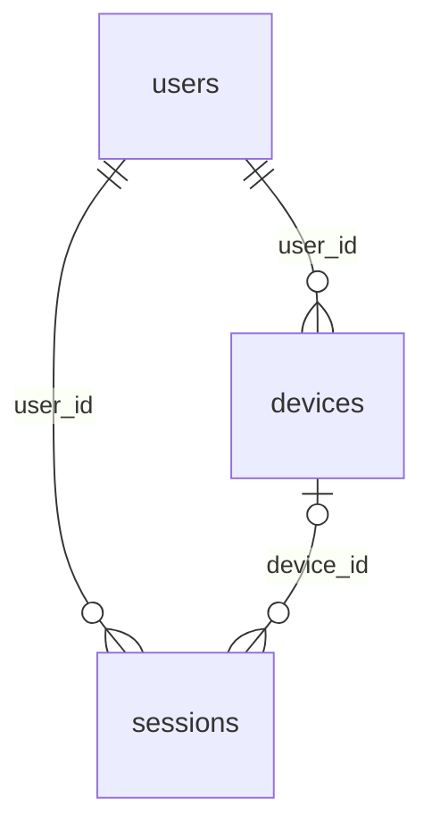

### `users` (★ foundation)

Anyone who signs in: staff, doctors, patients, Sakalya staff.

*User-scoped: rows belong to one signed-in user · sensitivity: personal · offline: server only*

| Column | Type | Notes |
|---|---|---|
| `auth_uid` | `uuid` | Supabase Auth user id, unique |
| `phone_e164` | `text?` | unique |
| `email` | `text?` |  |
| `display_name` | `text` |  |
| `locale` | `text` | en-IN, hi-IN, mr-IN ... |
| `status` | `user_status` | active, disabled |
| `last_seen_at` | `timestamptz?` |  |

Referenced by: `access_log.actor_user_id`, `audit_events.actor_user_id`, `devices.user_id`, `invitations.invited_by`, `memberships.user_id`, `messages.user_id`, `notifications.user_id`, `patient_links.user_id`, `platform_users.user_id`, `sessions.user_id`, `support_grants.granted_by`

### `sessions` (★ foundation)

Signed-in sessions, so a stolen phone or idle PC can be signed out.

*User-scoped: rows belong to one signed-in user · sensitivity: personal · offline: server only*

| Column | Type | Notes |
|---|---|---|
| `user_id` | `uuid` | → `users` |
| `provider_session_id` | `uuid` | session_id claim in the JWT |
| `device_id` | `uuid?` | → `devices` |
| `audience` | `session_audience` | clinic, patient, platform |
| `last_active_at` | `timestamptz` |  |
| `expires_at` | `timestamptz` |  |
| `revoked_at` | `timestamptz?` |  |
| `revoke_reason` | `text?` |  |

### `devices`

Phones and browsers a user signs in from, with push tokens.

*User-scoped: rows belong to one signed-in user · sensitivity: personal · offline: server only*

| Column | Type | Notes |
|---|---|---|
| `user_id` | `uuid` | → `users` |
| `platform` | `device_platform` | android, ios, web |
| `model` | `text?` |  |
| `app_version` | `text?` |  |
| `push_token` | `text?` |  |
| `push_token_updated_at` | `timestamptz?` |  |

Referenced by: `access_log.device_id`, `sessions.device_id`

## Clinic setup (`tenancy`)

The clinic itself: branches, domains, rooms, modules, roles, staff memberships, numbering.

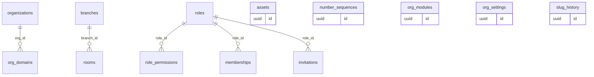

### `organizations` (★ foundation)

A clinic business, the tenant. Everything clinic-owned points here.

*Platform-wide: no tenant, written by Sakalya or the system · sensitivity: internal · offline: read-only on devices*

| Column | Type | Notes |
|---|---|---|
| `slug` | `text` | unique, the subdomain: smilecatchers |
| `name` | `text` |  |
| `legal_name` | `text?` |  |
| `number_prefix` | `text` | SC in SC-1042 |
| `status` | `org_status` | trial, active, suspended, churned |
| `timezone` | `text` | default Asia/Kolkata |
| `gstin` | `text?` |  |

Referenced by: `consents.grantee_org_id`, `entitlement_overrides.org_id`, `org_daily_stats.org_id`, `org_domains.org_id`, `patient_links.org_id`, `saas_invoices.org_id`, `subscriptions.org_id`, `support_grants.org_id`, `usage_counters.org_id`

### `branches` (★ foundation)

Locations of a clinic. Single-location clinics have one.

*Clinic-scoped: org_id + row-level security · sensitivity: internal · offline: read-only on devices*

| Column | Type | Notes |
|---|---|---|
| `slug` | `text` | unique per clinic |
| `name` | `text` |  |
| `address` | `jsonb` |  |
| `phone_e164` | `text?` |  |
| `is_default` | `bool` |  |

Referenced by: `appointments.branch_id`, `daily_closings.branch_id`, `encounters.branch_id`, `equipment.branch_id`, `expenses.branch_id`, `invoices.branch_id`, `leave_blocks.branch_id`, `queue_tokens.branch_id`, `rooms.branch_id`, `working_hours.branch_id`

### `org_domains` (★ foundation)

Host names that resolve to a clinic: its portal and its website.

*Platform-wide: no tenant, written by Sakalya or the system · sensitivity: internal · offline: server only*

| Column | Type | Notes |
|---|---|---|
| `org_id` | `uuid` | → `organizations` |
| `hostname` | `text` | unique: smilecatchers.aarogyam.app, smilecatchers.in |
| `kind` | `domain_kind` | portal, website |
| `is_primary` | `bool` |  |
| `cloudflare_hostname_id` | `text?` |  |
| `verified_at` | `timestamptz?` |  |

Read on every request to resolve the tenant; cached in memory.

### `slug_history`

Old slugs, so renamed clinics, doctors and pages keep redirecting.

*Platform-wide: no tenant, written by Sakalya or the system · sensitivity: internal · offline: server only*

| Column | Type | Notes |
|---|---|---|
| `entity` | `slug_entity` | organization, practitioner, site_page |
| `entity_id` | `uuid` |  |
| `old_slug` | `text` |  |
| `changed_at` | `timestamptz` |  |

### `rooms`

Chairs, rooms and labs that appointments can be booked into.

*Clinic-scoped: org_id + row-level security · sensitivity: internal · offline: read-only on devices*

| Column | Type | Notes |
|---|---|---|
| `branch_id` | `uuid` | → `branches` |
| `name` | `text` |  |
| `kind` | `room_kind` | chair, room, lab |
| `active` | `bool` |  |

Referenced by: `appointments.room_id`

### `org_modules`

Specialty modules switched on for a clinic, with their settings.

*Clinic-scoped: org_id + row-level security · sensitivity: internal · offline: read-only on devices*

| Column | Type | Notes |
|---|---|---|
| `module_key` | `text` | dental, general, obstetrics, pediatrics ... |
| `enabled_at` | `timestamptz` |  |
| `settings` | `jsonb` | e.g. tooth numbering FDI or Universal |

### `org_settings` (★ foundation)

One row per clinic: branding, bill and prescription settings, defaults.

*Clinic-scoped: org_id + row-level security · sensitivity: internal · offline: read-only on devices*

| Column | Type | Notes |
|---|---|---|
| `branding` | `jsonb` | colours, logo asset |
| `billing` | `jsonb` | GST, bill footer |
| `prescription` | `jsonb` | letterhead layout |
| `notifications` | `jsonb` | quiet hours, sender |

### `assets`

Non-medical files: logos, signatures, generated PDFs, website images.

*Clinic-scoped: org_id + row-level security · sensitivity: internal · offline: server only*

| Column | Type | Notes |
|---|---|---|
| `kind` | `asset_kind` | logo, signature, pdf, site_image |
| `storage_key` | `text` |  |
| `mime_type` | `text` |  |
| `size_bytes` | `bigint` |  |

Stored in a different bucket from patient attachments.

Referenced by: `expenses.receipt_asset_id`, `invoices.pdf_asset_id`, `practitioners.signature_asset_id`, `prescriptions.pdf_asset_id`

### `roles` (★ foundation)

Named bundles of permissions. Seeded from templates; owners can add their own.

*Clinic-scoped: org_id + row-level security · sensitivity: internal · offline: read-only on devices*

| Column | Type | Notes |
|---|---|---|
| `key` | `text` | owner, doctor, consultant, finance, front_desk, assistant, or custom |
| `name` | `text` |  |
| `is_template` | `bool` |  |
| `description` | `text?` |  |

Referenced by: `invitations.role_id`, `memberships.role_id`, `role_permissions.role_id`

### `role_permissions` (★ foundation)

What a role may do: module.action plus a scope.

*Clinic-scoped: org_id + row-level security · sensitivity: internal · offline: read-only on devices*

| Column | Type | Notes |
|---|---|---|
| `role_id` | `uuid` | → `roles` |
| `permission` | `text` | patients.read, finance.view, mask.patient_phone |
| `scope` | `permission_scope` | all, own, assigned |

Primary key (org_id, role_id, permission).

### `memberships` (★ foundation)

A user's place in a clinic: role, branches, status. The link between users and clinics.

*Clinic-scoped: org_id + row-level security · sensitivity: internal · offline: read-only on devices*

| Column | Type | Notes |
|---|---|---|
| `user_id` | `uuid` | → `users` |
| `role_id` | `uuid` | → `roles` |
| `status` | `membership_status` | invited, active, suspended, left |
| `branch_ids` | `uuid[]?` | null means all branches |
| `pin_hash` | `text?` | quick switch on shared PCs |
| `joined_at` | `timestamptz?` |  |

Referenced by: `allergies.verified_by`, `attachments.verified_by`, `clinical_notes.author_id`, `clinical_notes.signed_by`, `conditions.verified_by`, `daily_closings.closed_by`, `document_extractions.confirmed_by`, `medical_history_items.verified_by`, `note_addenda.author_id`, `observations.verified_by`, `payments.received_by`, `payroll_entries.membership_id`, `practitioners.membership_id`, `prescription_alerts.acted_by`, `prescriptions.signed_by`, `salary_structures.membership_id`, `specialty_records.verified_by`, `staff_advances.membership_id`

### `invitations` (★ foundation)

Pending invites to join a clinic.

*Clinic-scoped: org_id + row-level security · sensitivity: internal · offline: server only*

| Column | Type | Notes |
|---|---|---|
| `phone_e164` | `text?` |  |
| `email` | `text?` |  |
| `role_id` | `uuid` | → `roles` |
| `invited_by` | `uuid` | → `users` |
| `token_hash` | `text` |  |
| `expires_at` | `timestamptz` |  |
| `accepted_at` | `timestamptz?` |  |

### `number_sequences` (★ foundation)

Counters behind readable numbers: SC-1042, V-2026-0318, SC/26-27/000318.

*Clinic-scoped: org_id + row-level security · sensitivity: internal · offline: server only*

| Column | Type | Notes |
|---|---|---|
| `kind` | `sequence_kind` | patient, visit, invoice, prescription, lab_order |
| `period` | `text` | financial year such as 26-27, or empty |
| `next_value` | `bigint` |  |

Primary key (org_id, kind, period). Incremented with UPDATE ... RETURNING inside the same transaction.

## Patients and doctors (`people`)

Each clinic's own patient records, identifiers, families, referral sources and practitioners.

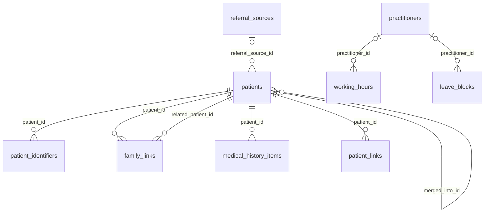

### `patients` (★ foundation)

A clinic's own record of a patient. Two clinics never share this row.

*Clinic-scoped: org_id + row-level security · sensitivity: personal · offline: read and write on devices*

| Column | Type | Notes |
|---|---|---|
| `number` | `text` | SC-1042, unique per clinic, used in URLs |
| `full_name` | `text` |  |
| `sex` | `sex` | female, male, other, unknown |
| `date_of_birth` | `date?` |  |
| `age_estimate_years` | `smallint?` | when the date of birth is unknown |
| `phone_e164` | `text?` | contact, never identity; indexed |
| `alt_phone_e164` | `text?` |  |
| `email` | `text?` |  |
| `address` | `jsonb?` |  |
| `preferred_language` | `text` |  |
| `blood_group` | `blood_group?` |  |
| `referral_source_id` | `uuid?` | → `referral_sources` |
| `referred_by_patient_id` | `uuid?` | → `patients` |
| `tags` | `text[]` |  |
| `status` | `patient_status` | active, inactive, deceased, merged |
| `merged_into_id` | `uuid?` | → `patients`. set by a merge, cleared by an unmerge |
| `last_visit_at` | `timestamptz?` |  |

A phone number is contact information, never identity: families share numbers and numbers change. A merge only sets merged_into_id; records stay on the original patient and reads resolve to the canonical one, so a wrong merge can be undone. Name search uses pg_trgm; same-phone registrations get a duplicate warning, never an automatic merge.

Referenced by: `access_log.patient_id`, `allergies.patient_id`, `appointments.patient_id`, `attachments.patient_id`, `care_episodes.patient_id`, `clinical_notes.patient_id`, `conditions.patient_id`, `consent_forms.patient_id`, `contact_preferences.patient_id`, `data_requests.patient_id`, `document_extractions.patient_id`, `encounters.patient_id`, `family_links.patient_id`, `family_links.related_patient_id`, `invoices.patient_id`, `lab_orders.patient_id`, `medical_history_items.patient_id`, `messages.patient_id`, `observations.patient_id`, `patient_identifiers.patient_id`, `patient_links.patient_id`, `patients.merged_into_id`, `patients.referred_by_patient_id`, `payments.patient_id`, `prescriptions.patient_id`, `procedures.patient_id`, `promo_redemptions.patient_id`, `queue_tokens.patient_id`, `recalls.patient_id`, `share_links.patient_id`, `specialty_records.patient_id`, `treatment_plans.patient_id`

### `patient_identifiers` (★ foundation)

Extra IDs for a patient: custom file number, smart card, ABHA, legacy import.

*Clinic-scoped: org_id + row-level security · sensitivity: personal · offline: read and write on devices*

| Column | Type | Notes |
|---|---|---|
| `patient_id` | `uuid` | → `patients` |
| `kind` | `identifier_kind` | custom, smart_card, abha_number, abha_address, legacy |
| `value` | `text` |  |

Unique (org_id, kind, value).

### `family_links`

Relationships between patients in the same clinic: parent, child, spouse, guardian.

*Clinic-scoped: org_id + row-level security · sensitivity: personal · offline: server only*

| Column | Type | Notes |
|---|---|---|
| `patient_id` | `uuid` | → `patients` |
| `related_patient_id` | `uuid` | → `patients` |
| `relation` | `relation_kind` | parent, child, spouse, guardian, other |
| `can_manage` | `bool` | guardian may act for this patient |

### `referral_sources`

Where patients come from, for the finance and marketing filters.

*Clinic-scoped: org_id + row-level security · sensitivity: personal · offline: read-only on devices*

| Column | Type | Notes |
|---|---|---|
| `name` | `text` |  |
| `kind` | `referral_kind` | patient, doctor, online, walk_in, camp, insurance, other |
| `active` | `bool` |  |

Referenced by: `patients.referral_source_id`

### `medical_history_items`

Patient-level history: past conditions, surgeries, long-term medicines, habits, family history.

*Clinic-scoped: org_id + row-level security · sensitivity: health · offline: read and write on devices*

| Column | Type | Notes |
|---|---|---|
| `patient_id` | `uuid` | → `patients` |
| `kind` | `history_kind` | condition, surgery, long_term_medication, habit, family_history |
| `description` | `text` |  |
| `code_system` | `code_system?` | icd10, icd11, snomed, loinc, custom |
| `code` | `text?` |  |
| `code_display` | `text?` |  |
| `code_version` | `text?` |  |
| `since` | `date?` |  |
| `active` | `bool` |  |
| `source` | `record_source` | clinician, assistant, patient, import, device, ai_draft, abdm |
| `verified_by` | `uuid?` | → `memberships` |
| `verified_at` | `timestamptz?` |  |

### `patient_links`

Phase 3: connects a patient's own Aarogyam account to their record at each clinic.

*User-scoped: rows belong to one signed-in user · sensitivity: health · offline: server only*

| Column | Type | Notes |
|---|---|---|
| `user_id` | `uuid` | → `users` |
| `org_id` | `uuid` | → `organizations` |
| `patient_id` | `uuid` | → `patients` |
| `verified_via` | `link_method` | otp, abha, clinic_confirmed |
| `verified_at` | `timestamptz` |  |
| `revoked_at` | `timestamptz?` |  |

This is the single-umbrella view: one person, many clinic records, joined only by verified links.

Referenced by: `consents.patient_link_id`

### `practitioners` (★ foundation)

Doctors who see patients at the clinic, with registration and fees.

*Clinic-scoped: org_id + row-level security · sensitivity: personal · offline: read-only on devices*

| Column | Type | Notes |
|---|---|---|
| `membership_id` | `uuid` | → `memberships` |
| `slug` | `text` | public page: dr-kiran-patil |
| `display_name` | `text` |  |
| `qualifications` | `text` |  |
| `council` | `registration_council` | nmc, state, dci, ayush ... |
| `registration_number` | `text` |  |
| `specialties` | `text[]` | module keys |
| `signature_asset_id` | `uuid?` | → `assets` |
| `default_fee_paise` | `bigint` |  |
| `is_visiting` | `bool` | visiting consultant |
| `calendar_color` | `text` |  |

Referenced by: `appointments.practitioner_id`, `booking_requests.practitioner_id`, `care_episodes.practitioner_id`, `consents.grantee_practitioner_id`, `consultant_fee_rules.practitioner_id`, `consultant_payouts.practitioner_id`, `encounters.practitioner_id`, `invoice_items.practitioner_id`, `lab_orders.practitioner_id`, `leave_blocks.practitioner_id`, `prescriptions.practitioner_id`, `procedures.practitioner_id`, `treatment_plans.practitioner_id`, `working_hours.practitioner_id`

### `working_hours` (★ foundation)

Weekly hours per clinic or doctor. Split shifts are two rows.

*Clinic-scoped: org_id + row-level security · sensitivity: personal · offline: read-only on devices*

| Column | Type | Notes |
|---|---|---|
| `practitioner_id` | `uuid?` | → `practitioners`. null means clinic hours |
| `branch_id` | `uuid` | → `branches` |
| `weekday` | `smallint` | 1 Monday to 7 Sunday |
| `starts` | `time` |  |
| `ends` | `time` |  |
| `valid_from` | `date` |  |
| `valid_to` | `date?` |  |

### `leave_blocks`

Time a doctor or branch is unavailable.

*Clinic-scoped: org_id + row-level security · sensitivity: personal · offline: server only*

| Column | Type | Notes |
|---|---|---|
| `practitioner_id` | `uuid?` | → `practitioners` |
| `branch_id` | `uuid?` | → `branches` |
| `starts_at` | `timestamptz` |  |
| `ends_at` | `timestamptz` |  |
| `reason` | `text?` |  |

## Scheduling (`scheduling`)

Appointments, their history, and the walk-in token queue.

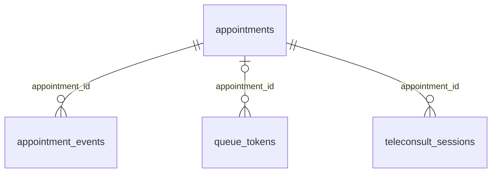

### `appointments` (★ foundation)

A booked slot with a doctor, optionally in a room or chair.

*Clinic-scoped: org_id + row-level security · sensitivity: personal · offline: read and write on devices*

| Column | Type | Notes |
|---|---|---|
| `patient_id` | `uuid` | → `patients` |
| `practitioner_id` | `uuid` | → `practitioners` |
| `branch_id` | `uuid` | → `branches` |
| `room_id` | `uuid?` | → `rooms` |
| `starts_at` | `timestamptz` |  |
| `ends_at` | `timestamptz` |  |
| `status` | `appointment_status` | scheduled, confirmed, arrived, in_progress, completed, cancelled, no_show |
| `kind` | `appointment_kind` | new, follow_up, procedure, teleconsult |
| `reason` | `text?` |  |
| `source` | `booking_source` | front_desk, phone, website, app, whatsapp |
| `cancel_reason` | `text?` |  |
| `encounter_id` | `uuid?` | → `encounters` |

An exclusion constraint on (org_id, practitioner_id, time range) stops double booking.

Referenced by: `appointment_events.appointment_id`, `booking_requests.appointment_id`, `encounters.appointment_id`, `queue_tokens.appointment_id`, `teleconsult_sessions.appointment_id`

### `appointment_events` (★ foundation)

Every status change of an appointment, for history and no-show reports.

*Clinic-scoped: org_id + row-level security · sensitivity: personal · offline: read and write on devices*

| Column | Type | Notes |
|---|---|---|
| `appointment_id` | `uuid` | → `appointments` |
| `from_status` | `appointment_status?` |  |
| `to_status` | `appointment_status` |  |
| `at` | `timestamptz` |  |
| `note` | `text?` |  |

### `queue_tokens` (★ foundation)

Walk-in tokens shown on the waiting-room screen.

*Clinic-scoped: org_id + row-level security · sensitivity: personal · offline: read and write on devices*

| Column | Type | Notes |
|---|---|---|
| `branch_id` | `uuid` | → `branches` |
| `day` | `date` |  |
| `token_number` | `int` |  |
| `patient_id` | `uuid` | → `patients` |
| `appointment_id` | `uuid?` | → `appointments` |
| `status` | `token_status` | waiting, called, in_room, done, skipped |
| `called_at` | `timestamptz?` |  |

Unique (org_id, branch_id, day, token_number).

### `teleconsult_sessions`

A video or audio consultation attached to an appointment.

*Clinic-scoped: org_id + row-level security · sensitivity: personal · offline: server only*

| Column | Type | Notes |
|---|---|---|
| `appointment_id` | `uuid` | → `appointments` |
| `provider` | `text` | video service used |
| `room_ref` | `text` | the provider's room id, never a public link |
| `status` | `tele_status` | scheduled, live, ended, failed |
| `started_at` | `timestamptz?` |  |
| `ended_at` | `timestamptz?` |  |
| `patient_joined_at` | `timestamptz?` |  |

Follows the 2020 Telemedicine Practice Guidelines; the prescription is issued in the usual way afterwards.

## Clinical (`clinical`)

Visits, notes, vitals, diagnoses, prescriptions, procedures, treatment plans, files and specialty data.

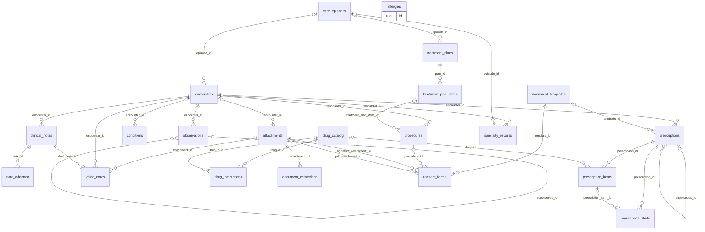

### `care_episodes`

A course of care spanning visits: a root canal on tooth 36, a pregnancy, a diabetes plan.

*Clinic-scoped: org_id + row-level security · sensitivity: health · offline: server only*

| Column | Type | Notes |
|---|---|---|
| `patient_id` | `uuid` | → `patients` |
| `practitioner_id` | `uuid?` | → `practitioners` |
| `pack` | `text?` |  |
| `kind` | `text` | root_canal, pregnancy, chronic_care ... |
| `title` | `text` |  |
| `status` | `episode_status` | active, completed, cancelled |
| `started_at` | `timestamptz` |  |
| `ended_at` | `timestamptz?` |  |

Optional: visits, treatment plans and specialty records may link to an episode. Built when a pack needs it.

Referenced by: `encounters.episode_id`, `specialty_records.episode_id`, `treatment_plans.episode_id`

### `encounters` (★ foundation)

One visit. Visit-level clinical data (complaint, vitals, notes, procedures, prescriptions) hangs off it.

*Clinic-scoped: org_id + row-level security · sensitivity: health · offline: read and write on devices*

| Column | Type | Notes |
|---|---|---|
| `number` | `text` | V-2026-0318 |
| `patient_id` | `uuid` | → `patients` |
| `practitioner_id` | `uuid` | → `practitioners` |
| `branch_id` | `uuid` | → `branches` |
| `appointment_id` | `uuid?` | → `appointments` |
| `episode_id` | `uuid?` | → `care_episodes` |
| `started_at` | `timestamptz` |  |
| `ended_at` | `timestamptz?` |  |
| `status` | `encounter_status` | open, closed |
| `chief_complaint` | `text?` |  |

Patient-level facts (allergies, active conditions, history) live on the patient and may be updated during a visit; they do not require one.

Referenced by: `appointments.encounter_id`, `attachments.encounter_id`, `clinical_notes.encounter_id`, `conditions.encounter_id`, `invoices.encounter_id`, `observations.encounter_id`, `prescriptions.encounter_id`, `procedures.encounter_id`, `specialty_records.encounter_id`, `voice_notes.encounter_id`

### `clinical_notes` (★ foundation)

Doctor and intake notes. Signed notes never change.

*Clinic-scoped: org_id + row-level security · sensitivity: health · offline: read and write on devices*

| Column | Type | Notes |
|---|---|---|
| `encounter_id` | `uuid` | → `encounters` |
| `patient_id` | `uuid` | → `patients` |
| `author_id` | `uuid` | → `memberships` |
| `kind` | `note_kind` | soap, progress, procedure, intake, front_desk |
| `body` | `jsonb` | sections: subjective, objective, assessment, plan |
| `source` | `note_source` | typed, voice, ai_draft |
| `status` | `note_status` | draft, signed |
| `signed_at` | `timestamptz?` |  |
| `signed_by` | `uuid?` | → `memberships` |

Reading a note writes access_log. Corrections go in note_addenda.

Referenced by: `note_addenda.note_id`, `voice_notes.draft_note_id`

### `note_addenda` (★ foundation)

Corrections and additions to a signed note, with their own author and time.

*Clinic-scoped: org_id + row-level security · sensitivity: health · offline: server only*

| Column | Type | Notes |
|---|---|---|
| `note_id` | `uuid` | → `clinical_notes` |
| `author_id` | `uuid` | → `memberships` |
| `body` | `text` |  |

### `observations` (★ foundation)

Measurements: BP, pulse, temperature, SpO2, weight, height, sugar.

*Clinic-scoped: org_id + row-level security · sensitivity: health · offline: read and write on devices*

| Column | Type | Notes |
|---|---|---|
| `patient_id` | `uuid` | → `patients` |
| `encounter_id` | `uuid?` | → `encounters` |
| `kind` | `observation_kind` | bp_systolic, bp_diastolic, pulse, temperature, spo2, weight, height, blood_sugar ... |
| `value_num` | `numeric` |  |
| `unit` | `text` |  |
| `code_system` | `code_system?` | icd10, icd11, snomed, loinc, custom |
| `code` | `text?` |  |
| `code_display` | `text?` |  |
| `code_version` | `text?` |  |
| `recorded_at` | `timestamptz` |  |
| `status` | `observation_status` | final, corrected, entered_in_error |
| `supersedes_id` | `uuid?` | → `observations`. the value this one corrects |
| `source` | `record_source` | clinician, assistant, patient, import, device, ai_draft, abdm |
| `verified_by` | `uuid?` | → `memberships` |
| `verified_at` | `timestamptz?` |  |

Values are never edited: a correction is a new row that supersedes the old one, which stays visible as corrected.

Referenced by: `observations.supersedes_id`

### `conditions` (★ foundation)

Diagnoses and the problem list. Patient-level; a visit link records where it was found.

*Clinic-scoped: org_id + row-level security · sensitivity: health · offline: read and write on devices*

| Column | Type | Notes |
|---|---|---|
| `patient_id` | `uuid` | → `patients` |
| `encounter_id` | `uuid?` | → `encounters` |
| `display_text` | `text` | what the doctor wrote, always present |
| `code_system` | `code_system?` | icd10, icd11, snomed, loinc, custom |
| `code` | `text?` |  |
| `code_display` | `text?` |  |
| `code_version` | `text?` |  |
| `status` | `condition_status` | active, resolved, entered_in_error |
| `onset` | `date?` |  |
| `source` | `record_source` | clinician, assistant, patient, import, device, ai_draft, abdm |
| `verified_by` | `uuid?` | → `memberships` |
| `verified_at` | `timestamptz?` |  |

### `allergies` (★ foundation)

Allergies, shown as a warning banner on the patient and on prescriptions.

*Clinic-scoped: org_id + row-level security · sensitivity: health · offline: read and write on devices*

| Column | Type | Notes |
|---|---|---|
| `patient_id` | `uuid` | → `patients` |
| `substance` | `text` |  |
| `code_system` | `code_system?` | icd10, icd11, snomed, loinc, custom |
| `code` | `text?` |  |
| `code_display` | `text?` |  |
| `code_version` | `text?` |  |
| `reaction` | `text?` |  |
| `severity` | `severity` | mild, moderate, severe |
| `status` | `allergy_status` | active, inactive, entered_in_error |
| `source` | `record_source` | clinician, assistant, patient, import, device, ai_draft, abdm |
| `verified_by` | `uuid?` | → `memberships` |
| `verified_at` | `timestamptz?` |  |

### `drug_catalog`

Shared list of medicines (brand, generic, strength) for quick prescribing.

*Platform-wide: no tenant, written by Sakalya or the system · sensitivity: public · offline: read-only on devices*

| Column | Type | Notes |
|---|---|---|
| `brand_name` | `text` |  |
| `generic_name` | `text` |  |
| `strength` | `text` |  |
| `form` | `drug_form` | tablet, syrup, injection ... |
| `manufacturer` | `text?` |  |

Referenced by: `drug_interactions.drug_a_id`, `drug_interactions.drug_b_id`, `prescription_items.drug_id`

### `prescriptions` (★ foundation)

A prescription from a visit: shown to staff and the patient, printed with the clinic letterhead.

*Clinic-scoped: org_id + row-level security · sensitivity: health · offline: read and write on devices*

| Column | Type | Notes |
|---|---|---|
| `number` | `text?` | RX-0412, assigned by the server when issued |
| `encounter_id` | `uuid` | → `encounters` |
| `patient_id` | `uuid` | → `patients` |
| `practitioner_id` | `uuid` | → `practitioners` |
| `diagnosis_text` | `text?` |  |
| `advice` | `text?` | diet, care, warnings |
| `follow_up_on` | `date?` |  |
| `language` | `text` | patient's language for instructions |
| `status` | `rx_status` | draft, issued, cancelled |
| `issued_at` | `timestamptz?` |  |
| `signed_by` | `uuid?` | → `memberships` |
| `cancel_reason` | `text?` |  |
| `supersedes_id` | `uuid?` | → `prescriptions`. the prescription this one replaces |
| `template_id` | `uuid?` | → `document_templates`. print layout |
| `pdf_asset_id` | `uuid?` | → `assets` |

Issued prescriptions never change: a correction cancels and reissues. The print shows the doctor's name, qualifications and registration number, generic names in capitals, the clinic's branding, and a small 'Prescribed with Aarogyam' footer with a QR code that opens the verified copy.

Referenced by: `prescription_alerts.prescription_id`, `prescription_items.prescription_id`, `prescriptions.supersedes_id`

### `prescription_items` (★ foundation)

One medicine on a prescription.

*Clinic-scoped: org_id + row-level security · sensitivity: health · offline: read and write on devices*

| Column | Type | Notes |
|---|---|---|
| `prescription_id` | `uuid` | → `prescriptions` |
| `drug_id` | `uuid?` | → `drug_catalog` |
| `drug_name` | `text` | as printed; generic name in capitals |
| `code_system` | `code_system?` | icd10, icd11, snomed, loinc, custom |
| `code` | `text?` |  |
| `code_display` | `text?` |  |
| `code_version` | `text?` |  |
| `dose` | `text` |  |
| `frequency` | `text` | 1-0-1 |
| `timing` | `dose_timing` | before_food, after_food, bedtime, sos |
| `duration_days` | `smallint` |  |
| `instructions` | `text?` | in the prescription's language |

Referenced by: `prescription_alerts.prescription_item_id`

### `procedures` (★ foundation)

Treatment actually done (or planned for today), linked to the price list.

*Clinic-scoped: org_id + row-level security · sensitivity: health · offline: read and write on devices*

| Column | Type | Notes |
|---|---|---|
| `encounter_id` | `uuid` | → `encounters` |
| `patient_id` | `uuid` | → `patients` |
| `practitioner_id` | `uuid` | → `practitioners` |
| `price_item_id` | `uuid` | → `price_items` |
| `label` | `text` |  |
| `code_system` | `code_system?` | icd10, icd11, snomed, loinc, custom |
| `code` | `text?` |  |
| `code_display` | `text?` |  |
| `code_version` | `text?` |  |
| `site` | `jsonb?` | specialty location, e.g. tooth 36, surfaces O and D |
| `status` | `procedure_status` | planned, done, entered_in_error |
| `performed_at` | `timestamptz?` |  |
| `amount_paise` | `bigint` |  |
| `treatment_plan_item_id` | `uuid?` | → `treatment_plan_items` |

Marking done deducts stock via procedure_materials and can create a lab_order.

Referenced by: `consent_forms.procedure_id`, `invoice_items.procedure_id`, `lab_orders.procedure_id`, `recalls.source_procedure_id`, `stock_movements.procedure_id`

### `treatment_plans`

A proposed course of treatment with a cost estimate, accepted or declined by the patient.

*Clinic-scoped: org_id + row-level security · sensitivity: health · offline: server only*

| Column | Type | Notes |
|---|---|---|
| `patient_id` | `uuid` | → `patients` |
| `practitioner_id` | `uuid` | → `practitioners` |
| `episode_id` | `uuid?` | → `care_episodes` |
| `title` | `text` |  |
| `status` | `plan_status` | proposed, accepted, in_progress, completed, declined |
| `estimate_paise` | `bigint` |  |
| `accepted_at` | `timestamptz?` |  |

Referenced by: `treatment_plan_items.plan_id`

### `treatment_plan_items`

Steps of a treatment plan, in phases.

*Clinic-scoped: org_id + row-level security · sensitivity: health · offline: server only*

| Column | Type | Notes |
|---|---|---|
| `plan_id` | `uuid` | → `treatment_plans` |
| `price_item_id` | `uuid` | → `price_items` |
| `label` | `text` |  |
| `site` | `jsonb?` |  |
| `phase` | `smallint` |  |
| `estimate_paise` | `bigint` |  |
| `status` | `plan_item_status` | pending, done, dropped |

Referenced by: `procedures.treatment_plan_item_id`

### `attachments` (★ foundation)

Patient files: photos, X-rays, reports, documents, audio, signed consent.

*Clinic-scoped: org_id + row-level security · sensitivity: health · offline: read and write on devices*

| Column | Type | Notes |
|---|---|---|
| `patient_id` | `uuid` | → `patients` |
| `encounter_id` | `uuid?` | → `encounters` |
| `kind` | `attachment_kind` | photo, xray, report, document, audio, consent |
| `storage_key` | `text` | private bucket |
| `mime_type` | `text` |  |
| `size_bytes` | `bigint` |  |
| `taken_at` | `timestamptz?` |  |
| `caption` | `text?` |  |
| `site` | `jsonb?` | e.g. tooth 36 |
| `source` | `record_source` | clinician, assistant, patient, import, device, ai_draft, abdm |
| `verified_by` | `uuid?` | → `memberships` |
| `verified_at` | `timestamptz?` |  |

Served only through short-lived signed URLs after a permission check.

Referenced by: `consent_forms.pdf_attachment_id`, `consent_forms.signature_attachment_id`, `document_extractions.attachment_id`, `imports.file_attachment_id`, `voice_notes.attachment_id`

### `voice_notes`

A recorded note, its transcription status and the draft it produced.

*Clinic-scoped: org_id + row-level security · sensitivity: health · offline: read and write on devices*

| Column | Type | Notes |
|---|---|---|
| `attachment_id` | `uuid` | → `attachments` |
| `encounter_id` | `uuid` | → `encounters` |
| `duration_ms` | `int` |  |
| `language` | `text` |  |
| `transcript_status` | `transcript_status` | pending, processing, done, failed |
| `transcript` | `text?` |  |
| `draft_note_id` | `uuid?` | → `clinical_notes` |

### `specialty_records` (★ foundation)

Specialty Pack data as versioned JSON. Longitudinal: a tooth chart or pregnancy spans many visits.

*Clinic-scoped: org_id + row-level security · sensitivity: health · offline: read and write on devices*

| Column | Type | Notes |
|---|---|---|
| `patient_id` | `uuid` | → `patients` |
| `encounter_id` | `uuid?` | → `encounters`. the visit that changed it, if any |
| `episode_id` | `uuid?` | → `care_episodes` |
| `pack` | `text` | dental, general, obstetrics, pediatrics ... |
| `kind` | `text` | dental_chart, pregnancy, growth |
| `schema_version` | `int` |  |
| `data` | `jsonb` | validated against the pack's schema on write |
| `status` | `record_status` | current, superseded, entered_in_error |
| `effective_at` | `timestamptz` |  |
| `source` | `record_source` | clinician, assistant, patient, import, device, ai_draft, abdm |
| `verified_by` | `uuid?` | → `memberships` |
| `verified_at` | `timestamptz?` |  |

Each change writes a new row and marks the previous one superseded, so the full history (tooth 36: caries, root canal, crown) is kept.

### `document_templates` (★ foundation)

Print and form layouts: prescriptions, bills, consent forms, certificates, letters.

*Clinic-scoped: org_id + row-level security · sensitivity: internal · offline: read-only on devices*

| Column | Type | Notes |
|---|---|---|
| `kind` | `doc_template_kind` | prescription, invoice, consent, certificate, letter |
| `name` | `text` |  |
| `paper` | `paper_size` | a4, a5, thermal_80mm |
| `uses_letterhead` | `bool` | print on pre-printed paper |
| `body` | `text` | with placeholders |
| `pack` | `text?` |  |
| `is_default` | `bool` |  |

org_id is null for Aarogyam's default layouts, which clinics copy and adjust.

Referenced by: `consent_forms.template_id`, `prescriptions.template_id`

### `prescription_alerts`

Safety warnings raised while prescribing, and what the doctor did about them.

*Clinic-scoped: org_id + row-level security · sensitivity: health · offline: server only*

| Column | Type | Notes |
|---|---|---|
| `prescription_id` | `uuid` | → `prescriptions` |
| `prescription_item_id` | `uuid?` | → `prescription_items` |
| `kind` | `alert_kind` | allergy, interaction, contraindication, pregnancy, lactation, pediatric_dose, duplicate, precaution |
| `severity` | `alert_severity` | info, caution, serious |
| `message` | `text` |  |
| `source` | `alert_source` | allergy_record, drug_database, ai |
| `action` | `alert_action` | accepted_change, overridden, dismissed |
| `override_reason` | `text?` |  |
| `acted_by` | `uuid?` | → `memberships` |

Overrides are kept with their reason for medico-legal review.

### `drug_interactions`

Licensed reference data: which medicines interact, how badly, and why.

*Platform-wide: no tenant, written by Sakalya or the system · sensitivity: public · offline: read-only on devices*

| Column | Type | Notes |
|---|---|---|
| `drug_a_id` | `uuid` | → `drug_catalog` |
| `drug_b_id` | `uuid` | → `drug_catalog` |
| `severity` | `alert_severity` |  |
| `description` | `text` |  |
| `source_version` | `text` |  |

Loaded from a licensed Indian drug database; contraindications and pregnancy categories sit alongside it.

### `document_extractions`

Smart Scan: values read from a photographed paper report, waiting for confirmation.

*Clinic-scoped: org_id + row-level security · sensitivity: health · offline: server only*

| Column | Type | Notes |
|---|---|---|
| `attachment_id` | `uuid` | → `attachments` |
| `patient_id` | `uuid` | → `patients` |
| `status` | `extraction_status` | pending, extracted, confirmed, rejected |
| `extracted` | `jsonb` | test names, values, units, dates |
| `confirmed_by` | `uuid?` | → `memberships` |
| `confirmed_at` | `timestamptz?` |  |

Nothing enters observations until a person confirms it; confirmed rows carry source = import.

### `consent_forms`

A signed procedure consent.

*Clinic-scoped: org_id + row-level security · sensitivity: health · offline: server only*

| Column | Type | Notes |
|---|---|---|
| `patient_id` | `uuid` | → `patients` |
| `template_id` | `uuid` | → `document_templates` |
| `procedure_id` | `uuid?` | → `procedures` |
| `signed_at` | `timestamptz` |  |
| `signature_attachment_id` | `uuid` | → `attachments` |
| `pdf_attachment_id` | `uuid?` | → `attachments` |

## Clinic operations (`ops`)

Lab work, inventory and stock, equipment maintenance, payroll and consultant fees.

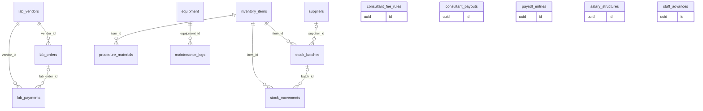

### `lab_vendors`

Outside labs: dental labs for crowns, pathology, radiology.

*Clinic-scoped: org_id + row-level security · sensitivity: internal · offline: server only*

| Column | Type | Notes |
|---|---|---|
| `name` | `text` |  |
| `phone_e164` | `text?` |  |
| `kind` | `lab_kind` | dental_lab, pathology, radiology |

Referenced by: `lab_orders.vendor_id`, `lab_payments.vendor_id`

### `lab_orders`

Work sent to a lab, its due date and status.

*Clinic-scoped: org_id + row-level security · sensitivity: health · offline: server only*

| Column | Type | Notes |
|---|---|---|
| `number` | `text` |  |
| `vendor_id` | `uuid` | → `lab_vendors` |
| `patient_id` | `uuid` | → `patients` |
| `practitioner_id` | `uuid` | → `practitioners` |
| `procedure_id` | `uuid?` | → `procedures` |
| `work_type` | `text` | crown, bridge, denture, blood test |
| `details` | `jsonb` | shade, tooth |
| `sent_at` | `timestamptz?` |  |
| `due_at` | `timestamptz?` |  |
| `received_at` | `timestamptz?` |  |
| `status` | `lab_status` | draft, sent, received, fitted, cancelled |
| `cost_paise` | `bigint` |  |

Referenced by: `lab_payments.lab_order_id`

### `lab_payments`

Money paid to labs.

*Clinic-scoped: org_id + row-level security · sensitivity: financial · offline: server only*

| Column | Type | Notes |
|---|---|---|
| `vendor_id` | `uuid` | → `lab_vendors` |
| `lab_order_id` | `uuid?` | → `lab_orders` |
| `amount_paise` | `bigint` |  |
| `paid_at` | `timestamptz` |  |
| `method` | `payment_method` |  |
| `reference` | `text?` |  |

### `suppliers`

Where materials are bought.

*Clinic-scoped: org_id + row-level security · sensitivity: internal · offline: server only*

| Column | Type | Notes |
|---|---|---|
| `name` | `text` |  |
| `phone_e164` | `text?` |  |
| `gstin` | `text?` |  |

Referenced by: `stock_batches.supplier_id`

### `inventory_items`

Materials and medicines the clinic stocks.

*Clinic-scoped: org_id + row-level security · sensitivity: internal · offline: server only*

| Column | Type | Notes |
|---|---|---|
| `name` | `text` |  |
| `sku` | `text?` |  |
| `unit` | `stock_unit` | piece, ml, g, box, pack |
| `category` | `text?` |  |
| `reorder_level` | `numeric` |  |
| `active` | `bool` |  |

Referenced by: `procedure_materials.item_id`, `stock_batches.item_id`, `stock_movements.item_id`

### `stock_batches`

Received stock by batch, with expiry and cost.

*Clinic-scoped: org_id + row-level security · sensitivity: internal · offline: server only*

| Column | Type | Notes |
|---|---|---|
| `item_id` | `uuid` | → `inventory_items` |
| `supplier_id` | `uuid?` | → `suppliers` |
| `batch_no` | `text?` |  |
| `expiry` | `date?` |  |
| `quantity` | `numeric` | remaining |
| `unit_cost_paise` | `bigint` |  |
| `received_at` | `timestamptz` |  |

Referenced by: `stock_movements.batch_id`

### `stock_movements`

Every change in stock: purchase, use, adjustment, expiry. Stock history comes from here.

*Clinic-scoped: org_id + row-level security · sensitivity: internal · offline: server only*

| Column | Type | Notes |
|---|---|---|
| `item_id` | `uuid` | → `inventory_items` |
| `batch_id` | `uuid?` | → `stock_batches` |
| `kind` | `stock_move` | purchase, consume, adjust, expire, return |
| `quantity` | `numeric` | signed |
| `procedure_id` | `uuid?` | → `procedures` |
| `reason` | `text?` |  |
| `at` | `timestamptz` |  |

### `procedure_materials`

Materials a treatment uses, so stock deducts itself.

*Clinic-scoped: org_id + row-level security · sensitivity: internal · offline: server only*

| Column | Type | Notes |
|---|---|---|
| `price_item_id` | `uuid` | → `price_items` |
| `item_id` | `uuid` | → `inventory_items` |
| `quantity` | `numeric` |  |

### `equipment`

Chairs, autoclaves, X-ray units and their service schedule.

*Clinic-scoped: org_id + row-level security · sensitivity: internal · offline: server only*

| Column | Type | Notes |
|---|---|---|
| `branch_id` | `uuid` | → `branches` |
| `name` | `text` |  |
| `serial_no` | `text?` |  |
| `purchased_at` | `date?` |  |
| `warranty_until` | `date?` |  |
| `service_interval_days` | `int?` |  |

Referenced by: `maintenance_logs.equipment_id`

### `maintenance_logs`

Services and repairs done on equipment, and when the next is due.

*Clinic-scoped: org_id + row-level security · sensitivity: internal · offline: server only*

| Column | Type | Notes |
|---|---|---|
| `equipment_id` | `uuid` | → `equipment` |
| `kind` | `maintenance_kind` | service, repair, amc |
| `done_at` | `date` |  |
| `cost_paise` | `bigint` |  |
| `vendor` | `text?` |  |
| `next_due_at` | `date?` |  |
| `notes` | `text?` |  |

### `salary_structures`

A staff member's monthly salary from a date.

*Clinic-scoped: org_id + row-level security · sensitivity: financial · offline: server only*

| Column | Type | Notes |
|---|---|---|
| `membership_id` | `uuid` | → `memberships` |
| `monthly_paise` | `bigint` |  |
| `effective_from` | `date` |  |

### `payroll_entries`

Salary paid for a month, with deductions and advances recovered.

*Clinic-scoped: org_id + row-level security · sensitivity: financial · offline: server only*

| Column | Type | Notes |
|---|---|---|
| `membership_id` | `uuid` | → `memberships` |
| `month` | `date` |  |
| `gross_paise` | `bigint` |  |
| `deductions_paise` | `bigint` |  |
| `advance_recovered_paise` | `bigint` |  |
| `net_paise` | `bigint` |  |
| `paid_at` | `timestamptz?` |  |
| `method` | `payment_method?` |  |

### `staff_advances`

Salary advances given to staff and how much is recovered.

*Clinic-scoped: org_id + row-level security · sensitivity: financial · offline: server only*

| Column | Type | Notes |
|---|---|---|
| `membership_id` | `uuid` | → `memberships` |
| `amount_paise` | `bigint` |  |
| `given_at` | `date` |  |
| `recovered_paise` | `bigint` |  |

### `consultant_fee_rules`

How a visiting consultant is paid: a percentage or fixed amount per treatment.

*Clinic-scoped: org_id + row-level security · sensitivity: internal · offline: server only*

| Column | Type | Notes |
|---|---|---|
| `practitioner_id` | `uuid` | → `practitioners` |
| `price_item_id` | `uuid?` | → `price_items`. null means all |
| `kind` | `fee_kind` | percent_bps, fixed |
| `value` | `bigint` |  |

### `consultant_payouts`

Payments made to consultants for a period.

*Clinic-scoped: org_id + row-level security · sensitivity: financial · offline: server only*

| Column | Type | Notes |
|---|---|---|
| `practitioner_id` | `uuid` | → `practitioners` |
| `period_start` | `date` |  |
| `period_end` | `date` |  |
| `amount_paise` | `bigint` |  |
| `paid_at` | `timestamptz?` |  |
| `method` | `payment_method?` |  |

## Money (`billing`)

Price list, bills, payments, refunds, expenses and daily cash closing.

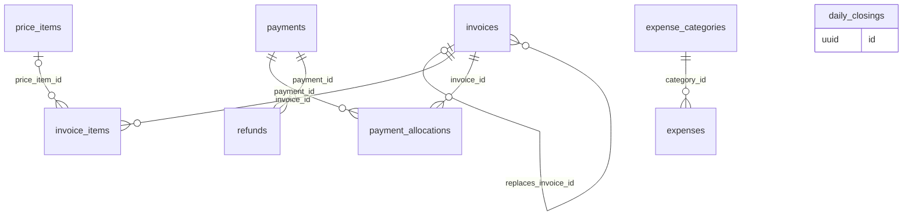

### `price_items` (★ foundation)

The clinic's price list. Seeded from the specialty, then edited.

*Clinic-scoped: org_id + row-level security · sensitivity: internal · offline: read-only on devices*

| Column | Type | Notes |
|---|---|---|
| `code` | `text?` |  |
| `name` | `text` | Root canal, Scaling, Consultation |
| `module` | `text?` |  |
| `category` | `text?` |  |
| `price_paise` | `bigint` |  |
| `tax_rate_bps` | `int` | 0 or 1800 |
| `active` | `bool` |  |

Referenced by: `consultant_fee_rules.price_item_id`, `invoice_items.price_item_id`, `procedure_materials.price_item_id`, `procedures.price_item_id`, `treatment_plan_items.price_item_id`

### `invoices` (★ foundation)

A bill to a patient. Totals are stored; balance is derived.

*Clinic-scoped: org_id + row-level security · sensitivity: financial · offline: server only*

| Column | Type | Notes |
|---|---|---|
| `number` | `text?` | SC/26-27/000318, assigned by the server when issued |
| `patient_id` | `uuid` | → `patients` |
| `encounter_id` | `uuid?` | → `encounters` |
| `branch_id` | `uuid` | → `branches` |
| `doc_type` | `invoice_doc` | tax_invoice, bill_of_supply |
| `status` | `invoice_status` | draft, issued, partially_paid, paid, void |
| `issued_at` | `timestamptz?` |  |
| `subtotal_paise` | `bigint` |  |
| `discount_paise` | `bigint` |  |
| `tax_paise` | `bigint` |  |
| `total_paise` | `bigint` |  |
| `paid_paise` | `bigint` |  |
| `replaces_invoice_id` | `uuid?` | → `invoices`. when a voided bill is reissued |
| `void_reason` | `text?` |  |
| `promo_code_id` | `uuid?` | → `promo_codes` |
| `pdf_asset_id` | `uuid?` | → `assets` |

Issued bills never change: corrections void and replace. Numbers are never generated offline.

Referenced by: `invoice_items.invoice_id`, `invoices.replaces_invoice_id`, `payment_allocations.invoice_id`, `promo_redemptions.invoice_id`

### `invoice_items` (★ foundation)

Lines on a bill, each optionally tied to a procedure and doctor.

*Clinic-scoped: org_id + row-level security · sensitivity: financial · offline: server only*

| Column | Type | Notes |
|---|---|---|
| `invoice_id` | `uuid` | → `invoices` |
| `price_item_id` | `uuid?` | → `price_items` |
| `procedure_id` | `uuid?` | → `procedures` |
| `practitioner_id` | `uuid?` | → `practitioners` |
| `description` | `text` |  |
| `quantity` | `numeric` |  |
| `unit_price_paise` | `bigint` |  |
| `discount_paise` | `bigint` |  |
| `tax_rate_bps` | `int` |  |
| `tax_paise` | `bigint` |  |
| `total_paise` | `bigint` |  |

### `payments` (★ foundation)

Money received from a patient, by any method.

*Clinic-scoped: org_id + row-level security · sensitivity: financial · offline: server only*

| Column | Type | Notes |
|---|---|---|
| `patient_id` | `uuid` | → `patients` |
| `received_at` | `timestamptz` |  |
| `amount_paise` | `bigint` |  |
| `method` | `payment_method` | cash, upi, card, bank_transfer, cheque, razorpay, insurance |
| `reference` | `text?` | UPI ref, cheque no |
| `received_by` | `uuid` | → `memberships` |
| `razorpay_payment_id` | `text?` |  |

Referenced by: `payment_allocations.payment_id`, `refunds.payment_id`

### `payment_allocations` (★ foundation)

Which bills a payment pays, so advances and partial payments work.

*Clinic-scoped: org_id + row-level security · sensitivity: financial · offline: server only*

| Column | Type | Notes |
|---|---|---|
| `payment_id` | `uuid` | → `payments` |
| `invoice_id` | `uuid` | → `invoices` |
| `amount_paise` | `bigint` |  |

### `refunds`

Money returned to a patient.

*Clinic-scoped: org_id + row-level security · sensitivity: financial · offline: server only*

| Column | Type | Notes |
|---|---|---|
| `payment_id` | `uuid` | → `payments` |
| `amount_paise` | `bigint` |  |
| `reason` | `text` |  |
| `refunded_at` | `timestamptz` |  |
| `method` | `payment_method` |  |

### `expense_categories`

Rent, electricity, salaries, consumables and so on.

*Clinic-scoped: org_id + row-level security · sensitivity: internal · offline: server only*

| Column | Type | Notes |
|---|---|---|
| `name` | `text` |  |

Referenced by: `expenses.category_id`

### `expenses`

Money the clinic spends.

*Clinic-scoped: org_id + row-level security · sensitivity: financial · offline: server only*

| Column | Type | Notes |
|---|---|---|
| `branch_id` | `uuid` | → `branches` |
| `category_id` | `uuid` | → `expense_categories` |
| `amount_paise` | `bigint` |  |
| `paid_at` | `date` |  |
| `method` | `payment_method` |  |
| `vendor` | `text?` |  |
| `notes` | `text?` |  |
| `receipt_asset_id` | `uuid?` | → `assets` |

### `daily_closings`

End-of-day cash count against what the system expects.

*Clinic-scoped: org_id + row-level security · sensitivity: financial · offline: server only*

| Column | Type | Notes |
|---|---|---|
| `branch_id` | `uuid` | → `branches` |
| `day` | `date` |  |
| `cash_expected_paise` | `bigint` |  |
| `cash_counted_paise` | `bigint` |  |
| `closed_by` | `uuid` | → `memberships` |
| `closed_at` | `timestamptz` |  |

## Notifications (`notify`)

Templates, rules, consent, recalls, campaigns, promo codes, the outbox and every message sent.

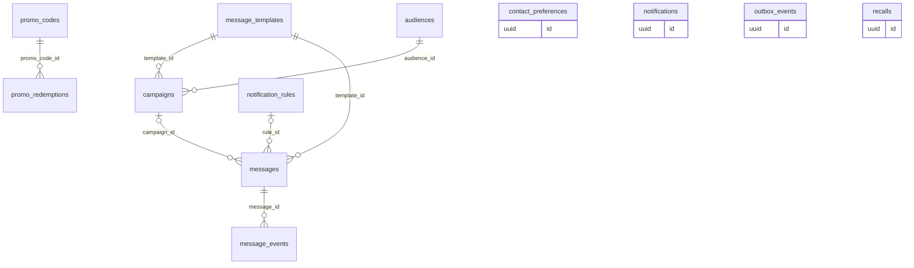

### `message_templates`

Message text per channel and language. Clinic rows override platform defaults.

*Clinic-scoped: org_id + row-level security · sensitivity: personal · offline: read-only on devices*

| Column | Type | Notes |
|---|---|---|
| `key` | `text` | appointment_reminder, birthday, recall_cleaning ... |
| `channel` | `channel` | whatsapp, sms, email, push |
| `language` | `text` |  |
| `body` | `text` |  |
| `category` | `message_category` | transactional, promotional |
| `provider_template_id` | `text?` | Meta or DLT template id |
| `approval` | `approval_status` | draft, pending, approved, rejected |

org_id is null for platform defaults; this table allows that.

Referenced by: `campaigns.template_id`, `messages.template_id`

### `notification_rules`

When to message: on an event, before an appointment, on birthdays, on recalls.

*Clinic-scoped: org_id + row-level security · sensitivity: personal · offline: server only*

| Column | Type | Notes |
|---|---|---|
| `trigger` | `rule_trigger` | event, before_appointment, birthday, recall |
| `event_key` | `text?` | booking.confirmed, invoice.paid ... |
| `offset_minutes` | `int?` | e.g. -1440 for a day before |
| `template_key` | `text` |  |
| `channels` | `channel[]` | in order of preference |
| `conditions` | `jsonb?` |  |
| `active` | `bool` |  |

Referenced by: `messages.rule_id`

### `contact_preferences`

Per patient and channel: may we message them, and was promotional consent given?

*Clinic-scoped: org_id + row-level security · sensitivity: personal · offline: server only*

| Column | Type | Notes |
|---|---|---|
| `patient_id` | `uuid` | → `patients` |
| `channel` | `channel` |  |
| `transactional_ok` | `bool` |  |
| `promotional_ok` | `bool` |  |
| `consented_at` | `timestamptz?` |  |
| `consent_source` | `text?` |  |
| `opted_out_at` | `timestamptz?` |  |

Primary key (org_id, patient_id, channel).

### `recalls`

Follow-ups that are due: cleaning in six months, BP review, vaccine.

*Clinic-scoped: org_id + row-level security · sensitivity: personal · offline: server only*

| Column | Type | Notes |
|---|---|---|
| `patient_id` | `uuid` | → `patients` |
| `kind` | `text` | cleaning, bp_review, vaccine, anc_visit |
| `due_on` | `date` |  |
| `status` | `recall_status` | due, notified, booked, dismissed |
| `source_procedure_id` | `uuid?` | → `procedures` |

### `audiences`

Saved patient filters for campaigns: age, sex, treatment, doctor, fees, history.

*Clinic-scoped: org_id + row-level security · sensitivity: personal · offline: server only*

| Column | Type | Notes |
|---|---|---|
| `name` | `text` |  |
| `filter` | `jsonb` |  |
| `estimated_count` | `int?` |  |

Referenced by: `campaigns.audience_id`

### `campaigns`

A one-off or scheduled send to an audience: health tips, offers.

*Clinic-scoped: org_id + row-level security · sensitivity: personal · offline: server only*

| Column | Type | Notes |
|---|---|---|
| `name` | `text` |  |
| `audience_id` | `uuid` | → `audiences` |
| `template_id` | `uuid` | → `message_templates` |
| `scheduled_at` | `timestamptz?` |  |
| `status` | `campaign_status` | draft, scheduled, sending, sent, cancelled |
| `cost_estimate_paise` | `bigint?` |  |

Referenced by: `messages.campaign_id`

### `promo_codes`

Discount codes a clinic can share.

*Clinic-scoped: org_id + row-level security · sensitivity: personal · offline: server only*

| Column | Type | Notes |
|---|---|---|
| `code` | `text` | unique per clinic |
| `kind` | `discount_kind` | percent_bps, fixed |
| `value` | `bigint` |  |
| `valid_from` | `date` |  |
| `valid_to` | `date?` |  |
| `max_uses` | `int?` |  |
| `used_count` | `int` |  |
| `applies_to` | `jsonb?` | price items or categories |

Referenced by: `invoices.promo_code_id`, `promo_redemptions.promo_code_id`

### `promo_redemptions`

Each use of a promo code on a bill.

*Clinic-scoped: org_id + row-level security · sensitivity: personal · offline: server only*

| Column | Type | Notes |
|---|---|---|
| `promo_code_id` | `uuid` | → `promo_codes` |
| `patient_id` | `uuid` | → `patients` |
| `invoice_id` | `uuid` | → `invoices` |
| `discount_paise` | `bigint` |  |
| `redeemed_at` | `timestamptz` |  |

### `outbox_events` (★ foundation)

Events written in the same transaction as the change, for the worker to act on.

*Clinic-scoped: org_id + row-level security · sensitivity: personal · offline: server only*

| Column | Type | Notes |
|---|---|---|
| `event_key` | `text` | appointment.booked, invoice.paid, report.uploaded |
| `payload` | `jsonb` | ids only, no patient details |
| `processed_at` | `timestamptz?` |  |

Guarantees a message is never lost or sent for a change that rolled back.

### `messages` (partitioned)

Every message scheduled or sent, with its outcome and cost.

*Clinic-scoped: org_id + row-level security · sensitivity: personal · offline: server only*

| Column | Type | Notes |
|---|---|---|
| `patient_id` | `uuid?` | → `patients` |
| `user_id` | `uuid?` | → `users` |
| `channel` | `channel` |  |
| `template_id` | `uuid` | → `message_templates` |
| `rule_id` | `uuid?` | → `notification_rules` |
| `campaign_id` | `uuid?` | → `campaigns` |
| `scheduled_for` | `timestamptz` |  |
| `status` | `message_status` | scheduled, queued, sent, delivered, read, failed, skipped |
| `skip_reason` | `skip_reason?` | no_consent, quiet_hours, duplicate, quota |
| `dedupe_key` | `text` | unique, e.g. reminder:appt-id:24h |
| `provider` | `text?` |  |
| `provider_message_id` | `text?` |  |
| `cost_paise` | `bigint?` |  |
| `sent_at` | `timestamptz?` |  |

Referenced by: `message_events.message_id`

### `message_events` (partitioned)

Delivery receipts from providers: sent, delivered, read, failed.

*Clinic-scoped: org_id + row-level security · sensitivity: personal · offline: server only*

| Column | Type | Notes |
|---|---|---|
| `message_id` | `uuid` | → `messages` |
| `kind` | `text` |  |
| `at` | `timestamptz` |  |
| `details` | `jsonb?` |  |

### `notifications`

The in-app notification feed for staff.

*Clinic-scoped: org_id + row-level security · sensitivity: personal · offline: server only*

| Column | Type | Notes |
|---|---|---|
| `user_id` | `uuid` | → `users` |
| `kind` | `text` |  |
| `title` | `text` |  |
| `entity_ref` | `jsonb` | type and id to open |
| `read_at` | `timestamptz?` |  |

## Websites (`web`)

Generated clinic websites, their versions, booking requests and traffic.

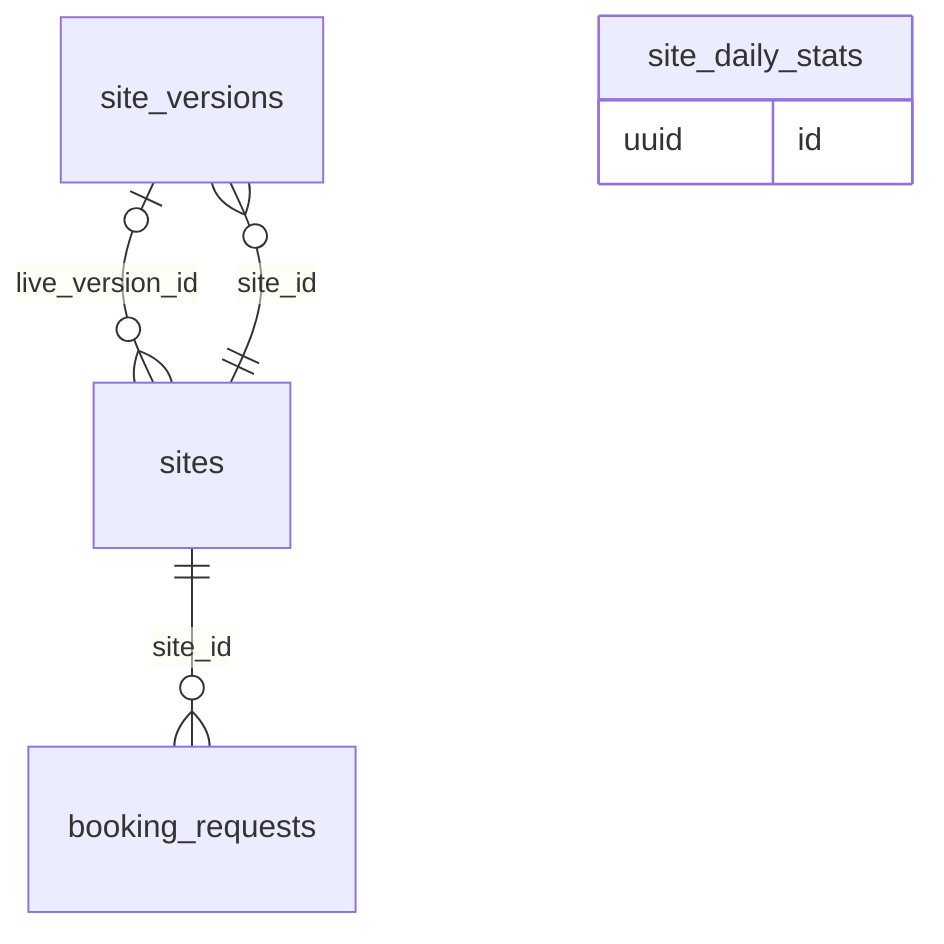

### `sites`

A clinic's generated website: template family, repository and live version.

*Clinic-scoped: org_id + row-level security · sensitivity: public · offline: server only*

| Column | Type | Notes |
|---|---|---|
| `family` | `text` | template family key |
| `template_version` | `text` |  |
| `repo_full_name` | `text?` | sakalyatechnologies/site-smilecatchers |
| `status` | `site_status` | draft, building, live, failed |
| `config` | `jsonb` | from onboarding answers |
| `live_version_id` | `uuid?` | → `site_versions` |

Referenced by: `booking_requests.site_id`, `site_versions.site_id`

### `site_versions`

Each publish of a site, so any version can be restored.

*Clinic-scoped: org_id + row-level security · sensitivity: public · offline: server only*

| Column | Type | Notes |
|---|---|---|
| `site_id` | `uuid` | → `sites` |
| `config` | `jsonb` |  |
| `commit_sha` | `text?` |  |
| `build_status` | `build_status` | queued, building, succeeded, failed |
| `built_at` | `timestamptz?` |  |
| `deployed_url` | `text?` |  |

Referenced by: `sites.live_version_id`

### `booking_requests`

Booking requests from the website, before they become appointments.

*Clinic-scoped: org_id + row-level security · sensitivity: personal · offline: server only*

| Column | Type | Notes |
|---|---|---|
| `site_id` | `uuid` | → `sites` |
| `name` | `text` |  |
| `phone_e164` | `text` |  |
| `practitioner_id` | `uuid?` | → `practitioners` |
| `preferred_at` | `timestamptz?` |  |
| `message` | `text?` |  |
| `status` | `booking_status` | new, contacted, booked, spam |
| `appointment_id` | `uuid?` | → `appointments` |

### `site_daily_stats`

Website visits and bookings per day, for the clinic and the console.

*Clinic-scoped: org_id + row-level security · sensitivity: internal · offline: server only*

| Column | Type | Notes |
|---|---|---|
| `day` | `date` |  |
| `visits` | `int` |  |
| `unique_visitors` | `int` |  |
| `booking_requests` | `int` |  |

Primary key (org_id, day). Imported from Cloudflare Web Analytics.

## Trust and audit (`trust`)

Patient consents, who viewed what, every change, and data-rights requests.

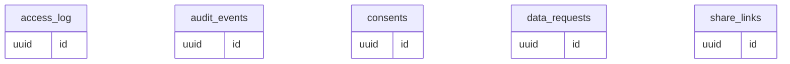

### `consents`

A patient's permission for a clinic or doctor to see records held elsewhere, for a purpose and time.

*User-scoped: rows belong to one signed-in user · sensitivity: health · offline: server only*

| Column | Type | Notes |
|---|---|---|
| `patient_link_id` | `uuid` | → `patient_links` |
| `grantee_org_id` | `uuid` | → `organizations` |
| `grantee_practitioner_id` | `uuid?` | → `practitioners` |
| `purpose` | `consent_purpose` | care, referral, insurance, research |
| `data_categories` | `text[]` | e.g. prescriptions, dental, lab_reports |
| `source` | `consent_source` | patient_app, clinic, abdm |
| `starts_at` | `timestamptz` |  |
| `expires_at` | `timestamptz?` |  |
| `revoked_at` | `timestamptz?` |  |

Every grant and revocation is audited. The clinic owns its record; the patient controls sharing across clinics.

### `share_links` (★ foundation)

Expiring links that let a patient open a prescription, bill or report: aarogyam.app/r/…

*Clinic-scoped: org_id + row-level security · sensitivity: health · offline: server only*

| Column | Type | Notes |
|---|---|---|
| `token_hash` | `text` | the link holds the token; only its hash is stored |
| `resource` | `share_resource` | prescription, invoice, report, upload_request |
| `resource_id` | `uuid` |  |
| `patient_id` | `uuid` | → `patients` |
| `channel` | `channel` | whatsapp, sms, email |
| `otp_required` | `bool` | a one-time code to the patient's phone before opening |
| `expires_at` | `timestamptz` |  |
| `opened_at` | `timestamptz?` |  |
| `open_count` | `int` |  |
| `revoked_at` | `timestamptz?` |  |

Every open is written to access_log with purpose patient_self.

### `access_log` (★ foundation, partitioned)

The access ledger: who opened which patient record, why, when and from which device. Patients can see it.

*Clinic-scoped: org_id + row-level security · sensitivity: health · offline: server only*

| Column | Type | Notes |
|---|---|---|
| `actor_user_id` | `uuid` | → `users` |
| `actor_kind` | `actor_kind` | staff, patient, support |
| `patient_id` | `uuid` | → `patients` |
| `resource` | `access_resource` | chart, note, attachment, prescription, invoice, export |
| `resource_id` | `uuid?` |  |
| `action` | `access_action` | view, download, print, share, export |
| `purpose` | `access_purpose` | care, front_desk, billing, support, patient_self, export |
| `device_id` | `uuid?` | → `devices` |
| `at` | `timestamptz` |  |
| `request_id` | `text` |  |

Append-only: the app role can insert but never update or delete. Views made offline are queued on the device and uploaded.

### `audit_events` (★ foundation, partitioned)

Every insert, update and delete, written by triggers.

*Clinic-scoped: org_id + row-level security · sensitivity: health · offline: server only*

| Column | Type | Notes |
|---|---|---|
| `table_name` | `text` |  |
| `row_id` | `uuid` |  |
| `action` | `audit_action` | insert, update, delete |
| `actor_user_id` | `uuid?` | → `users` |
| `changed_fields` | `text[]` |  |
| `old` | `jsonb?` | sensitive fields masked |
| `new` | `jsonb?` | sensitive fields masked |
| `at` | `timestamptz` |  |
| `request_id` | `text?` |  |

Append-only. org_id may be null for platform tables.

### `data_requests`

Patients' DPDP requests: export, correction, erasure.

*Clinic-scoped: org_id + row-level security · sensitivity: health · offline: server only*

| Column | Type | Notes |
|---|---|---|
| `patient_id` | `uuid` | → `patients` |
| `kind` | `data_request_kind` | export, correction, erasure |
| `status` | `request_status` | received, in_progress, done, rejected |
| `requested_at` | `timestamptz` |  |
| `completed_at` | `timestamptz?` |  |
| `notes` | `text?` |  |

## Onboarding (`onboarding`)

First-login progress and data imports from old software.

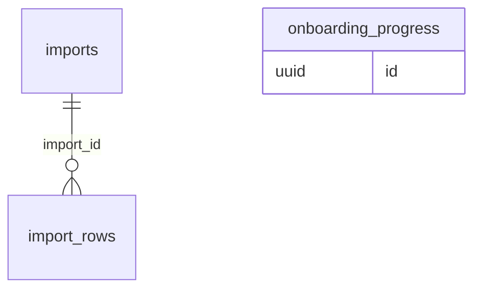

### `onboarding_progress`

Where a new clinic is in the first-login wizard, and its answers.

*Clinic-scoped: org_id + row-level security · sensitivity: personal · offline: server only*

| Column | Type | Notes |
|---|---|---|
| `steps` | `jsonb` | step key to answers |
| `completed_at` | `timestamptz?` |  |

One row per clinic.

### `imports`

A data import from Excel or old software.

*Clinic-scoped: org_id + row-level security · sensitivity: personal · offline: server only*

| Column | Type | Notes |
|---|---|---|
| `kind` | `import_kind` | patients, appointments, invoices |
| `source` | `text` | excel, csv, legacy app name |
| `file_attachment_id` | `uuid` | → `attachments` |
| `mapping` | `jsonb` | column mapping |
| `status` | `import_status` | uploaded, mapped, running, done, failed |
| `total_rows` | `int` |  |
| `imported_rows` | `int` |  |
| `failed_rows` | `int` |  |

Referenced by: `import_rows.import_id`

### `import_rows`

Each row of an import with its result, so failures can be fixed and retried.

*Clinic-scoped: org_id + row-level security · sensitivity: personal · offline: server only*

| Column | Type | Notes |
|---|---|---|
| `import_id` | `uuid` | → `imports` |
| `row_number` | `int` |  |
| `raw` | `jsonb` |  |
| `status` | `row_status` | pending, imported, failed |
| `error` | `text?` |  |
| `entity_id` | `uuid?` |  |
