# Database

<!-- Generated by scripts/gen_schema_docs.py from docs/schema/model.py. Do not edit by hand. -->

147 tables in 12 areas. 53 are needed for the foundation milestone (marked ★). This is the design. Tables that are built must match it: a test compares the migrated database with this model.

## Conventions every table follows

- **Clinic-scoped tables** also have `org_id uuid -> organizations`, `id uuid`, a primary key of `(org_id, id)`, `created_at`, `created_by`, `updated_at`, `updated_by`, and `deleted_at` when the lifecycle is `soft_delete`. Foreign keys include `org_id`, so a row can never point at another clinic's row, and every unique key starts with `org_id`. Row-level security limits every query to `org_id = app.tenant_id()`.
- **Platform tables** have `id uuid` as the primary key. Row-level security is on for them too: clinic members read only rows about their own clinic, and only the console and the system write them.
- **User tables** belong to one signed-in user.
- **Schemas:** tables live in `aarogyam`, the two logs in `audit`, helper functions in `app`, internal tables in `private`. Nothing goes in `public`, which Supabase exposes through its Data API.
- **Lifecycle** (mutable, soft delete, finalizable, append-only, ephemeral) decides the columns, triggers and grants: only ephemeral rows can be deleted.
- IDs are UUIDv7. Money is `bigint` paise. Times are `timestamptz` in UTC. Statuses are `text` with a CHECK constraint listing the allowed values, because Postgres enums can't use an index under row-level security.
- Readable numbers (`SC-1042`, `SC/26-27/000318`) come from `number_sequences`.
- Tables marked *partitioned* are split by month.
- **Immutable once final:** signed notes (corrections are addenda), issued prescriptions (cancel and reissue), issued bills (void and replace), and observations (a correction supersedes). Readable numbers are assigned by the server at issue, never on a device.
- **Clinical codes are optional:** free text always works; `code_system`, `code`, `code_display` and `code_version` leave room for ICD, SNOMED and LOINC when interoperability needs them.
- **Provenance:** important clinical rows record `source` (clinician, assistant, patient, import, device, AI draft, ABDM) and who verified it.
- **Sensitivity** (public, internal, personal, financial, health) decides what may be logged, exported, sent to analytics, shown to support, or given to AI. **Offline** says whether phones may write a table, only read it, or never hold it.
- **Schema checks in tests:** every table has row-level security with a policy and no privileges for Supabase's `anon` and `authenticated` roles; every clinic table has `org_id`, keys starting with `org_id`, tenant-aware foreign keys with indexes, and an audit trigger. The two logs have no foreign keys. A test fails the build otherwise.

## How the areas connect

Arrows show foreign keys between areas (links to `organizations` omitted). The number is how many.

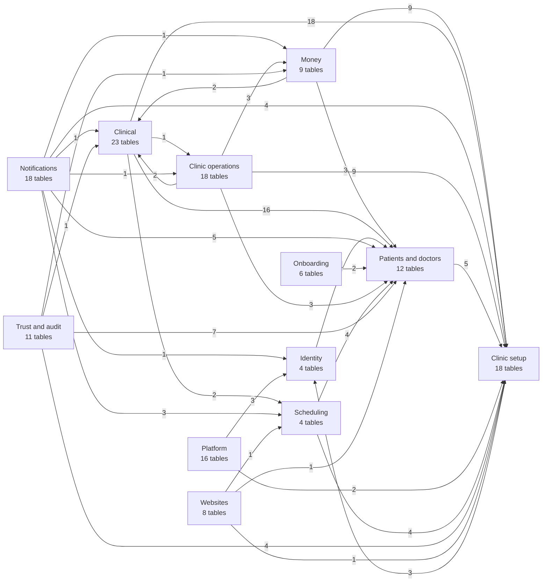

## Journeys: which tables a real task touches

### A new clinic signs up

1. **Sakalya console**: Clinic created on a trial plan with its subdomain. (`organizations`, `org_domains`, `subscriptions`)
2. **Owner**: Owner accepts the invite and becomes a member with the owner role. (`invitations`, `users`, `memberships`, `roles`)
3. **Wizard**: Specialty, branding, prices and hours set up from defaults. (`onboarding_progress`, `org_modules`, `org_settings`, `price_items`, `working_hours`, `practitioners`)
4. **Website**: Site generated from answers, repository created, built and deployed. (`sites`, `site_versions`, `org_domains`)
5. **Import**: The clinic's CSV or Excel file mapped automatically, previewed and imported, keeping file numbers; patients missing details go on the front desk's to-do list. (`import_sessions`, `import_column_memory`, `imports`, `import_rows`, `patients`, `patient_identifiers`, `patient_gaps`)

### A patient visits the dentist

1. **Front desk**: New patient registered as SC-1042, or found by name, phone or ID. (`patients`, `patient_identifiers`, `referral_sources`, `number_sequences`)
2. **Front desk**: Appointment marked arrived; token shown on the waiting screen. (`appointments`, `appointment_events`, `queue_tokens`)
3. **Assistant**: Visit opened; vitals and intake note recorded. (`encounters`, `observations`, `clinical_notes`)
4. **Doctor**: Dictates a note, adds an X-ray, updates the tooth chart; every view is logged. (`voice_notes`, `attachments`, `specialty_records`, `clinical_notes`, `access_log`)
5. **Doctor**: Root canal done on tooth 36: stock deducted, crown sent to the lab, prescription issued. (`procedures`, `stock_movements`, `lab_orders`, `prescriptions`, `prescription_items`)
6. **Doctor**: Prescription printed on the clinic letterhead with the Aarogyam footer and QR; the patient gets an expiring WhatsApp link. (`document_templates`, `share_links`, `access_log`)
7. **Front desk**: Bill SC/26-27/000318 issued and paid by UPI. (`invoices`, `invoice_items`, `payments`, `payment_allocations`)
8. **System**: Receipt sent on WhatsApp, a follow-up recall created, all changes audited. (`outbox_events`, `messages`, `recalls`, `audit_events`)

### Reminders, birthdays and recalls

1. **Rules**: Clinic has reminder, birthday and recall rules switched on. (`notification_rules`, `message_templates`)
2. **Scheduler**: Due messages created with a dedupe key, e.g. reminder:appt:24h. (`appointments`, `patients`, `recalls`, `messages`)
3. **Worker**: Consent, quiet hours and quota checked; message sent or skipped with a reason. (`contact_preferences`, `usage_counters`, `messages`)
4. **Provider**: Delivery and read receipts recorded; cost metered per clinic. (`message_events`, `messages`)

### Month-end finance report

1. **Money in**: Collections by doctor, treatment, referral source and payment method. (`payments`, `refunds`, `payment_allocations`, `invoices`)
2. **Money out**: Spending by category, lab, staff and consultant. (`expenses`, `lab_payments`, `payroll_entries`, `consultant_payouts`)
3. **Report**: A ledger view joins both sides; exported to Excel by the worker. (`daily_closings`)

### A request checks access

1. **Host**: smilecatchers.aarogyam.example resolves to the clinic. (`org_domains`, `organizations`)
2. **Session**: JWT verified, session still active. (`users`, `sessions`)
3. **Membership**: User is an active member whose role allows patients.read. (`memberships`, `roles`, `role_permissions`)
4. **Plan and flags**: Feature is in the plan and released to this clinic. (`subscriptions`, `plan_features`, `entitlement_overrides`, `feature_flags`, `flag_rules`)
5. **Database**: Row-level security limits every query to this clinic. (`patients`)

### Phase 3: a patient sees all their clinics

1. **Patient**: Patient signs in with their phone and verifies records at each clinic. (`users`, `patient_links`)
2. **Patient**: Patient lets their new cardiologist see their dental and GP records. (`consents`)
3. **Cardiologist**: Reads the shared records; the patient sees who looked. (`encounters`, `prescriptions`, `attachments`, `access_log`)

## Offline

What the phone apps may do without a connection.

- **Read and write on devices:** `patients`, `patient_identifiers`, `medical_history_items`, `appointments`, `appointment_events`, `queue_tokens`, `encounters`, `clinical_notes`, `note_addenda`, `observations`, `conditions`, `allergies`, `prescriptions`, `prescription_items`, `procedures`, `attachments`, `voice_notes`, `specialty_records`

- **Read-only on devices:** `organizations`, `branches`, `rooms`, `org_modules`, `org_settings`, `roles`, `role_permissions`, `memberships`, `membership_branches`, `referral_sources`, `practitioners`, `working_hours`, `drug_catalog`, `document_templates`, `drug_interactions`, `price_items`, `message_templates`

- **Server only:** everything else, including bill and prescription numbers, payments, share links, audit and access logs, permissions and plans.

## Platform (`platform`)

Run by Sakalya: plans, billing clinics, feature rollout, support, platform analytics. Console only.

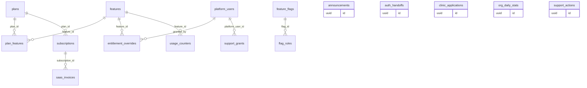

### `plans`

Subscription plans clinics can buy (Solo, Clinic, Pro, Enterprise).

*Platform-wide: no tenant, written by Sakalya or the system · sensitivity: internal · offline: server only*

| Column | Type | Notes |
|---|---|---|
| `code` | `text` | unique: solo, clinic, pro, enterprise |
| `name` | `text` |  |
| `monthly_price_paise` | `bigint` |  |
| `yearly_price_paise` | `bigint` |  |
| `is_public` | `bool` | hidden plans for custom deals |
| `sort_order` | `int` |  |

Referenced by: `plan_features.plan_id`, `subscriptions.plan_id`

### `features`

Every feature that a plan can include or limit.

*Platform-wide: no tenant, written by Sakalya or the system · sensitivity: internal · offline: server only*

| Column | Type | Notes |
|---|---|---|
| `key` | `text` | unique, e.g. website_builder, whatsapp_campaigns |
| `name` | `text` |  |
| `kind` | `feature_kind` | boolean or limit |
| `description` | `text` |  |

Referenced by: `entitlement_overrides.feature_id`, `plan_features.feature_id`, `usage_counters.feature_id`

### `plan_features`

What each plan includes, and its limits.

*Platform-wide: no tenant, written by Sakalya or the system · sensitivity: internal · offline: server only*

| Column | Type | Notes |
|---|---|---|
| `plan_id` | `uuid` | → `plans` |
| `feature_id` | `uuid` | → `features` |
| `included` | `bool` |  |
| `limit_value` | `int?` | e.g. 2000 messages a month |

Primary key (plan_id, feature_id).

### `subscriptions`

Which plan a clinic is on and whether it is paid up.

*Platform-wide: no tenant, written by Sakalya or the system · sensitivity: internal · offline: server only*

| Column | Type | Notes |
|---|---|---|
| `org_id` | `uuid` | → `organizations` |
| `plan_id` | `uuid` | → `plans` |
| `status` | `subscription_status` | trialing, active, past_due, paused, canceled |
| `period_start` | `date` |  |
| `period_end` | `date` |  |
| `trial_ends_at` | `timestamptz?` |  |
| `razorpay_subscription_id` | `text?` |  |
| `canceled_at` | `timestamptz?` |  |

Referenced by: `saas_invoices.subscription_id`

### `saas_invoices`

Sakalya's own GST invoices to clinics for the subscription.

*Platform-wide: no tenant, written by Sakalya or the system · sensitivity: financial · offline: server only*

| Column | Type | Notes |
|---|---|---|
| `org_id` | `uuid` | → `organizations` |
| `subscription_id` | `uuid` | → `subscriptions` |
| `number` | `text` | Sakalya's invoice series |
| `amount_paise` | `bigint` |  |
| `gst_paise` | `bigint` |  |
| `status` | `saas_invoice_status` | issued, paid, void |
| `razorpay_payment_id` | `text?` |  |
| `issued_at` | `timestamptz` |  |

### `entitlement_overrides`

Per-clinic exceptions to the plan: promos, grandfathering, custom deals.

*Platform-wide: no tenant, written by Sakalya or the system · sensitivity: internal · offline: server only*

| Column | Type | Notes |
|---|---|---|
| `org_id` | `uuid` | → `organizations` |
| `feature_id` | `uuid` | → `features` |
| `included` | `bool` |  |
| `limit_value` | `int?` |  |
| `reason` | `text` |  |
| `expires_at` | `timestamptz?` |  |
| `granted_by` | `uuid` | → `platform_users` |

### `usage_counters`

How much of each limited feature a clinic used this month.

*Platform-wide: no tenant, written by Sakalya or the system · sensitivity: internal · offline: server only*

| Column | Type | Notes |
|---|---|---|
| `org_id` | `uuid` | → `organizations` |
| `feature_id` | `uuid` | → `features` |
| `period` | `date` | first day of the month |
| `used` | `bigint` |  |

Primary key (org_id, feature_id, period). Incremented by the API and worker.

### `feature_flags`

Switches that release a feature gradually, separate from plans.

*Platform-wide: no tenant, written by Sakalya or the system · sensitivity: internal · offline: server only*

| Column | Type | Notes |
|---|---|---|
| `key` | `text` | unique |
| `description` | `text` |  |
| `default_on` | `bool` |  |
| `kill_switch` | `bool` | forces off everywhere |

Referenced by: `flag_rules.flag_id`

### `flag_rules`

Who a flag is on for: named clinics, a percentage, a plan, a platform or app version.

*Platform-wide: no tenant, written by Sakalya or the system · sensitivity: internal · offline: server only*

| Column | Type | Notes |
|---|---|---|
| `flag_id` | `uuid` | → `feature_flags` |
| `kind` | `flag_rule_kind` | org_list, percentage, plan, platform, min_app_version |
| `value` | `jsonb` |  |
| `priority` | `int` |  |

### `platform_users` (★ foundation)

Sakalya staff who can use the console, and their role.

*Platform-wide: no tenant, written by Sakalya or the system · sensitivity: internal · offline: server only · lifecycle: mutable*

| Column | Type | Notes |
|---|---|---|
| `user_id` | `uuid` | → `users` |
| `role` | `platform_role` | owner, support, onboarding, analyst |
| `active` | `bool` |  |

Referenced by: `entitlement_overrides.granted_by`, `support_grants.platform_user_id`

### `auth_handoffs`

Central sign-in: one-time codes that hand a session to one clinic or console host, valid 60 seconds.

*Platform-wide: no tenant, written by Sakalya or the system · sensitivity: internal · offline: server only · lifecycle: ephemeral*

| Column | Type | Notes |
|---|---|---|
| `code_hash` | `text` | unique, SHA-256 of the code; the code is never stored |
| `user_id` | `uuid` | → `users` |
| `target_host` | `text` | the only host that may redeem it |
| `expires_at` | `timestamptz` |  |
| `redeemed_at` | `timestamptz?` | first attempt uses it up |
| `redeemed` | `bool?` | whether that attempt gave a session |

Written and redeemed only through app.auth_handoff_create() and app.auth_handoff_redeem().

### `clinic_applications` (★ foundation)

Clinics asking to join from the public landing page; staff approve or reject them in the console.

*Platform-wide: no tenant, written by Sakalya or the system · sensitivity: internal · offline: server only · lifecycle: mutable*

| Column | Type | Notes |
|---|---|---|
| `clinic_name` | `text` |  |
| `city` | `text` |  |
| `specialty` | `specialty` | dental, general |
| `contact_name` | `text` |  |
| `email` | `text` | one pending application per address |
| `phone_e164` | `text?` |  |
| `message` | `text?` |  |
| `status` | `application_status` | pending, approved, rejected |
| `submissions` | `int` | times the address applied while pending |
| `decision_reason` | `text?` |  |
| `decided_by` | `uuid?` | → `users` |
| `decided_at` | `timestamptz?` |  |
| `created_org_id` | `uuid?` | → `organizations`. the clinic approval created |

No grants: the API reaches it through definer functions only. Approval creates the clinic, the owner's invitation and the invitation email in one transaction.

### `support_grants`

Time-limited read access a clinic owner gives one named Sakalya staff member (support.grant).

*Clinic-scoped: org_id + row-level security · sensitivity: internal · offline: server only · lifecycle: mutable*

| Column | Type | Notes |
|---|---|---|
| `platform_user_id` | `uuid` | → `platform_users`. one named person, owner or support role |
| `access` | `support_access` | read (records, read-only) |
| `reason` | `text` | 3 to 500 characters, shown to the staff member |
| `starts_at` | `timestamptz` | now when granted |
| `ends_at` | `timestamptz` | at most 7 days after starts_at |
| `granted_by` | `uuid` | → `memberships` |
| `revoked_at` | `timestamptz?` |  |
| `revoked_by` | `uuid?` | → `memberships` |

Platform staff can't hold memberships (0172); a grant is their only way into a clinic. While active, app.support_authorize admits them on the clinic host through routes that name a permission, with read permissions only, actor kind support (the database refuses their writes in app.set_row_meta), and records each request in support_actions. A trigger allows one change: revocation. Ends by itself at ends_at.

### `support_actions` (partitioned)

Every request Sakalya staff made under a support grant: the grant, method and route template.

*Clinic-scoped: org_id + row-level security · sensitivity: internal · offline: server only · lifecycle: append only · schema: `audit`*

| Column | Type | Notes |
|---|---|---|
| `grant_id` | `uuid` | the support grant |
| `user_id` | `uuid` | the staff member |
| `method` | `text` | GET, POST ... |
| `route` | `text` | the route template, never a value |
| `at` | `timestamptz` |  |
| `request_id` | `text?` | joins the change history and access record |

Primary key (org_id, at, id), partitioned by month. Written by app.support_authorize only; the clinic reads its own rows (GET /support-grants/{id}/actions).

### `announcements`

Release notes and notices shown inside the clinic apps.

*Platform-wide: no tenant, written by Sakalya or the system · sensitivity: internal · offline: server only*

| Column | Type | Notes |
|---|---|---|
| `title` | `text` |  |
| `body` | `text` |  |
| `audience` | `jsonb` | plans, roles, platforms |
| `starts_at` | `timestamptz` |  |
| `ends_at` | `timestamptz?` |  |

### `org_daily_stats`

Per-clinic daily counts for the console. Counts only, never patient data.

*Platform-wide: no tenant, written by Sakalya or the system · sensitivity: internal · offline: server only*

| Column | Type | Notes |
|---|---|---|
| `org_id` | `uuid` | → `organizations` |
| `day` | `date` |  |
| `active_users` | `int` |  |
| `new_patients` | `int` |  |
| `appointments` | `int` |  |
| `visits` | `int` |  |
| `billed_paise` | `bigint` |  |
| `messages_sent` | `int` |  |
| `storage_bytes` | `bigint` |  |

Primary key (org_id, day). Written nightly, copied to BigQuery.

## Identity (`iam`)

People who sign in, their sessions and devices. One user can belong to many clinics.

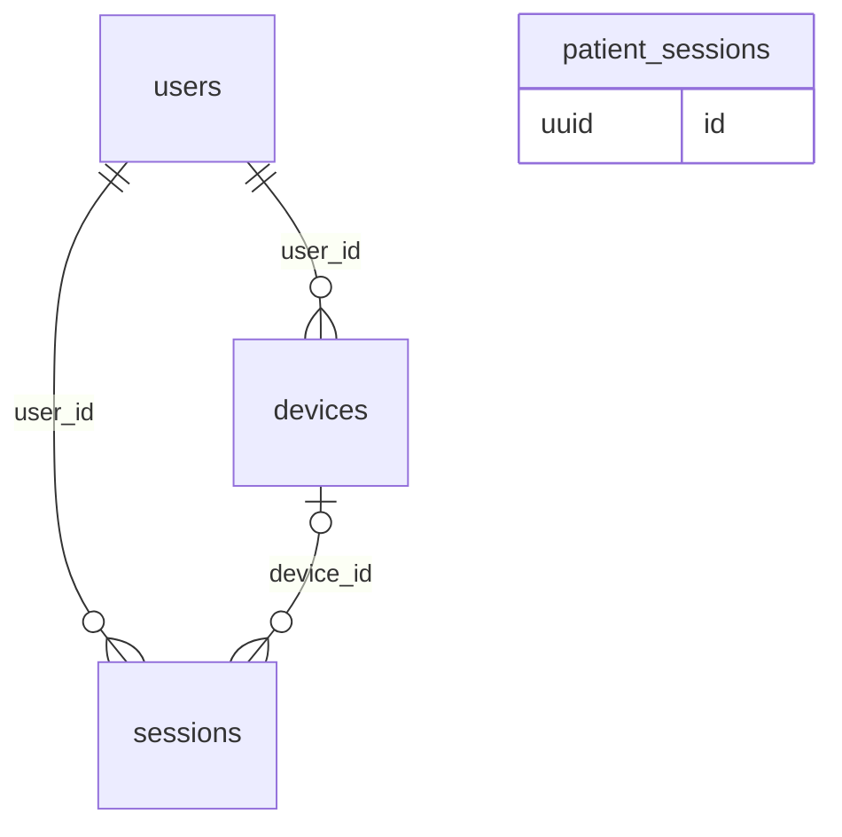

### `users` (★ foundation)

Anyone who signs in: staff, doctors, patients, Sakalya staff.

*User-scoped: rows belong to one signed-in user · sensitivity: personal · offline: server only · lifecycle: mutable*

| Column | Type | Notes |
|---|---|---|
| `auth_uid` | `uuid` | Supabase Auth user id, unique |
| `phone_e164` | `text?` | unique |
| `email` | `text?` |  |
| `display_name` | `text` |  |
| `locale` | `text` | en-IN, hi-IN, mr-IN ... |
| `status` | `user_status` | active, disabled |
| `last_seen_at` | `timestamptz?` |  |

Referenced by: `auth_handoffs.user_id`, `clinic_applications.decided_by`, `devices.user_id`, `invitations.invited_by`, `memberships.user_id`, `notifications.user_id`, `platform_users.user_id`, `role_changes.changed_by`, `sessions.user_id`

### `sessions` (★ foundation)

Signed-in sessions, so a stolen phone or idle PC can be signed out.

*User-scoped: rows belong to one signed-in user · sensitivity: personal · offline: server only · lifecycle: ephemeral*

| Column | Type | Notes |
|---|---|---|
| `user_id` | `uuid` | → `users` |
| `provider_session_id` | `uuid` | session_id claim in the JWT |
| `device_id` | `uuid?` | → `devices` |
| `audience` | `session_audience` | clinic, patient, platform |
| `last_active_at` | `timestamptz` |  |
| `expires_at` | `timestamptz` |  |
| `revoked_at` | `timestamptz?` |  |
| `revoke_reason` | `text?` |  |

### `patient_sessions`

Patient app sign-in sessions, so a patient can see where they are signed in and sign one out.

*User-scoped: rows belong to one signed-in user · sensitivity: personal · offline: server only · lifecycle: ephemeral*

| Column | Type | Notes |
|---|---|---|
| `account_id` | `uuid` | → `patient_accounts` |
| `provider_session_id` | `uuid` | session_id claim in the JWT, unique |
| `last_active_at` | `timestamptz` | refreshed at most every 5 minutes |
| `expires_at` | `timestamptz` |  |
| `revoked_at` | `timestamptz?` |  |
| `revoke_reason` | `text?` | signed_out |

Recorded by app.patient_access on every patient request, which also refuses a revoked session; GET /me/patient/sessions and DELETE /me/patient/sessions/{id}. Staff sessions stay in sessions (patient accounts are not users).

### `devices` (★ foundation)

Phones and browsers a user signs in from, with push tokens.

*User-scoped: rows belong to one signed-in user · sensitivity: personal · offline: server only · lifecycle: mutable*

| Column | Type | Notes |
|---|---|---|
| `user_id` | `uuid` | → `users` |
| `platform` | `device_platform` | android, ios, web |
| `model` | `text?` |  |
| `app_version` | `text?` |  |
| `push_token` | `text?` |  |
| `push_token_updated_at` | `timestamptz?` |  |

Referenced by: `sessions.device_id`

## Clinic setup (`tenancy`)

The clinic itself: branches, domains, rooms, modules, roles, staff memberships, numbering.

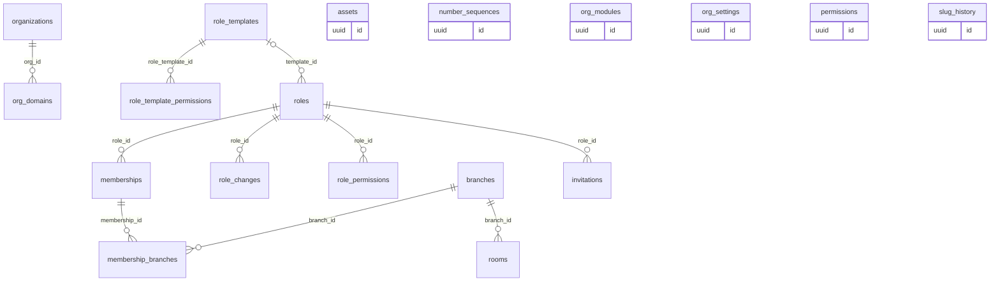

### `organizations` (★ foundation)

A clinic business, the tenant. Everything clinic-owned points here.

*Platform-wide: no tenant, written by Sakalya or the system · sensitivity: internal · offline: read-only on devices · lifecycle: mutable*

| Column | Type | Notes |
|---|---|---|
| `slug` | `text` | unique, the subdomain: smilecatchers |
| `name` | `text` |  |
| `legal_name` | `text?` |  |
| `number_prefix` | `text` | 1 to 3 capital letters: SC in SC-1042 |
| `specialty` | `text` | dental in Phase 1A; general later |
| `status` | `org_status` | trial, active, suspended, churned |
| `timezone` | `text` | default Asia/Kolkata |
| `gstin` | `text?` |  |

Members can read only their own clinic's row. The console creates clinics through app.create_clinic().

Referenced by: `clinic_applications.created_org_id`, `consents.grantee_org_id`, `entitlement_overrides.org_id`, `org_daily_stats.org_id`, `org_domains.org_id`, `saas_invoices.org_id`, `subscriptions.org_id`, `usage_counters.org_id`

### `branches` (★ foundation)

Locations of a clinic. Single-location clinics have one.

*Clinic-scoped: org_id + row-level security · sensitivity: internal · offline: read-only on devices · lifecycle: soft delete*

| Column | Type | Notes |
|---|---|---|
| `slug` | `text` | unique per clinic |
| `name` | `text` |  |
| `address` | `jsonb` |  |
| `phone_e164` | `text?` |  |
| `gstin` | `text?` | when the branch has its own GST registration |
| `state_code` | `text?` | GST state code, e.g. 27 for Maharashtra; the place of supply |
| `is_default` | `bool` | exactly one per clinic |

Referenced by: `appointments.branch_id`, `clinic_hours.branch_id`, `daily_closings.branch_id`, `encounters.branch_id`, `equipment.branch_id`, `invoices.branch_id`, `membership_branches.branch_id`, `queue_tokens.branch_id`, `rooms.branch_id`, `working_hours.branch_id`

### `org_domains` (★ foundation)

Host names that resolve to a clinic: its portal, its free website address (site) and its own domain (website).

*Platform-wide: no tenant, written by Sakalya or the system · sensitivity: internal · offline: server only · lifecycle: mutable*

| Column | Type | Notes |
|---|---|---|
| `org_id` | `uuid` | → `organizations` |
| `hostname` | `text` | unique, lower case: smilecatchers.aarogyam.example, smilecatchers.in |
| `kind` | `domain_kind` | portal, website, site |
| `is_primary` | `bool` |  |
| `cloudflare_hostname_id` | `text?` |  |
| `verified_at` | `timestamptz?` | only verified hosts resolve |
| `edge_status` | `text?` | portal and site rows: pending, ready, failed, removing (a taken-down site) |
| `edge_attempts` | `int` |  |
| `edge_next_attempt_at` | `timestamptz?` | when the outbox job tries next |
| `edge_error` | `text?` | short reason, no secrets |
| `edge_ready_at` | `timestamptz?` |  |

Read before the clinic is known, through app.resolve_clinic_host(); cached in memory for a short time. New portal rows start pending (trigger); publishing a site writes its site row (app.site_host_publish); the outbox job makes hosts work and removes taken-down sites (app.edge_hosts_work).

### `slug_history`

Old slugs, so renamed clinics, doctors and pages keep redirecting.

*Platform-wide: no tenant, written by Sakalya or the system · sensitivity: internal · offline: server only*

| Column | Type | Notes |
|---|---|---|
| `entity` | `slug_entity` | organization, practitioner, site_page |
| `entity_id` | `uuid` |  |
| `old_slug` | `text` |  |
| `changed_at` | `timestamptz` |  |

### `rooms` (★ foundation)

Chairs, rooms and labs that appointments can be booked into.

*Clinic-scoped: org_id + row-level security · sensitivity: internal · offline: read-only on devices · lifecycle: soft delete*

| Column | Type | Notes |
|---|---|---|
| `branch_id` | `uuid` | → `branches` |
| `name` | `text` | unique per branch |
| `kind` | `room_kind` | chair, room, lab |
| `active` | `bool` |  |
| `sort_order` | `smallint` |  |

Referenced by: `appointments.room_id`, `queue_tokens.room_id`

### `org_modules`

Specialty modules switched on for a clinic, with their settings.

*Clinic-scoped: org_id + row-level security · sensitivity: internal · offline: read-only on devices*

| Column | Type | Notes |
|---|---|---|
| `module_key` | `text` | dental, general, obstetrics, pediatrics ... |
| `enabled_at` | `timestamptz` |  |
| `settings` | `jsonb` | e.g. tooth numbering FDI or Universal |

### `org_settings` (★ foundation)

One row per clinic: branding, bill and prescription settings, defaults.

*Clinic-scoped: org_id + row-level security · sensitivity: internal · offline: read-only on devices · lifecycle: mutable*

| Column | Type | Notes |
|---|---|---|
| `branding` | `jsonb` | colours, logo asset |
| `billing` | `jsonb` | GST, bill footer |
| `prescription` | `jsonb` | letterhead layout |
| `notifications` | `jsonb` | quiet hours, sender |
| `booking` | `jsonb` | online booking: enabled, slot_minutes, buffer_minutes, auto_confirm, horizon_days, min_notice_minutes |
| `patient_retention_years` | `smallint?` | 7 to 50; null keeps the default 7 years |

Primary key (org_id): exactly one row per clinic.

### `assets`

Non-medical files: logos, signatures, generated PDFs, website images.

*Clinic-scoped: org_id + row-level security · sensitivity: internal · offline: server only*

| Column | Type | Notes |
|---|---|---|
| `kind` | `asset_kind` | logo, signature, pdf, site_image |
| `storage_key` | `text` |  |
| `mime_type` | `text` |  |
| `size_bytes` | `bigint` |  |

Stored in a different bucket from patient attachments.

### `permissions` (★ foundation)

Every permission the API checks, such as patients.read.

*Platform-wide: no tenant, written by Sakalya or the system · sensitivity: internal · offline: server only · lifecycle: mutable*

| Column | Type | Notes |
|---|---|---|
| `key` | `text` | unique, module.action |
| `module` | `text` |  |
| `description` | `text` |  |
| `scopes` | `text[]` | which of all, own, assigned it can be narrowed to; always all |

Seeded by migrations from the Rust permission list; a test checks that they match. intake.write (migration 0310: owner, doctor, front desk, assistant) records patient-reported allergies and "No known allergies" at a walk-in and grants no clinical reading.

### `role_templates` (★ foundation)

Default roles copied into each new clinic: owner, doctor, front desk, assistant, finance.

*Platform-wide: no tenant, written by Sakalya or the system · sensitivity: internal · offline: server only · lifecycle: mutable*

| Column | Type | Notes |
|---|---|---|
| `key` | `text` | unique |
| `name` | `text` |  |
| `description` | `text` |  |

Referenced by: `role_template_permissions.role_template_id`, `roles.template_id`

### `role_template_permissions` (★ foundation)

The permissions each default role starts with.

*Platform-wide: no tenant, written by Sakalya or the system · sensitivity: internal · offline: server only · lifecycle: ephemeral*

| Column | Type | Notes |
|---|---|---|
| `role_template_id` | `uuid` | → `role_templates` |
| `permission` | `text` | a key from permissions |
| `scope` | `permission_scope` | all, own, assigned |

Primary key (role_template_id, permission).

### `roles` (★ foundation)

Named bundles of permissions. Seeded from templates; owners can add their own.

*Clinic-scoped: org_id + row-level security · sensitivity: internal · offline: read-only on devices · lifecycle: soft delete*

| Column | Type | Notes |
|---|---|---|
| `key` | `text` | owner, doctor, consultant, finance, front_desk, assistant, or custom |
| `name` | `text` |  |
| `is_template` | `bool` |  |
| `description` | `text?` |  |
| `template_id` | `uuid?` | → `role_templates`. the template a custom role started from |

Key unique among live roles. Only unused custom roles are removed; standard roles never are.

Referenced by: `invitations.role_id`, `memberships.role_id`, `role_changes.role_id`, `role_permissions.role_id`

### `role_changes` (★ foundation)

Who changed a role's access and what it was before and after.

*Clinic-scoped: org_id + row-level security · sensitivity: internal · offline: server only · lifecycle: append only*

| Column | Type | Notes |
|---|---|---|
| `role_id` | `uuid` | → `roles` |
| `action` | `text` | created, permissions_changed, deleted |
| `changed_by` | `uuid` | → `users` |
| `before` | `jsonb` | [{key, scope}] sorted by key |
| `after` | `jsonb` | [{key, scope}] sorted by key |

### `role_permissions` (★ foundation)

What a role may do: module.action plus a scope.

*Clinic-scoped: org_id + row-level security · sensitivity: internal · offline: read-only on devices · lifecycle: ephemeral*

| Column | Type | Notes |
|---|---|---|
| `role_id` | `uuid` | → `roles` |
| `permission` | `text` | a key from permissions: patients.read, finance.view |
| `scope` | `permission_scope` | all, own, assigned |

Primary key (org_id, role_id, permission).

### `memberships` (★ foundation)

A user's place in a clinic: role, branches, status. The link between users and clinics.

*Clinic-scoped: org_id + row-level security · sensitivity: internal · offline: read-only on devices · lifecycle: mutable*

| Column | Type | Notes |
|---|---|---|
| `user_id` | `uuid` | → `users` |
| `role_id` | `uuid` | → `roles` |
| `status` | `membership_status` | invited, active, suspended, left |
| `pin_hash` | `text?` | quick switch on shared PCs |
| `joined_at` | `timestamptz?` |  |
| `avatar_preset` | `text?` | the staff avatar as a preset id the apps ship (migration 0386) |
| `avatar_file_id` | `uuid?` | or the member's own PNG or JPEG photo in file storage under the clinic's folder, read through signed links |
| `avatar_mime` | `text?` | image/png or image/jpeg, set with avatar_file_id |

Unique (org_id, user_id): one membership per person per clinic. Before the clinic scope is set it is read only through app.authorize(). At most one of avatar_preset and avatar_file_id; the member sets their own with PUT /me/avatar, and app.my_clinics returns both for the clinic switcher.

Referenced by: `allergies.verified_by`, `chat_messages.author_membership_id`, `clinical_notes.author_id`, `clinical_notes.error_by`, `clinical_notes.signed_by`, `conditions.verified_by`, `consent_notices.published_by`, `conversation_members.membership_id`, `daily_closings.closed_by`, `dental_terms.added_by`, `dental_terms.retired_by`, `document_extractions.confirmed_by`, `encounters.clinician_id`, `expenses.recorded_by`, `expenses.voided_by`, `invoices.issued_by`, `invoices.voided_by`, `lab_order_events.actor_id`, `lab_orders.doctor_id`, `lab_orders.last_contacted_by`, `lab_payments.recorded_by`, `lab_payments.voided_by`, `medical_history_items.verified_by`, `member_setup.membership_id`, `membership_branches.membership_id`, `note_addenda.author_id`, `observations.verified_by`, `patient_consents.recorded_by`, `patient_consents.withdrawn_by`, `patient_duplicates.resolved_by`, `patient_links.decided_by`, `payments.received_by`, `payments.voided_by`, `payroll_entries.membership_id`, `practitioners.membership_id`, `prescription_alerts.acted_by`, `prescriptions.cancelled_by`, `prescriptions.issued_by`, `procedures.clinician_id`, `salary_structures.membership_id`, `specialty_records.verified_by`, `staff_advances.membership_id`, `staff_notification_reads.membership_id`, `staff_notifications.handled_by`, `support_grants.granted_by`, `support_grants.revoked_by`, `treatment_plans.clinician_id`

### `membership_branches` (★ foundation)

Which branches a staff member works at. No rows means every branch.

*Clinic-scoped: org_id + row-level security · sensitivity: internal · offline: read-only on devices · lifecycle: ephemeral*

| Column | Type | Notes |
|---|---|---|
| `membership_id` | `uuid` | → `memberships` |
| `branch_id` | `uuid` | → `branches` |

Primary key (org_id, membership_id, branch_id). Branch-scoped permissions read this table.

### `invitations` (★ foundation)

Pending invites to join a clinic.

*Clinic-scoped: org_id + row-level security · sensitivity: internal · offline: server only · lifecycle: mutable*

| Column | Type | Notes |
|---|---|---|
| `phone_e164` | `text?` |  |
| `email` | `text?` |  |
| `role_id` | `uuid` | → `roles` |
| `invited_by` | `uuid` | → `users` |
| `token_hash` | `text` |  |
| `expires_at` | `timestamptz` |  |
| `accepted_at` | `timestamptz?` |  |

### `number_sequences` (★ foundation)

Counters behind readable numbers: SC-1042, V-2026-0318, SC/26-27/000318.

*Clinic-scoped: org_id + row-level security · sensitivity: internal · offline: server only · lifecycle: mutable*

| Column | Type | Notes |
|---|---|---|
| `kind` | `sequence_kind` | patient, visit, invoice, prescription, receipt, lab_order, queue_token |
| `series` | `text` | main, a separate series such as one per GSTIN, or a branch for queue tokens |
| `period` | `text` | financial year such as 26-27 or a local date for queue tokens, in the clinic's time zone; or empty |
| `next_value` | `bigint` |  |

Primary key (org_id, kind, series, period). app.next_number() issues a number with INSERT ... ON CONFLICT DO UPDATE ... RETURNING in the caller's transaction, so the first number of a new year needs no setup. GST invoice numbers stay within 16 characters.

## Patients and doctors (`people`)

Each clinic's own patient records, identifiers, families, referral sources and practitioners.

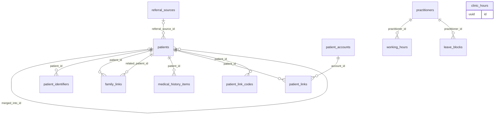

### `patients` (★ foundation)

A clinic's own record of a patient. Two clinics never share this row.

*Clinic-scoped: org_id + row-level security · sensitivity: personal · offline: read and write on devices · lifecycle: soft delete*

| Column | Type | Notes |
|---|---|---|
| `number` | `text` | SC-1042, unique per clinic, used in URLs |
| `full_name` | `text` |  |
| `search_name` | `text` | lower-case name kept by a trigger, for prefix search |
| `sex` | `sex` | female, male, other, unknown |
| `date_of_birth` | `date?` |  |
| `birth_date_estimated` | `bool` | date_of_birth was estimated from an age |
| `phone_e164` | `text?` | contact, never identity; indexed |
| `alt_phone_e164` | `text?` |  |
| `email` | `text?` |  |
| `address` | `jsonb?` |  |
| `preferred_language` | `text` |  |
| `blood_group` | `blood_group?` |  |
| `referral_source_id` | `uuid?` | → `referral_sources` |
| `referred_by_patient_id` | `uuid?` | → `patients` |
| `tags` | `text[]` |  |
| `status` | `patient_status` | active, inactive, deceased, merged, erased |
| `merged_into_id` | `uuid?` | → `patients`. set by a merge, cleared by an unmerge |
| `last_visit_at` | `timestamptz?` |  |
| `allergies_reviewed` | `allergy_review` | unknown, none_known, has_allergies; set by walk-in intake and by recording an active allergy |
| `allergies_reviewed_at` | `timestamptz?` | null exactly while unknown |
| `row_version` | `bigint` | starts at 1 and goes up when the record changes; sent as the ETag, checked against If-Match on edits |
| `legal_hold` | `bool` | stops erasure (PUT /patients/{id}/legal-hold) |
| `legal_hold_reason` | `text?` |  |
| `legal_hold_at` | `timestamptz?` |  |
| `erased_at` | `timestamptz?` | set with status erased: a tombstone with identity cleared |

A phone number is contact information, never identity: families share numbers and numbers change. A merge only sets merged_into_id; records stay on the original patient and reads resolve to the canonical one, so a wrong merge can be undone. Number, phone and name-prefix search use plain indexes; fuzzy name search goes through app.search_patients(), because trigram matching can't use an index under row-level security. Same-phone registrations get a duplicate warning, never an automatic merge.

Referenced by: `allergies.patient_id`, `appointments.patient_id`, `attachments.patient_id`, `care_episodes.patient_id`, `chat_messages.patient_id`, `clinical_notes.patient_id`, `conditions.patient_id`, `consent_forms.patient_id`, `contact_preferences.patient_id`, `data_requests.patient_id`, `document_extractions.patient_id`, `encounters.patient_id`, `family_links.patient_id`, `family_links.related_patient_id`, `import_rows.patient_id`, `invoices.patient_id`, `lab_orders.patient_id`, `medical_history_items.patient_id`, `messages.patient_id`, `observations.patient_id`, `patient_consents.patient_id`, `patient_duplicates.candidate_id`, `patient_duplicates.patient_id`, `patient_gaps.patient_id`, `patient_identifiers.patient_id`, `patient_link_codes.patient_id`, `patient_links.patient_id`, `patient_notes.patient_id`, `patients.merged_into_id`, `patients.referred_by_patient_id`, `payment_allocations.patient_id`, `payments.patient_id`, `prescriptions.patient_id`, `procedures.patient_id`, `promo_redemptions.patient_id`, `queue_tokens.patient_id`, `recalls.patient_id`, `share_links.patient_id`, `specialty_records.patient_id`, `treatment_plan_items.patient_id`, `treatment_plans.patient_id`

### `patient_identifiers` (★ foundation)

Extra IDs for a patient: the clinic's file number, smart card, ABHA, legacy import.

*Clinic-scoped: org_id + row-level security · sensitivity: personal · offline: read and write on devices · lifecycle: soft delete*

| Column | Type | Notes |
|---|---|---|
| `patient_id` | `uuid` | → `patients` |
| `kind` | `identifier_kind` | file_number, legacy, smart_card, abha_number, abha_address |
| `value` | `text` |  |

Unique (org_id, kind, value).

### `family_links`

Relationships between patients in the same clinic: parent, child, spouse, guardian.

*Clinic-scoped: org_id + row-level security · sensitivity: personal · offline: server only*

| Column | Type | Notes |
|---|---|---|
| `patient_id` | `uuid` | → `patients` |
| `related_patient_id` | `uuid` | → `patients` |
| `relation` | `relation_kind` | parent, child, spouse, guardian, other |
| `can_manage` | `bool` | guardian may act for this patient |

### `referral_sources` (★ foundation)

Where patients come from, for the finance and marketing filters.

*Clinic-scoped: org_id + row-level security · sensitivity: personal · offline: read-only on devices · lifecycle: mutable*

| Column | Type | Notes |
|---|---|---|
| `name` | `text` |  |
| `kind` | `referral_kind` | patient, doctor, online, walk_in, camp, insurance, other |
| `active` | `bool` |  |

Referenced by: `patients.referral_source_id`

### `medical_history_items`

Patient-level history: past conditions, surgeries, long-term medicines, habits, family history.

*Clinic-scoped: org_id + row-level security · sensitivity: health · offline: read and write on devices*

| Column | Type | Notes |
|---|---|---|
| `patient_id` | `uuid` | → `patients` |
| `kind` | `history_kind` | condition, surgery, long_term_medication, habit, family_history |
| `description` | `text` |  |
| `code_system` | `code_system?` | icd10, icd11, snomed, loinc, custom |
| `code` | `text?` |  |
| `code_display` | `text?` |  |
| `code_version` | `text?` |  |
| `since` | `date?` |  |
| `active` | `bool` |  |
| `source` | `record_source` | clinician, assistant, patient, import, device, ai_draft, abdm |
| `verified_by` | `uuid?` | → `memberships` |
| `verified_at` | `timestamptz?` |  |

### `patient_accounts`

A person signed in to the patient app with a verified email. Holds no clinic data.

*User-scoped: rows belong to one signed-in user · sensitivity: personal · offline: server only · lifecycle: mutable*

| Column | Type | Notes |
|---|---|---|
| `auth_uid` | `uuid` | unique: the Supabase Auth subject |
| `email` | `text` | the verified email, lower case |
| `status` | `text` | active, disabled |

Made on the first patient-app request from the token's verified email. Reached only through definer functions (app.patient_access and friends, migration 0261); app_user has no grants.

Referenced by: `patient_links.account_id`, `patient_sessions.account_id`

### `patient_links`

Connects a patient account to the clinic's record of that patient.

*Clinic-scoped: org_id + row-level security · sensitivity: personal · offline: server only · lifecycle: mutable*

| Column | Type | Notes |
|---|---|---|
| `patient_id` | `uuid` | → `patients` |
| `account_id` | `uuid` | → `patient_accounts` |
| `status` | `text` | pending, active, declined, revoked |
| `linked_via` | `text` | code (a clinic-issued link code) or clinic_confirmed (a match the patient asked for and the clinic confirmed) |
| `purpose` | `text` | care |
| `consented_at` | `timestamptz` | when the patient redeemed the code or asked |
| `linked_at` | `timestamptz?` |  |
| `decided_by` | `uuid?` | → `memberships` |
| `revoked_at` | `timestamptz?` |  |
| `revoked_by` | `text?` | patient, clinic |

Never made automatically by phone or name. One open link per account per clinic, one active account per record. Every clinic table has a restrictive patient_account policy: a patient account reads only the linked record's appointments, issued prescriptions and bills, payments and shared files.

Referenced by: `consents.patient_link_id`

### `patient_link_codes`

Link codes from "Invite to patient app": shown as a QR code and emailed through the outbox.

*Clinic-scoped: org_id + row-level security · sensitivity: personal · offline: server only · lifecycle: mutable*

| Column | Type | Notes |
|---|---|---|
| `patient_id` | `uuid` | → `patients` |
| `code_hash` | `text` | SHA-256 of the 10-character code; the code itself is never stored |
| `expires_at` | `timestamptz` | a week after issue |
| `used_at` | `timestamptz?` |  |
| `replaced_at` | `timestamptz?` | a newer code for the same record |

### `practitioners` (★ foundation)

Doctors who see patients at the clinic, with registration and fees.

*Clinic-scoped: org_id + row-level security · sensitivity: personal · offline: read-only on devices · lifecycle: soft delete*

| Column | Type | Notes |
|---|---|---|
| `membership_id` | `uuid?` | → `memberships`. null for a visiting consultant without a sign-in |
| `display_name` | `text` |  |
| `registration_number` | `text?` |  |
| `qualifications` | `text?` |  |
| `specialty` | `text?` |  |
| `calendar_color` | `text` | #RRGGBB |
| `active` | `bool` |  |

Built in M3 with the columns the calendar needs. Planned: slug (public page), qualifications, council, signature_asset_id -> assets, default_fee_paise, is_visiting.

Referenced by: `appointments.practitioner_id`, `booking_requests.practitioner_id`, `care_episodes.practitioner_id`, `consents.grantee_practitioner_id`, `consultant_fee_rules.practitioner_id`, `consultant_payouts.practitioner_id`, `leave_blocks.practitioner_id`, `queue_tokens.practitioner_id`, `working_hours.practitioner_id`

### `working_hours` (★ foundation)

Weekly hours per clinic or doctor. Split shifts are two rows.

*Clinic-scoped: org_id + row-level security · sensitivity: personal · offline: read-only on devices · lifecycle: ephemeral*

| Column | Type | Notes |
|---|---|---|
| `practitioner_id` | `uuid` | → `practitioners` |
| `branch_id` | `uuid` | → `branches` |
| `weekday` | `smallint` | 1 Monday to 7 Sunday |
| `starts` | `time` |  |
| `ends` | `time` |  |

Replaced as a whole per doctor. Clinic opening hours are in clinic_hours. valid_from/valid_to are planned.

### `clinic_hours`

When each branch of the clinic is open, by weekday. Split shifts are two rows.

*Clinic-scoped: org_id + row-level security · sensitivity: personal · offline: server only · lifecycle: ephemeral*

| Column | Type | Notes |
|---|---|---|
| `branch_id` | `uuid` | → `branches` |
| `weekday` | `smallint` | 1 Monday to 7 Sunday |
| `starts` | `time` |  |
| `ends` | `time` |  |

Built (migration 0330). Replaced as a whole per branch (GET/PUT /clinic-hours). Chair utilization counts open minutes from it, nine hours a day when a branch has none. Clinics that existed got the union of their active doctors' hours.

### `leave_blocks` (★ foundation)

Time a doctor is unavailable. Booking into it is allowed with a warning.

*Clinic-scoped: org_id + row-level security · sensitivity: personal · offline: server only · lifecycle: ephemeral*

| Column | Type | Notes |
|---|---|---|
| `practitioner_id` | `uuid` | → `practitioners` |
| `starts_at` | `timestamptz` |  |
| `ends_at` | `timestamptz` |  |
| `reason` | `text?` |  |

## Scheduling (`scheduling`)

Appointments, their history, and the walk-in token queue.

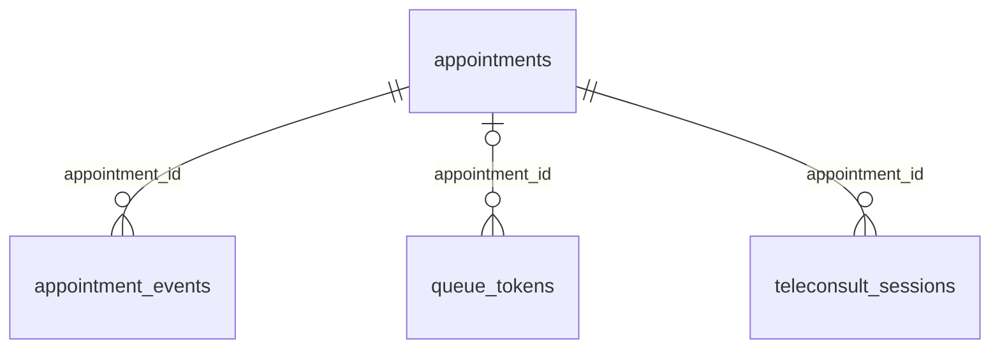

### `appointments` (★ foundation)

A booked slot with a doctor, optionally in a room or chair.

*Clinic-scoped: org_id + row-level security · sensitivity: personal · offline: read and write on devices · lifecycle: soft delete*

| Column | Type | Notes |
|---|---|---|
| `patient_id` | `uuid` | → `patients` |
| `practitioner_id` | `uuid` | → `practitioners` |
| `branch_id` | `uuid` | → `branches` |
| `room_id` | `uuid?` | → `rooms` |
| `starts_at` | `timestamptz` |  |
| `ends_at` | `timestamptz` |  |
| `status` | `appointment_status` | requested, booked, confirmed, arrived, in_chair, completed, cancelled, no_show |
| `kind` | `appointment_kind` | new, follow_up, procedure, emergency |
| `reason` | `text?` |  |
| `notes` | `text?` | front-desk note |
| `source` | `booking_source` | front_desk, phone, website, app, whatsapp |
| `cancel_reason` | `text?` | required when cancelled |
| `arrived_at` | `timestamptz?` |  |
| `seated_at` | `timestamptz?` |  |
| `completed_at` | `timestamptz?` |  |
| `booked_by_account` | `uuid?` | Supabase auth id of the patient who booked online; null for staff bookings |
| `row_version` | `bigint` | starts at 1 and goes up when the record changes; sent as the ETag, checked against If-Match on edits |

Online self-bookings start as requested (or confirmed when the clinic auto-confirms); a unique index on (doctor, start) for active self-bookings backs the per-doctor check. An exclusion constraint on (org_id, room_id, time range) for active rows (not cancelled, not no-show, not deleted) stops two bookings in one chair; a doctor in two chairs at once is a warning, not an error. Status changes follow the transition table in aarogyam_domain::schedule. Visits point at appointments, not the other way round.

Referenced by: `appointment_events.appointment_id`, `booking_requests.appointment_id`, `encounters.appointment_id`, `messages.appointment_id`, `queue_tokens.appointment_id`, `staff_inbox_messages.appointment_id`, `staff_notifications.appointment_id`, `teleconsult_sessions.appointment_id`

### `appointment_events` (★ foundation)

Every status change of an appointment, for history and no-show reports.

*Clinic-scoped: org_id + row-level security · sensitivity: personal · offline: read and write on devices · lifecycle: append only*

| Column | Type | Notes |
|---|---|---|
| `appointment_id` | `uuid` | → `appointments` |
| `kind` | `appointment_event_kind` | booked, changed, status |
| `from_status` | `appointment_status?` |  |
| `to_status` | `appointment_status?` |  |
| `changes` | `jsonb?` | {column: [old, new]} for times, room and doctor |
| `at` | `timestamptz` |  |
| `note` | `text?` |  |

### `queue_tokens` (★ foundation)

Walk-in tokens shown on the waiting-room screen.

*Clinic-scoped: org_id + row-level security · sensitivity: personal · offline: read and write on devices · lifecycle: mutable*

| Column | Type | Notes |
|---|---|---|
| `branch_id` | `uuid` | → `branches` |
| `day` | `date` | clinic's local date |
| `token_number` | `int` |  |
| `patient_id` | `uuid` | → `patients` |
| `appointment_id` | `uuid?` | → `appointments`. null for a walk-in |
| `practitioner_id` | `uuid?` | → `practitioners` |
| `status` | `token_status` | waiting, called, in_chair, ready_to_bill, done, left (called and ready_to_bill: migration 0610) |
| `issued_at` | `timestamptz` |  |
| `called_at` | `timestamptz?` |  |
| `done_at` | `timestamptz?` |  |
| `room_id` | `uuid?` | → `rooms`. the chair chosen when seated; a room of the token's branch (migration 0384) |

Unique (org_id, branch_id, day, token_number) and one token per appointment. Unique (org_id, id, patient_id) so a visit started from a token is the same patient's. Numbers come from number_sequences (kind queue_token, series = branch, period = local date). Starting a visit from a token seats it; closing that visit marks it done.

Referenced by: `encounters.queue_token_id`

### `teleconsult_sessions`

A video or audio consultation attached to an appointment.

*Clinic-scoped: org_id + row-level security · sensitivity: personal · offline: server only*

| Column | Type | Notes |
|---|---|---|
| `appointment_id` | `uuid` | → `appointments` |
| `provider` | `text` | video service used |
| `room_ref` | `text` | the provider's room id, never a public link |
| `status` | `tele_status` | scheduled, live, ended, failed |
| `started_at` | `timestamptz?` |  |
| `ended_at` | `timestamptz?` |  |
| `patient_joined_at` | `timestamptz?` |  |

Follows the 2020 Telemedicine Practice Guidelines; the prescription is issued in the usual way afterwards.

## Clinical (`clinical`)

Visits, notes, vitals, diagnoses, prescriptions, procedures, treatment plans, files and specialty data.

```mermaid
erDiagram
  encounters ||--o{ clinical_notes : "encounter_id"
  clinical_notes |o--o{ clinical_notes : "conflicts_with_id"
  clinical_notes ||--o{ note_addenda : "note_id"
  encounters |o--o{ observations : "encounter_id"
  observations |o--o{ observations : "supersedes_id"
  encounters |o--o{ conditions : "encounter_id"
  encounters |o--o{ prescriptions : "encounter_id"
  prescriptions |o--o{ prescriptions : "supersedes_id"
  document_templates |o--o{ prescriptions : "template_id"
  prescriptions ||--o{ prescription_items : "prescription_id"
  drug_catalog |o--o{ prescription_items : "drug_id"
  encounters ||--o{ procedures : "encounter_id"
  treatment_plan_items |o--o{ procedures : "treatment_plan_item_id"
  encounters |o--o{ treatment_plans : "encounter_id"
  treatment_plans ||--o{ treatment_plan_items : "plan_id"
  encounters |o--o{ attachments : "encounter_id"
  clinical_notes |o--o{ attachments : "note_id"
  note_addenda |o--o{ attachments : "addendum_id"
  attachments ||--o{ voice_notes : "attachment_id"
  encounters ||--o{ voice_notes : "encounter_id"
  clinical_notes |o--o{ voice_notes : "draft_note_id"
  encounters |o--o{ specialty_records : "encounter_id"
  specialty_records |o--o{ specialty_records : "supersedes_id"
  prescriptions ||--o{ prescription_alerts : "prescription_id"
  prescription_items |o--o{ prescription_alerts : "prescription_item_id"
  drug_catalog ||--o{ drug_interactions : "drug_a_id"
  drug_catalog ||--o{ drug_interactions : "drug_b_id"
  attachments ||--o{ document_extractions : "attachment_id"
  document_templates ||--o{ consent_forms : "template_id"
  procedures |o--o{ consent_forms : "procedure_id"
  attachments ||--o{ consent_forms : "signature_attachment_id"
  attachments |o--o{ consent_forms : "pdf_attachment_id"
  allergies {
    uuid id
  }
  care_episodes {
    uuid id
  }
  dental_terms {
    uuid id
  }
  patient_notes {
    uuid id
  }
```

### `care_episodes`

A course of care spanning visits: a root canal on tooth 36, a pregnancy, a diabetes plan.

*Clinic-scoped: org_id + row-level security · sensitivity: health · offline: server only*

| Column | Type | Notes |
|---|---|---|
| `patient_id` | `uuid` | → `patients` |
| `practitioner_id` | `uuid?` | → `practitioners` |
| `pack` | `text?` |  |
| `kind` | `text` | root_canal, pregnancy, chronic_care ... |
| `title` | `text` |  |
| `status` | `episode_status` | active, completed, cancelled |
| `started_at` | `timestamptz` |  |
| `ended_at` | `timestamptz?` |  |

Optional: visits, treatment plans and specialty records may link to an episode. Built when a pack needs it.

### `encounters` (★ foundation)

One visit. Visit-level clinical data (complaint, vitals, notes, procedures, files) hangs off it.

*Clinic-scoped: org_id + row-level security · sensitivity: health · offline: read and write on devices · lifecycle: mutable*

| Column | Type | Notes |
|---|---|---|
| `number` | `text` | V-318, issued by the server |
| `patient_id` | `uuid` | → `patients` |
| `clinician_id` | `uuid` | → `memberships`. the member responsible; a doctor's practitioner record hangs off the same membership |
| `branch_id` | `uuid` | → `branches` |
| `appointment_id` | `uuid?` | → `appointments`. foreign key added once appointments exist; one visit per appointment |
| `status` | `encounter_status` | open, closed |
| `chief_complaint` | `text?` |  |
| `started_at` | `timestamptz` |  |
| `ended_at` | `timestamptz?` | set when closed |
| `queue_token_id` | `uuid?` | → `queue_tokens`. the token it was started from; one visit per token, same patient (migration 0310) |

Unique (org_id, id, patient_id): every child row carries patient_id and a composite foreign key (org_id, encounter_id, patient_id), so a visit's notes, vitals, procedures and files can't belong to another patient. Patient-level facts (allergies, active conditions, history) live on the patient and may be updated during a visit; they do not require one. Opening a visit writes access_log.

Referenced by: `attachments.encounter_id`, `clinical_notes.encounter_id`, `conditions.encounter_id`, `invoices.encounter_id`, `lab_orders.encounter_id`, `observations.encounter_id`, `prescriptions.encounter_id`, `procedures.encounter_id`, `specialty_records.encounter_id`, `treatment_plans.encounter_id`, `voice_notes.encounter_id`

### `clinical_notes` (★ foundation)

Doctor and intake notes. Signed notes never change.

*Clinic-scoped: org_id + row-level security · sensitivity: health · offline: read and write on devices · lifecycle: finalizable*

| Column | Type | Notes |
|---|---|---|
| `encounter_id` | `uuid` | → `encounters` |
| `patient_id` | `uuid` | → `patients` |
| `author_id` | `uuid` | → `memberships` |
| `kind` | `note_kind` | soap, progress, procedure, intake, front_desk |
| `body` | `jsonb` | sections: subjective, objective, assessment, plan |
| `source` | `note_source` | typed, voice, ai_draft |
| `status` | `note_status` | draft, signed, conflict, entered_in_error |
| `signed_at` | `timestamptz?` |  |
| `signed_by` | `uuid?` | → `memberships`. the author; only they may sign |
| `conflicts_with_id` | `uuid?` | → `clinical_notes`. the version this one collided with during sync |
| `error_reason` | `text?` | required when marked entered_in_error |
| `error_at` | `timestamptz?` |  |
| `error_by` | `uuid?` | → `memberships` |
| `row_version` | `bigint` | starts at 1 and goes up when the record changes; sent as the ETag, checked against If-Match on edits |

Drafts are edited by their author only. Signing freezes the note: app.freeze_when() lets a signed or conflict note only move to entered_in_error (with a reason) and nothing else on it change. Never merged automatically: if a change synced from a device collides with a note already signed on the server, it is kept as a separate note with status conflict, linked by conflicts_with_id, and its author resolves it by marking one version entered_in_error. Corrections go in note_addenda.

Referenced by: `attachments.note_id`, `clinical_notes.conflicts_with_id`, `note_addenda.note_id`, `voice_notes.draft_note_id`

### `patient_notes`

One summary note per patient, kept up to date by clinicians outside any single visit.

*Clinic-scoped: org_id + row-level security · sensitivity: health · offline: server only · lifecycle: mutable*

| Column | Type | Notes |
|---|---|---|
| `patient_id` | `uuid` | → `patients`. unique: one summary note per patient |
| `body` | `text` | a strict Markdown subset (headings, lists, bold, italic), validated on save |
| `row_version` | `bigint` | starts at 1 and goes up when the text changes; sent as the ETag, checked against If-Match on edits |

Edited by any member with clinical.write whose scope reaches the patient; every change is audited. Visit notes stay in clinical_notes and signed ones change only through addenda.

### `note_addenda` (★ foundation)

Corrections and additions to a signed note, with their own author and time.

*Clinic-scoped: org_id + row-level security · sensitivity: health · offline: read and write on devices · lifecycle: append only*

| Column | Type | Notes |
|---|---|---|
| `note_id` | `uuid` | → `clinical_notes` |
| `author_id` | `uuid` | → `memberships` |
| `body` | `text` |  |

Referenced by: `attachments.addendum_id`

### `observations` (★ foundation)

Measurements: BP, pulse, temperature, SpO2, weight, height, sugar.

*Clinic-scoped: org_id + row-level security · sensitivity: health · offline: read and write on devices · lifecycle: finalizable*

| Column | Type | Notes |
|---|---|---|
| `patient_id` | `uuid` | → `patients` |
| `encounter_id` | `uuid?` | → `encounters` |
| `kind` | `observation_kind` | bp_systolic, bp_diastolic, pulse, temperature, spo2, weight, height, blood_sugar |
| `value_num` | `numeric` | checked against a plausible range per kind and unit |
| `unit` | `text` | UCUM: mmHg, /min, Cel, [degF], %, kg, cm, mg/dL |
| `code_system` | `code_system?` | icd10, icd11, snomed, loinc, custom |
| `code` | `text?` | LOINC code per kind, set by the server |
| `recorded_at` | `timestamptz` |  |
| `status` | `observation_status` | final, corrected, entered_in_error |
| `supersedes_id` | `uuid?` | → `observations`. the value this one corrects (same patient and kind) |
| `error_reason` | `text?` |  |
| `source` | `record_source` | clinician, assistant, patient, import, device, ai_draft, abdm |
| `verified_by` | `uuid?` | → `memberships` |
| `verified_at` | `timestamptz?` |  |

Values are never edited: a correction is a new row that supersedes the old one, which moves to corrected and stays visible. app.freeze_when() allows only final -> corrected or entered_in_error. A row with source ai_draft needs verified_by.

Referenced by: `observations.supersedes_id`

### `conditions` (★ foundation)

Diagnoses and the problem list. Patient-level; a visit link records where it was found.

*Clinic-scoped: org_id + row-level security · sensitivity: health · offline: read and write on devices · lifecycle: mutable*

| Column | Type | Notes |
|---|---|---|
| `patient_id` | `uuid` | → `patients` |
| `encounter_id` | `uuid?` | → `encounters` |
| `display_text` | `text` | what the doctor wrote, always present |
| `code_system` | `code_system?` | icd10, icd11, snomed, loinc, custom |
| `code` | `text?` |  |
| `status` | `condition_status` | active, resolved, entered_in_error |
| `flagged` | `bool` | shown in the clinical flags banner while active |
| `onset` | `date?` |  |
| `note` | `text?` |  |
| `source` | `record_source` | clinician, assistant, patient, import, device, ai_draft, abdm |
| `verified_by` | `uuid?` | → `memberships` |
| `verified_at` | `timestamptz?` |  |

### `allergies` (★ foundation)

Allergies, shown as a warning banner on the patient and on prescriptions.

*Clinic-scoped: org_id + row-level security · sensitivity: health · offline: read and write on devices · lifecycle: mutable*

| Column | Type | Notes |
|---|---|---|
| `patient_id` | `uuid` | → `patients` |
| `substance` | `text` |  |
| `code_system` | `code_system?` | icd10, icd11, snomed, loinc, custom |
| `code` | `text?` |  |
| `reaction` | `text?` |  |
| `severity` | `severity` | mild, moderate, severe |
| `status` | `allergy_status` | active, resolved, entered_in_error |
| `source` | `record_source` | clinician, assistant, patient, import, device, ai_draft, abdm |
| `verified_by` | `uuid?` | → `memberships`. who recorded or confirmed it; null while a patient-reported allergy awaits a clinician |
| `verified_at` | `timestamptz?` |  |

Allergies the front desk records at a walk-in (intake.write, migration 0310) have source patient and no verifier until a clinician confirms them (POST /patients/{id}/allergies/{aid}/confirm); entries by clinicians are verified by whoever records them. Recording an active allergy sets patients.allergies_reviewed to has_allergies.

### `drug_catalog`

Shared list of medicines (generic name, strength, form, usual dose) for quick prescribing.

*Platform-wide: no tenant, written by Sakalya or the system · sensitivity: public · offline: read-only on devices*

| Column | Type | Notes |
|---|---|---|
| `generic_name` | `text` |  |
| `brand_name` | `text?` |  |
| `strength` | `text` |  |
| `form` | `drug_form` | tablet, capsule, syrup, gel, mouthwash ... |
| `default_dose` | `text` |  |
| `default_frequency` | `text` | 1-0-1 |
| `default_timing` | `dose_timing?` |  |
| `default_duration_days` | `smallint?` |  |
| `allergy_classes` | `text[]` | penicillin, nsaid ...; lets the allergy check match a class |
| `active` | `bool` |  |

Referenced by: `drug_interactions.drug_a_id`, `drug_interactions.drug_b_id`, `prescription_items.drug_id`

### `prescriptions` (★ foundation)

A prescription from a visit: shown to staff and the patient, printed with the clinic letterhead.

*Clinic-scoped: org_id + row-level security · sensitivity: health · offline: read and write on devices · lifecycle: finalizable*

| Column | Type | Notes |
|---|---|---|
| `number` | `text?` | RX-412, assigned by the server when issued |
| `encounter_id` | `uuid?` | → `encounters`. same patient |
| `patient_id` | `uuid` | → `patients` |
| `diagnosis_text` | `text?` |  |
| `advice` | `text?` | diet, care, warnings |
| `follow_up_on` | `date?` |  |
| `language` | `text` | patient's language for instructions |
| `status` | `rx_status` | draft, issued, cancelled |
| `issued_at` | `timestamptz?` |  |
| `issued_by` | `uuid?` | → `memberships` |
| `override_reason` | `text?` | why it was issued despite allergy alerts |
| `verify_token` | `text?` | the QR's random token; opens only validity, date and clinic, so reprints keep it |
| `letterhead` | `jsonb?` | snapshot at issue |
| `doctor` | `jsonb?` | name, registration number at issue |
| `recipient` | `jsonb?` | patient name, number, age and sex at issue |
| `footer` | `text?` |  |
| `cancel_reason` | `text?` |  |
| `cancelled_at` | `timestamptz?` |  |
| `cancelled_by` | `uuid?` | → `memberships` |
| `supersedes_id` | `uuid?` | → `prescriptions`. the prescription this one replaces |
| `template_id` | `uuid?` | → `document_templates`. print layout |

Issued prescriptions never change (a trigger refuses): a correction cancels and reissues. The print shows the doctor's name, qualifications and registration number, generic names in capitals, the clinic's branding, and a small 'Prescribed with Aarogyam' footer with a QR code that opens the verified copy.

Referenced by: `prescription_alerts.prescription_id`, `prescription_items.prescription_id`, `prescriptions.supersedes_id`, `share_links.prescription_id`

### `prescription_items` (★ foundation)

One medicine on a prescription.

*Clinic-scoped: org_id + row-level security · sensitivity: health · offline: read and write on devices · lifecycle: finalizable*

| Column | Type | Notes |
|---|---|---|
| `prescription_id` | `uuid` | → `prescriptions` |
| `line_no` | `smallint` |  |
| `drug_id` | `uuid?` | → `drug_catalog` |
| `drug_name` | `text` | as printed; generic name in capitals |
| `strength` | `text?` |  |
| `form` | `text?` |  |
| `dose` | `text` |  |
| `frequency` | `text` | 1-0-1 |
| `timing` | `dose_timing?` | before_food, after_food, empty_stomach, bedtime, sos, as_directed |
| `duration_days` | `smallint?` |  |
| `instructions` | `text?` | in the prescription's language |

Referenced by: `prescription_alerts.prescription_item_id`

### `procedures` (★ foundation)

Treatment actually done (or planned for today) in a visit.

*Clinic-scoped: org_id + row-level security · sensitivity: health · offline: read and write on devices · lifecycle: finalizable*

| Column | Type | Notes |
|---|---|---|
| `encounter_id` | `uuid` | → `encounters` |
| `patient_id` | `uuid` | → `patients` |
| `clinician_id` | `uuid` | → `memberships` |
| `name` | `text` |  |
| `code_system` | `code_system?` | icd10, icd11, snomed, loinc, custom |
| `code` | `text?` |  |
| `tooth` | `smallint?` | FDI: 11-48 permanent, 51-85 primary |
| `surfaces` | `text[]` | subset of M, O, D, B, L |
| `status` | `procedure_status` | planned, done, entered_in_error |
| `performed_at` | `timestamptz?` |  |
| `price_paise` | `bigint?` | the fee; billing (M5) links it to the price list |
| `treatment_plan_item_id` | `uuid?` | → `treatment_plan_items`. same patient; completing the procedure marks the item done |
| `note` | `text?` |  |
| `error_reason` | `text?` |  |

Done procedures are frozen by app.freeze_when() (only done -> entered_in_error). One live procedure per plan item. Marking done will deduct stock via procedure_materials and can create a lab_order.

Referenced by: `consent_forms.procedure_id`, `invoice_items.procedure_id`, `lab_orders.procedure_id`, `recalls.source_procedure_id`

### `treatment_plans` (★ foundation)

A proposed course of treatment with a cost estimate, accepted or declined by the patient.

*Clinic-scoped: org_id + row-level security · sensitivity: health · offline: server only · lifecycle: mutable*

| Column | Type | Notes |
|---|---|---|
| `patient_id` | `uuid` | → `patients` |
| `clinician_id` | `uuid` | → `memberships` |
| `encounter_id` | `uuid?` | → `encounters`. the visit it was proposed in |
| `title` | `text` |  |
| `status` | `plan_status` | proposed, accepted, in_progress, completed, declined |
| `accepted_at` | `timestamptz?` |  |

The estimate is the sum of its items that aren't cancelled, computed when read.

Referenced by: `treatment_plan_items.plan_id`

### `treatment_plan_items` (★ foundation)

Steps of a treatment plan, in phases.

*Clinic-scoped: org_id + row-level security · sensitivity: health · offline: server only · lifecycle: mutable*

| Column | Type | Notes |
|---|---|---|
| `plan_id` | `uuid` | → `treatment_plans` |
| `patient_id` | `uuid` | → `patients`. same as the plan's |
| `name` | `text` |  |
| `code_system` | `code_system?` | icd10, icd11, snomed, loinc, custom |
| `code` | `text?` |  |
| `tooth` | `smallint?` | FDI: 11-48 permanent, 51-85 primary |
| `surfaces` | `text[]` | subset of M, O, D, B, L |
| `phase` | `smallint` |  |
| `estimate_paise` | `bigint` |  |
| `status` | `plan_item_status` | proposed, accepted, done, cancelled |

Accepting a plan accepts the chosen items and cancels the rest. An item becomes done when its procedure is done; the plan is then in_progress, and completed when no item is left to do.

Referenced by: `procedures.treatment_plan_item_id`

### `attachments` (★ foundation)

Patient files: photos, X-rays, reports, documents, audio, signed consent.

*Clinic-scoped: org_id + row-level security · sensitivity: health · offline: read and write on devices · lifecycle: soft delete*

| Column | Type | Notes |
|---|---|---|
| `patient_id` | `uuid` | → `patients` |
| `encounter_id` | `uuid?` | → `encounters` |
| `kind` | `attachment_kind` | photo, xray, report, document, audio, consent |
| `storage_key` | `text` | <org_id>/<id>, never from a file name |
| `mime_type` | `text` | from the content: JPEG, PNG, PDF, DICOM, or WebM, MP4, Ogg audio |
| `size_bytes` | `bigint` | at most 10 MB |
| `sha256` | `text` |  |
| `caption` | `text?` |  |
| `label` | `text?` | OPG, Intraoral - upper, X-ray, Consent or the clinic's own, up to 60 characters |
| `tooth` | `smallint?` | FDI: 11-48 permanent, 51-85 primary |
| `taken_at` | `timestamptz?` |  |
| `source` | `record_source` | clinician, assistant, patient, import, device, ai_draft, abdm |
| `note_id` | `uuid?` | → `clinical_notes`. a voice recording's note, in the same visit |
| `addendum_id` | `uuid?` | → `note_addenda`. how a recording joins a signed note |
| `duration_seconds` | `int?` | a recording, 1 to 600 |
| `language` | `text?` | a recording: en-IN, hi-IN, mr-IN |
| `shared_with_patient` | `bool` | shown in the patient app; never for audio |
| `lab_order_id` | `uuid?` | → `lab_orders`. the same patient's lab order (migration 0362; not read yet) |

A trigger refuses a recording on a signed note unless it carries an addendum. Served only through short-lived signed links (HMAC, 5 minutes) issued after a permission check; each download writes access_log. Local disk in development, object storage later, behind one Storage trait.

Referenced by: `consent_forms.pdf_attachment_id`, `consent_forms.signature_attachment_id`, `document_extractions.attachment_id`, `voice_notes.attachment_id`

### `voice_notes`

A recorded note, its transcription status and the draft it produced.

*Clinic-scoped: org_id + row-level security · sensitivity: health · offline: read and write on devices*

| Column | Type | Notes |
|---|---|---|
| `attachment_id` | `uuid` | → `attachments` |
| `encounter_id` | `uuid` | → `encounters` |
| `duration_ms` | `int` |  |
| `language` | `text` |  |
| `transcript_status` | `transcript_status` | pending, processing, done, failed |
| `transcript` | `text?` |  |
| `draft_note_id` | `uuid?` | → `clinical_notes` |

### `specialty_records` (★ foundation)

Specialty Pack data as versioned JSON. Longitudinal: a tooth chart or pregnancy spans many visits.

*Clinic-scoped: org_id + row-level security · sensitivity: health · offline: read and write on devices · lifecycle: finalizable*

| Column | Type | Notes |
|---|---|---|
| `patient_id` | `uuid` | → `patients` |
| `encounter_id` | `uuid?` | → `encounters`. the visit that changed it, if any |
| `module` | `text` | dental, general, obstetrics, pediatrics ... |
| `kind` | `text` | tooth (dental chart entry), pregnancy, growth |
| `schema_version` | `int` |  |
| `data` | `jsonb` | validated against the module's schema on write; dental: tooth, surface, finding, procedure, material, note (procedure and material are term ids: seeded or dental_terms) |
| `tooth` | `smallint?` | generated from data.tooth (FDI 11-48, 51-85) |
| `surface` | `text?` | generated from data.surface: M, O, D, B, L, or none for the whole tooth |
| `status` | `record_status` | current, superseded, entered_in_error |
| `supersedes_id` | `uuid?` | → `specialty_records`. the entry this one replaced |
| `error_reason` | `text?` |  |
| `effective_at` | `timestamptz` |  |
| `source` | `record_source` | clinician, assistant, patient, import, device, ai_draft, abdm |
| `verified_by` | `uuid?` | → `memberships` |
| `verified_at` | `timestamptz?` |  |

Each change writes a new row and marks the previous current one superseded, so the full history (tooth 36: caries, filled, crown) is kept. A partial unique index keeps one current entry per tooth and surface; a crown, implant or missing tooth also supersedes that tooth's surface entries. app.freeze_when() allows only current -> superseded or entered_in_error.

Referenced by: `specialty_records.supersedes_id`

### `dental_terms`

A clinic's own dental procedures and materials, beside the seeded vocabulary in specialties/dental/vocabulary.json.

*Clinic-scoped: org_id + row-level security · sensitivity: health · offline: server only · lifecycle: mutable*

| Column | Type | Notes |
|---|---|---|
| `kind` | `text` | procedure, material |
| `label` | `text` | unique per list ignoring case; may be renamed |
| `added_by` | `uuid` | → `memberships` |
| `retired_at` | `timestamptz?` | no longer offered for new entries |
| `retired_by` | `uuid?` | → `memberships` |

Chart entries name a term by id: a seeded id such as zirconia, or one of these UUIDs, and are never rewritten, so a rename shows on old entries; the change history keeps old labels. Only label and retirement change (column grants and a trigger); never deleted. The list arrives with the chart (retired terms left out) and clients filter it as the clinician types.

### `document_templates` (★ foundation)

Print and form layouts: prescriptions, bills, consent forms, certificates, letters.

*Clinic-scoped: org_id + row-level security · sensitivity: internal · offline: read-only on devices · lifecycle: soft delete*

| Column | Type | Notes |
|---|---|---|
| `kind` | `doc_template_kind` | prescription, invoice, consent, certificate, letter |
| `name` | `text` |  |
| `paper` | `paper_size` | a4, a5, thermal_80mm |
| `uses_letterhead` | `bool` | print on pre-printed paper |
| `body` | `text` | with placeholders |
| `pack` | `text?` |  |
| `is_default` | `bool` |  |

Aarogyam's default layouts are copied into each clinic as data, so org_id is never null.

Referenced by: `consent_forms.template_id`, `prescriptions.template_id`

### `prescription_alerts`

Safety warnings raised when a prescription was issued, and what the doctor did about them.

*Clinic-scoped: org_id + row-level security · sensitivity: health · offline: server only · lifecycle: append only*

| Column | Type | Notes |
|---|---|---|
| `prescription_id` | `uuid` | → `prescriptions` |
| `prescription_item_id` | `uuid?` | → `prescription_items` |
| `kind` | `alert_kind` | allergy, interaction, contraindication, pregnancy, lactation, pediatric_dose, duplicate, precaution |
| `severity` | `alert_severity` | info, caution, serious |
| `message` | `text` |  |
| `source` | `alert_source` | allergy_record, drug_database, ai |
| `action` | `alert_action` | accepted_change, overridden, dismissed |
| `override_reason` | `text?` |  |
| `acted_by` | `uuid` | → `memberships` |

Overrides are kept with their reason for medico-legal review.

### `drug_interactions`

Licensed reference data: which medicines interact, how badly, and why.

*Platform-wide: no tenant, written by Sakalya or the system · sensitivity: public · offline: read-only on devices*

| Column | Type | Notes |
|---|---|---|
| `drug_a_id` | `uuid` | → `drug_catalog` |
| `drug_b_id` | `uuid` | → `drug_catalog` |
| `severity` | `alert_severity` |  |
| `description` | `text` |  |
| `source_version` | `text` |  |

Loaded from a licensed Indian drug database; contraindications and pregnancy categories sit alongside it.

### `document_extractions`

Smart Scan: values read from a photographed paper report, waiting for confirmation.

*Clinic-scoped: org_id + row-level security · sensitivity: health · offline: server only*

| Column | Type | Notes |
|---|---|---|
| `attachment_id` | `uuid` | → `attachments` |
| `patient_id` | `uuid` | → `patients` |
| `status` | `extraction_status` | pending, extracted, confirmed, rejected |
| `extracted` | `jsonb` | test names, values, units, dates |
| `confirmed_by` | `uuid?` | → `memberships` |
| `confirmed_at` | `timestamptz?` |  |

Nothing enters observations until a person confirms it; confirmed rows carry source = import.

### `consent_forms`

A signed procedure consent.

*Clinic-scoped: org_id + row-level security · sensitivity: health · offline: server only*

| Column | Type | Notes |
|---|---|---|
| `patient_id` | `uuid` | → `patients` |
| `template_id` | `uuid` | → `document_templates` |
| `procedure_id` | `uuid?` | → `procedures` |
| `signed_at` | `timestamptz` |  |
| `signature_attachment_id` | `uuid` | → `attachments` |
| `pdf_attachment_id` | `uuid?` | → `attachments` |

## Clinic operations (`ops`)

Lab work, inventory and stock, equipment maintenance, payroll and consultant fees.

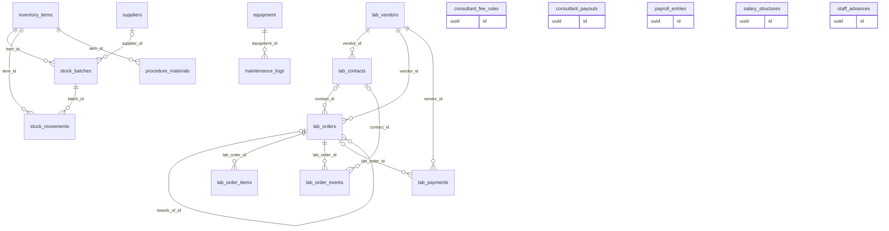

### `lab_vendors`

Outside labs: dental labs for crowns, pathology, radiology.

*Clinic-scoped: org_id + row-level security · sensitivity: internal · offline: server only · lifecycle: soft delete*

| Column | Type | Notes |
|---|---|---|
| `name` | `text` | unique per clinic among live labs |
| `kind` | `lab_kind` | dental_lab, pathology, radiology, other |
| `phone_e164` | `text?` |  |
| `email` | `text?` |  |
| `address` | `text?` |  |
| `note` | `text?` |  |
| `deleted_at` | `timestamptz?` |  |

Built (migration 0361). labs.read / labs.write. Removing a lab removes its contacts; its orders and payments stay. Phone, email, address and note are masked in the change history.

Referenced by: `lab_contacts.vendor_id`, `lab_orders.vendor_id`, `lab_payments.vendor_id`

### `lab_contacts`

The people at a lab: several per lab, each reachable their own way.

*Clinic-scoped: org_id + row-level security · sensitivity: personal · offline: server only · lifecycle: soft delete*

| Column | Type | Notes |
|---|---|---|
| `vendor_id` | `uuid` | → `lab_vendors` |
| `name` | `text` |  |
| `role` | `text?` |  |
| `phone_e164` | `text?` |  |
| `email` | `text?` | lab reminders go here |
| `whatsapp` | `bool` | needs a phone |
| `preferred_channel` | `text` | email, whatsapp, phone |
| `deleted_at` | `timestamptz?` |  |

Built (migration 0361). Not patients: reminders reach them through the outbox with recipient set. Name, phone and email are masked in the change history; retention class lab_contacts (365 days after removal).

Referenced by: `lab_order_events.contact_id`, `lab_orders.contact_id`

### `lab_orders`

Work sent to a lab for a patient, its due date and where it is.

*Clinic-scoped: org_id + row-level security · sensitivity: health · offline: server only*

| Column | Type | Notes |
|---|---|---|
| `number` | `text` | LAB-<n> from number_sequences kind lab_order |
| `vendor_id` | `uuid` | → `lab_vendors` |
| `contact_id` | `uuid?` | → `lab_contacts`. a contact of the same lab |
| `patient_id` | `uuid` | → `patients` |
| `doctor_id` | `uuid` | → `memberships`. responsible; app.clinical_in_reach |
| `procedure_id` | `uuid?` | → `procedures`. of the same patient |
| `encounter_id` | `uuid?` | → `encounters`. of the same patient |
| `status` | `lab_status` | draft, sent, in_progress, received, fitted, returned_for_rework, cancelled |
| `stage` | `text?` | wax try-in, framework trial, bisque |
| `instructions` | `text?` | masked in the change history |
| `sent_at` | `timestamptz?` |  |
| `due_on` | `date?` |  |
| `received_at` | `timestamptz?` |  |
| `rework_of_id` | `uuid?` | → `lab_orders`. the order this one remakes, same patient |
| `due_soon_reminded_on` | `date?` |  |
| `due_today_reminded_on` | `date?` |  |
| `overdue_flagged_on` | `date?` | reminder steps; cleared when due_on changes (trigger) |
| `last_contacted_at` | `timestamptz?` | contact log or manual reminder (migration 0364) |
| `last_contacted_by` | `uuid?` | → `memberships` |

Built (migration 0361). Status moves forward only (draft -> sent/cancelled; sent -> in_progress/received/cancelled; in_progress -> received/cancelled; received -> fitted/returned_for_rework). The outbox job emails the lab two days before and on the due date, and flags overdue work, each once per due date (app.run_lab_reminders, migration 0363). Reminders never name the patient. Retention class lab_work (8 years).

Referenced by: `attachments.lab_order_id`, `lab_order_events.lab_order_id`, `lab_order_items.lab_order_id`, `lab_orders.rework_of_id`, `lab_payments.lab_order_id`, `staff_notifications.lab_order_id`

### `lab_order_items`

What the lab makes on an order: a crown on 36 in A2 zirconia.

*Clinic-scoped: org_id + row-level security · sensitivity: health · offline: server only · lifecycle: ephemeral*

| Column | Type | Notes |
|---|---|---|
| `lab_order_id` | `uuid` | → `lab_orders` |
| `line_no` | `smallint` | 1-50 |
| `work_type` | `text` |  |
| `teeth` | `smallint[]` | FDI, up to 32 |
| `shade` | `text?` |  |
| `material` | `text?` |  |
| `qty` | `int` | 1-100 |
| `unit_cost_paise` | `bigint?` | seen and set only with finance.view |

Built (migration 0361). Added, changed and removed after creation until the order is final (migration 0364; ephemeral so removal is possible, each change audited and recorded as an event). Work type, shade and material are masked in the change history.

### `lab_order_events`

What happened to a lab order: created, status or stage or due date changed, reminded, overdue.

*Clinic-scoped: org_id + row-level security · sensitivity: health · offline: server only · lifecycle: append only*

| Column | Type | Notes |
|---|---|---|
| `lab_order_id` | `uuid` | → `lab_orders` |
| `kind` | `text` | created, status_changed, stage_changed, due_changed, reminded, reminder_skipped, overdue, contacted, item_added, item_changed, item_removed |
| `from_status` | `text?` |  |
| `to_status` | `text?` |  |
| `stage` | `text?` |  |
| `due_on` | `date?` | for contacted, the date the lab promised |
| `reminder` | `text?` | due_soon, due_today, manual |
| `channel` | `text?` | call, whatsapp, email, visit; set exactly for contacted |
| `outcome` | `text?` | reached, no_answer, promised_date, other |
| `contact_id` | `uuid?` | → `lab_contacts`. who at the lab was contacted |
| `line_no` | `smallint?` | the item, for item events |
| `note` | `text?` | masked in the change history; cleared on patient erasure |
| `actor_id` | `uuid?` | → `memberships`. null for the reminder job |

Built (migrations 0361, 0364). Also the contact log: POST /lab-orders/{id}/contacts-log.

### `lab_payments`

Money paid to labs.

*Clinic-scoped: org_id + row-level security · sensitivity: financial · offline: server only · lifecycle: finalizable*

| Column | Type | Notes |
|---|---|---|
| `vendor_id` | `uuid` | → `lab_vendors` |
| `lab_order_id` | `uuid?` | → `lab_orders`. an order of the same lab |
| `paid_on` | `date` |  |
| `amount_paise` | `bigint` |  |
| `lab_invoice_ref` | `text?` | the lab's bill number |
| `note` | `text?` |  |
| `expense_id` | `uuid` | → `expenses`. its lab-category expense, unique |
| `recorded_by` | `uuid` | → `memberships` |
| `status` | `text` | recorded, void |
| `void_reason` | `text?` |  |
| `voided_at` | `timestamptz?` |  |
| `voided_by` | `uuid?` | → `memberships` |

Built (migration 0362). Recording one records an expense in the lab category in the same transaction; voiding it voids that expense (and the expense can't be voided alone). Needs expenses.write and finance.view. Not built yet: payment method.

### `suppliers`

Where materials are bought.

*Clinic-scoped: org_id + row-level security · sensitivity: internal · offline: server only*

| Column | Type | Notes |
|---|---|---|
| `name` | `text` |  |
| `phone_e164` | `text?` |  |
| `gstin` | `text?` |  |
| `active` | `bool` |  |
| `deleted_at` | `timestamptz?` |  |

Built (migration 0061). Soft delete; names are unique per clinic.

Referenced by: `stock_batches.supplier_id`

### `inventory_items`

Materials and medicines the clinic stocks.

*Clinic-scoped: org_id + row-level security · sensitivity: internal · offline: server only*

| Column | Type | Notes |
|---|---|---|
| `name` | `text` |  |
| `category` | `text?` |  |
| `unit` | `text` | piece, ml, g, box, pack |
| `reorder_level` | `bigint` |  |
| `active` | `bool` |  |
| `deleted_at` | `timestamptz?` |  |

Built (migration 0061). Quantities are whole units. Status is derived: critical (out, or a fifth of the reorder level or less), low (at or below it), expiring (a batch within 30 days), else ok.

Referenced by: `procedure_materials.item_id`, `stock_batches.item_id`, `stock_movements.item_id`

### `stock_batches`

Received stock by batch, with expiry and cost.

*Clinic-scoped: org_id + row-level security · sensitivity: internal · offline: server only*

| Column | Type | Notes |
|---|---|---|
| `item_id` | `uuid` | → `inventory_items` |
| `supplier_id` | `uuid?` | → `suppliers` |
| `batch_no` | `text?` |  |
| `expiry` | `date?` |  |
| `received_quantity` | `bigint` |  |
| `quantity` | `bigint` | remaining, never below 0 |
| `unit_cost_paise` | `bigint` |  |
| `received_on` | `date` |  |

Only quantity changes after the delivery (trigger). Use takes the earliest expiry first (FEFO) and never from an expired batch.

Referenced by: `stock_movements.batch_id`

### `stock_movements`

Every change in stock: receive, use, adjustment, expiry. Stock history comes from here.

*Clinic-scoped: org_id + row-level security · sensitivity: internal · offline: server only*

| Column | Type | Notes |
|---|---|---|
| `item_id` | `uuid` | → `inventory_items` |
| `batch_id` | `uuid` | → `stock_batches` |
| `kind` | `text` | receive, use, adjust, expire |
| `quantity` | `bigint` | signed |
| `reason` | `text?` | required for adjust and expire |

Append-only; one row per batch touched; created_by is who. Procedure-linked deduction (procedure_id) comes with procedure_materials.

### `procedure_materials`

Materials a treatment uses, so stock deducts itself.

*Clinic-scoped: org_id + row-level security · sensitivity: internal · offline: server only*

| Column | Type | Notes |
|---|---|---|
| `price_item_id` | `uuid` | → `price_items` |
| `item_id` | `uuid` | → `inventory_items` |
| `quantity` | `numeric` |  |

### `equipment`

Chairs, autoclaves, X-ray units and their service schedule.

*Clinic-scoped: org_id + row-level security · sensitivity: internal · offline: server only*

| Column | Type | Notes |
|---|---|---|
| `branch_id` | `uuid` | → `branches` |
| `name` | `text` |  |
| `serial_no` | `text?` |  |
| `purchased_at` | `date?` |  |
| `warranty_until` | `date?` |  |
| `service_interval_days` | `int?` |  |

Referenced by: `maintenance_logs.equipment_id`

### `maintenance_logs`

Services and repairs done on equipment, and when the next is due.

*Clinic-scoped: org_id + row-level security · sensitivity: internal · offline: server only*

| Column | Type | Notes |
|---|---|---|
| `equipment_id` | `uuid` | → `equipment` |
| `kind` | `maintenance_kind` | service, repair, amc |
| `done_at` | `date` |  |
| `cost_paise` | `bigint` |  |
| `vendor` | `text?` |  |
| `next_due_at` | `date?` |  |
| `notes` | `text?` |  |

### `salary_structures`

A staff member's monthly salary from a date.

*Clinic-scoped: org_id + row-level security · sensitivity: financial · offline: server only*

| Column | Type | Notes |
|---|---|---|
| `membership_id` | `uuid` | → `memberships` |
| `monthly_paise` | `bigint` |  |
| `effective_from` | `date` |  |

### `payroll_entries`

Salary paid for a month, with deductions and advances recovered.

*Clinic-scoped: org_id + row-level security · sensitivity: financial · offline: server only*

| Column | Type | Notes |
|---|---|---|
| `membership_id` | `uuid` | → `memberships` |
| `month` | `date` |  |
| `gross_paise` | `bigint` |  |
| `deductions_paise` | `bigint` |  |
| `advance_recovered_paise` | `bigint` |  |
| `net_paise` | `bigint` |  |
| `paid_at` | `timestamptz?` |  |
| `method` | `payment_method?` |  |

### `staff_advances`

Salary advances given to staff and how much is recovered.

*Clinic-scoped: org_id + row-level security · sensitivity: financial · offline: server only*

| Column | Type | Notes |
|---|---|---|
| `membership_id` | `uuid` | → `memberships` |
| `amount_paise` | `bigint` |  |
| `given_at` | `date` |  |
| `recovered_paise` | `bigint` |  |

### `consultant_fee_rules`

How a visiting consultant is paid: a percentage or fixed amount per treatment.

*Clinic-scoped: org_id + row-level security · sensitivity: internal · offline: server only*

| Column | Type | Notes |
|---|---|---|
| `practitioner_id` | `uuid` | → `practitioners` |
| `price_item_id` | `uuid?` | → `price_items`. null means all |
| `kind` | `fee_kind` | percent_bps, fixed |
| `value` | `bigint` |  |

### `consultant_payouts`

Payments made to consultants for a period.

*Clinic-scoped: org_id + row-level security · sensitivity: financial · offline: server only*

| Column | Type | Notes |
|---|---|---|
| `practitioner_id` | `uuid` | → `practitioners` |
| `period_start` | `date` |  |
| `period_end` | `date` |  |
| `amount_paise` | `bigint` |  |
| `paid_at` | `timestamptz?` |  |
| `method` | `payment_method?` |  |

## Money (`billing`)

Price list, bills, payments, refunds, expenses and daily cash closing.

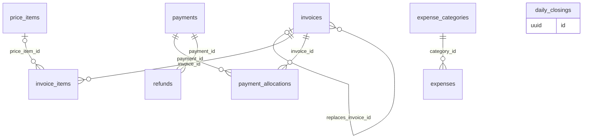

### `price_items` (★ foundation)

The clinic's price list. Seeded from the specialty, then edited.

*Clinic-scoped: org_id + row-level security · sensitivity: internal · offline: read-only on devices · lifecycle: soft delete*

| Column | Type | Notes |
|---|---|---|
| `code` | `text?` | unique per clinic |
| `name` | `text` | Root canal, Scaling, Consultation |
| `category` | `text?` | consultation, preventive, endodontics, medicines …; drives the revenue mix |
| `sac_hsn` | `text?` | SAC 9993 for health care, HSN for goods |
| `price_paise` | `bigint` |  |
| `taxable` | `bool` | false for health care by a clinical establishment (exempt) |
| `tax_rate_bps` | `int` | 0, 500, 1200 or 1800; 0 unless taxable |
| `active` | `bool` |  |

Referenced by: `consultant_fee_rules.price_item_id`, `invoice_items.price_item_id`, `procedure_materials.price_item_id`

### `invoices` (★ foundation)

A bill to a patient. Totals are stored at issue; whether it is paid is derived from allocations.

*Clinic-scoped: org_id + row-level security · sensitivity: financial · offline: server only · lifecycle: finalizable*

| Column | Type | Notes |
|---|---|---|
| `number` | `text?` | SC/26-27/000318, assigned by the server when issued (at most 16 characters) |
| `series` | `text` | number series, main by default |
| `financial_year` | `text?` | 26-27, in clinic time |
| `patient_id` | `uuid` | → `patients` |
| `encounter_id` | `uuid?` | → `encounters`. same patient |
| `branch_id` | `uuid` | → `branches` |
| `doc_type` | `invoice_doc?` | tax_invoice, bill_of_supply; decided at issue |
| `status` | `invoice_status` | draft, issued, void |
| `place_of_supply` | `text?` | state code; IGST when it differs from the branch's state |
| `notes` | `text?` |  |
| `issued_at` | `timestamptz?` |  |
| `issued_by` | `uuid?` | → `memberships` |
| `supplier` | `jsonb?` | snapshot at issue: legal name, GSTIN, address, state |
| `recipient` | `jsonb?` | snapshot at issue: patient name and number |
| `subtotal_paise` | `bigint` |  |
| `discount_paise` | `bigint` |  |
| `taxable_paise` | `bigint` |  |
| `cgst_paise` | `bigint` |  |
| `sgst_paise` | `bigint` |  |
| `igst_paise` | `bigint` |  |
| `tax_paise` | `bigint` |  |
| `round_off_paise` | `bigint` | to the nearest rupee, -50 to 50 |
| `total_paise` | `bigint` |  |
| `replaces_invoice_id` | `uuid?` | → `invoices`. when a voided bill is reissued |
| `void_reason` | `text?` |  |
| `voided_at` | `timestamptz?` |  |
| `voided_by` | `uuid?` | → `memberships` |

Issued bills never change (a trigger refuses): corrections void and replace. Numbers are never generated offline. Payment state (unpaid, partial, paid) is derived from payment_allocations of payments that are not void.

Referenced by: `invoice_items.invoice_id`, `invoices.replaces_invoice_id`, `payment_allocations.invoice_id`, `promo_redemptions.invoice_id`, `share_links.invoice_id`

### `invoice_items` (★ foundation)

Lines on a bill, each optionally tied to a price item or procedure. GST is computed per line at issue.

*Clinic-scoped: org_id + row-level security · sensitivity: financial · offline: server only · lifecycle: finalizable*

| Column | Type | Notes |
|---|---|---|
| `invoice_id` | `uuid` | → `invoices` |
| `line_no` | `smallint` |  |
| `price_item_id` | `uuid?` | → `price_items` |
| `procedure_id` | `uuid?` | → `procedures` |
| `description` | `text` |  |
| `sac_hsn` | `text?` |  |
| `category` | `text?` |  |
| `quantity` | `int` |  |
| `unit_price_paise` | `bigint` |  |
| `discount_paise` | `bigint` |  |
| `tax_rate_bps` | `int` |  |
| `taxable_paise` | `bigint` |  |
| `cgst_paise` | `bigint` |  |
| `sgst_paise` | `bigint` |  |
| `igst_paise` | `bigint` |  |
| `total_paise` | `bigint` |  |

Lines change only while the bill is a draft.

### `payments` (★ foundation)

Money received from a patient, by any method.

*Clinic-scoped: org_id + row-level security · sensitivity: financial · offline: server only · lifecycle: finalizable*

| Column | Type | Notes |
|---|---|---|
| `number` | `text` | receipt RC/26-27/000042 |
| `patient_id` | `uuid` | → `patients` |
| `received_at` | `timestamptz` |  |
| `amount_paise` | `bigint` |  |
| `method` | `payment_method` | cash, upi, card, bank |
| `reference` | `text?` | UPI ref, card slip |
| `received_by` | `uuid` | → `memberships` |
| `idempotency_key` | `text` | unique per clinic; a retry returns the first payment |
| `request_hash` | `text` | a reused key with a different request is refused |
| `status` | `payment_status` | received, void |
| `void_reason` | `text?` |  |
| `voided_at` | `timestamptz?` |  |
| `voided_by` | `uuid?` | → `memberships` |

Referenced by: `payment_allocations.payment_id`, `refunds.payment_id`

### `payment_allocations` (★ foundation)

Which bills a payment pays, so advances and partial payments work.

*Clinic-scoped: org_id + row-level security · sensitivity: financial · offline: server only · lifecycle: append only*

| Column | Type | Notes |
|---|---|---|
| `payment_id` | `uuid` | → `payments` |
| `invoice_id` | `uuid` | → `invoices` |
| `patient_id` | `uuid` | → `patients`. must match both the payment's and the bill's |
| `amount_paise` | `bigint` |  |

A trigger refuses allocations past the bill's balance or the payment's amount, and to bills that are not issued.

### `refunds`

Money returned to a patient.

*Clinic-scoped: org_id + row-level security · sensitivity: financial · offline: server only*

| Column | Type | Notes |
|---|---|---|
| `payment_id` | `uuid` | → `payments` |
| `amount_paise` | `bigint` |  |
| `reason` | `text` |  |
| `refunded_at` | `timestamptz` |  |
| `method` | `payment_method` |  |

### `expense_categories`

Rent, electricity, salaries, consumables and so on.

*Clinic-scoped: org_id + row-level security · sensitivity: internal · offline: server only · lifecycle: mutable*

| Column | Type | Notes |
|---|---|---|
| `key` | `text` | unique per clinic: salary, material, electricity, lab, rent, other |
| `name` | `text` | Salaries, Materials, Electricity, Lab work, Rent, Other |
| `is_system` | `bool` | seeded for every clinic |

Built (migration 0300). The six system categories are seeded for every clinic by a trigger on organizations (and for clinics that existed). Custom categories are not offered yet.

Referenced by: `expenses.category_id`

### `expenses`

Money the clinic spends.

*Clinic-scoped: org_id + row-level security · sensitivity: financial · offline: server only · lifecycle: finalizable*

| Column | Type | Notes |
|---|---|---|
| `category_id` | `uuid` | → `expense_categories` |
| `spent_on` | `date` | the clinic day |
| `amount_paise` | `bigint` | above zero |
| `note` | `text?` | up to 300 characters |
| `recorded_by` | `uuid` | → `memberships` |
| `status` | `expense_status` | recorded, void |
| `void_reason` | `text?` |  |
| `voided_at` | `timestamptz?` |  |
| `voided_by` | `uuid?` | → `memberships` |
| `idempotency_key` | `text?` | the client's Idempotency-Key; unique per clinic (migration 0385) |
| `request_hash` | `text?` | SHA-256 of the request sent with the key |

Built (migration 0300). Recording needs expenses.write; listing and voiding need finance.view. Never edited: a mistake is voided with a reason (trigger). Stock deliveries are not copied in; the Analytics report counts stock_batches at cost as material. Not built yet: branch, payment method, vendor, receipt file.

Referenced by: `lab_payments.expense_id`

### `daily_closings`

End-of-day cash count against what the system expects.

*Clinic-scoped: org_id + row-level security · sensitivity: financial · offline: server only*

| Column | Type | Notes |
|---|---|---|
| `branch_id` | `uuid` | → `branches` |
| `day` | `date` |  |
| `cash_expected_paise` | `bigint` |  |
| `cash_counted_paise` | `bigint` |  |
| `closed_by` | `uuid` | → `memberships` |
| `closed_at` | `timestamptz` |  |

## Notifications (`notify`)

Templates, rules, consent, recalls, campaigns, promo codes, the outbox and every message sent.

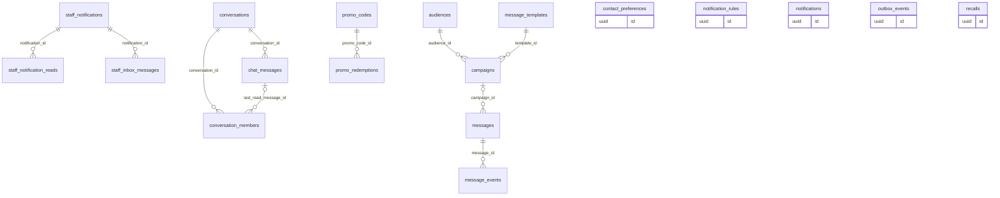

### `message_templates`

What each patient message says, per clinic, channel and language; WhatsApp ones with their Meta review state.

*Clinic-scoped: org_id + row-level security · sensitivity: personal · offline: read-only on devices · lifecycle: mutable*

| Column | Type | Notes |
|---|---|---|
| `key` | `text` | care.note, reminder.follow_up, promo.offer, appointment.reminder, booking.*, prescription.shared, patient_app.invited |
| `channel` | `text` | email, whatsapp, sms |
| `language` | `text` | en-IN, hi-IN, mr-IN |
| `body` | `text` | with allow-listed {{variables}}; for WhatsApp, the order of Meta's parameters |
| `category` | `text` | marketing, utility, authentication (as Meta returns it) |
| `provider_template_ref` | `text?` | the template's name at Meta |
| `status` | `text` | draft, submitted, approved, rejected, paused |
| `submitted_at` | `timestamptz?` |  |
| `reviewed_at` | `timestamptz?` |  |
| `sender_header` | `text?` | SMS DLT sender, later |
| `dlt_template_id` | `text?` | SMS DLT template, later |

Built (migration 0375). Unique per clinic, key, channel and language. Each clinic gets copies of app.message_template_defaults() when it is created (trigger on organizations); never a row without a clinic. Email rows start approved (wording still in code), WhatsApp ones as drafts. Meta's review webhook updates submitted copies by name and language (app.whatsapp_template_reviewed). No patient data; retention class message_templates.

Referenced by: `campaigns.template_id`

### `notification_rules`

When to message: on an event, before an appointment, on birthdays, on recalls.

*Clinic-scoped: org_id + row-level security · sensitivity: personal · offline: server only*

| Column | Type | Notes |
|---|---|---|
| `trigger` | `rule_trigger` | event, before_appointment, birthday, recall |
| `event_key` | `text?` | booking.confirmed, invoice.paid ... |
| `offset_minutes` | `int?` | e.g. -1440 for a day before |
| `template_key` | `text` |  |
| `channels` | `channel[]` | in order of preference |
| `conditions` | `jsonb?` |  |
| `active` | `bool` |  |

### `contact_preferences`

What a patient asked for per channel and category: an opt-out, and for WhatsApp when they opted in.

*Clinic-scoped: org_id + row-level security · sensitivity: personal · offline: server only · lifecycle: mutable*

| Column | Type | Notes |
|---|---|---|
| `patient_id` | `uuid` | → `patients` |
| `channel` | `text` | email, whatsapp, sms |
| `category` | `text` | all, care, reminders, promotional |
| `opted_out` | `bool` |  |
| `opted_out_at` | `timestamptz?` |  |
| `whatsapp_opt_in_at` | `timestamptz?` | WhatsApp only |
| `source` | `text` | staff, patient, unsubscribe_link, bounce, complaint, stop_keyword |

Built (migration 0370). Unique (org_id, patient_id, channel, category). Consent for a purpose is patient_consents (app.may_contact); this is the patient not wanting a channel. Written by staff (POST /patients/{id}/contact-preferences), the unsubscribe link and Resend bounces or complaints (app.contact_opt_out). Erased with the patient.

### `staff_notifications`

Something clinic staff are told about: an online booking waiting for an answer, one confirmed automatically, one the patient cancelled, or lab work past its due date.

*Clinic-scoped: org_id + row-level security · sensitivity: internal · offline: server only · lifecycle: mutable*

| Column | Type | Notes |
|---|---|---|
| `kind` | `text` | booking_requested, booking_confirmed_auto, booking_cancelled_by_patient, lab_overdue |
| `appointment_id` | `uuid?` | → `appointments`. booking kinds |
| `lab_order_id` | `uuid?` | → `lab_orders`. lab_overdue; exactly one of the two is set |
| `lab_due_on` | `date?` | the due date the order was overdue on; one alert per order and due date |
| `handled_at` | `timestamptz?` | set when the appointment is confirmed, declined or cancelled |
| `handled_by` | `uuid?` | → `memberships`. null when the patient cancelled |
| `reminded_at` | `timestamptz?` | the reminder job reminded everyone |
| `escalated_at` | `timestamptz?` | the reminder job told the owners |

Built (migration 0320). IDs only, never patient details. Written in the same transaction as the online booking (public page or patient app) or the patient's cancellation (through app.notify_patient_cancelled). Who sees one is decided when reading: members whose role has appointments.read and whose scope reaches the appointment's doctor. Since migration 0395 also lab_overdue, written by a trigger when the reminder job flags an order overdue (overdue_flagged_on) and handled when the work comes back, is cancelled or gets a new due date; seen by members with labs.read whose scope reaches the order (app.clinical_in_reach).

Referenced by: `staff_inbox_messages.notification_id`, `staff_notification_reads.notification_id`

### `staff_notification_reads`

Which member has read which notification: read state is per person.

*Clinic-scoped: org_id + row-level security · sensitivity: internal · offline: server only · lifecycle: append only*

| Column | Type | Notes |
|---|---|---|
| `notification_id` | `uuid` | → `staff_notifications` |
| `membership_id` | `uuid` | → `memberships` |
| `read_at` | `timestamptz` |  |

Built (migration 0320). Primary key (org_id, notification_id, membership_id). The change history keeps metadata only.

### `staff_inbox_messages`

The clinic inbox: a reminder about a booking request nobody answered, or its escalation to the owners. Open until the booking is handled.

*Clinic-scoped: org_id + row-level security · sensitivity: internal · offline: server only · lifecycle: append only*

| Column | Type | Notes |
|---|---|---|
| `kind` | `text` | booking_reminder, booking_escalation |
| `audience` | `text` | clinic (everyone who sees the notification) or owners |
| `notification_id` | `uuid` | → `staff_notifications` |
| `appointment_id` | `uuid` | → `appointments` |

Built (migration 0320). Written by the outbox job (app.record_booking_request_step), at most one of each kind per notification. IDs only.

### `conversations`

Staff chat: a one-to-one (direct) or group conversation between members of a clinic.

*Clinic-scoped: org_id + row-level security · sensitivity: internal · offline: server only · lifecycle: mutable*

| Column | Type | Notes |
|---|---|---|
| `kind` | `text` | direct, group |
| `title` | `text?` | groups only, 1 to 80 characters |
| `direct_key` | `text?` | the pair's membership ids, smaller first; unique per clinic for direct |
| `archived_at` | `timestamptz?` |  |

Built (migration 0391). Only its active members see it: a restrictive policy asks app.chat_conversation_ids() (active clinic membership, not left).

Referenced by: `chat_messages.conversation_id`, `conversation_members.conversation_id`

### `conversation_members`

Who is in a conversation, their role, and how far they have read.

*Clinic-scoped: org_id + row-level security · sensitivity: internal · offline: server only · lifecycle: mutable*

| Column | Type | Notes |
|---|---|---|
| `conversation_id` | `uuid` | → `conversations` |
| `membership_id` | `uuid` | → `memberships` |
| `role` | `text` | member, admin |
| `joined_at` | `timestamptz` |  |
| `left_at` | `timestamptz?` | set on leaving or removal |
| `muted` | `boolean` | left out of the badge |
| `last_read_message_id` | `uuid?` | → `chat_messages`. unread counts start after it |

Built (migration 0391). Primary key (org_id, conversation_id, membership_id). The read pointer is left out of the change history. A trigger (0396) caps a group at 100 active members.

### `chat_messages`

A staff chat message: plain text, optionally about one patient.

*Clinic-scoped: org_id + row-level security · sensitivity: health · offline: server only · lifecycle: soft delete*

| Column | Type | Notes |
|---|---|---|
| `conversation_id` | `uuid` | → `conversations` |
| `author_membership_id` | `uuid` | → `memberships` |
| `body` | `text?` | 1 to 4000 characters; cleared on delete |
| `patient_id` | `uuid?` | → `patients`. within the author's reach |
| `client_id` | `uuid` | unique per author: a retried post is not posted twice |
| `deleted_at` | `timestamptz?` | by the author only |

Built (migration 0392). Body masked in the change history and never logged. Reading a message with a patient leaves an access-record entry (resource chat) once per reader, patient, conversation and day. Kept 365 days (retention class chat_messages).

Referenced by: `conversation_members.last_read_message_id`

### `recalls`

Follow-ups that are due: cleaning in six months, BP review, vaccine.

*Clinic-scoped: org_id + row-level security · sensitivity: personal · offline: server only · lifecycle: mutable*

| Column | Type | Notes |
|---|---|---|
| `patient_id` | `uuid` | → `patients` |
| `kind` | `text` | follow_up, cleaning, bp_review, vaccine |
| `reason` | `text` |  |
| `due_on` | `date` |  |
| `status` | `recall_status` | due, notified, booked, done, dismissed |
| `done_at` | `timestamptz?` |  |
| `source_procedure_id` | `uuid?` | → `procedures` |

### `audiences`

Saved patient filters for campaigns: all active, last visit, birthday month, age band, sex, tag.

*Clinic-scoped: org_id + row-level security · sensitivity: personal · offline: server only · lifecycle: ephemeral*

| Column | Type | Notes |
|---|---|---|
| `name` | `text` |  |
| `filter` | `jsonb` | one typed filter by kind: all_active, last_visit, birthday_month, age_band, sex, tag |

Built (migration 0380). No balance, treatment or visit-kind filters (purpose limitation). Evaluated when a campaign sends (app.audience_patients, 0382). Holds no patient, so no erasure step; support never reads it.

Referenced by: `campaigns.audience_id`

### `campaigns`

A one-off promotional send of a clinic's template to an audience.

*Clinic-scoped: org_id + row-level security · sensitivity: personal · offline: server only · lifecycle: mutable*

| Column | Type | Notes |
|---|---|---|
| `name` | `text` |  |
| `audience_id` | `uuid` | → `audiences` |
| `template_id` | `uuid` | → `message_templates` |
| `channel` | `text` | email, whatsapp |
| `offer_text` | `text` | the allow-listed {{offer_text}}, and the email body |
| `scheduled_at` | `timestamptz?` |  |
| `status` | `text` | draft, scheduled, sending, sent, cancelled |
| `scheduled_count` | `int?` | the audience size the owner saw (count_token) |
| `fan_out_cursor` | `uuid?` | last patient expanded |
| `fan_out_started_at` | `timestamptz?` |  |
| `fan_out_done_at` | `timestamptz?` |  |
| `last_batch_at` | `timestamptz?` |  |
| `cancelled_at` | `timestamptz?` |  |

Built (migrations 0381, 0383). Messages name their campaign (messages.campaign_id) under dedupe key campaign:<id>:<patient>; counts are group by status, skip_reason over them, never stored. app.campaigns_fan_out_next expands 500 patients a call, resumable and idempotent. Holds no patient; retention class campaigns.

Referenced by: `messages.campaign_id`

### `promo_codes`

Discount codes a clinic can share.

*Clinic-scoped: org_id + row-level security · sensitivity: personal · offline: server only*

| Column | Type | Notes |
|---|---|---|
| `code` | `text` | unique per clinic |
| `kind` | `discount_kind` | percent_bps, fixed |
| `value` | `bigint` |  |
| `valid_from` | `date` |  |
| `valid_to` | `date?` |  |
| `max_uses` | `int?` |  |
| `used_count` | `int` |  |
| `applies_to` | `jsonb?` | price items or categories |

Referenced by: `promo_redemptions.promo_code_id`

### `promo_redemptions`

Each use of a promo code on a bill.

*Clinic-scoped: org_id + row-level security · sensitivity: personal · offline: server only*

| Column | Type | Notes |
|---|---|---|
| `promo_code_id` | `uuid` | → `promo_codes` |
| `patient_id` | `uuid` | → `patients` |
| `invoice_id` | `uuid` | → `invoices` |
| `discount_paise` | `bigint` |  |
| `redeemed_at` | `timestamptz` |  |

### `outbox_events` (★ foundation)

Messages to send because of a change, written in the same transaction as the change, for the worker to deliver.

*Clinic-scoped: org_id + row-level security · sensitivity: personal · offline: server only · lifecycle: ephemeral*

| Column | Type | Notes |
|---|---|---|
| `event_key` | `text` | staff.invited; later appointment.booked, invoice.paid |
| `channel` | `channel` | email for now |
| `recipient` | `text?` | a staff address; patient messages will carry the patient's id in the payload |
| `payload` | `jsonb` | ids and non-patient template values, never patient details |
| `secret` | `text?` | a one-time link secret, cleared once sent or abandoned |
| `status` | `outbox_status` | pending, sent, failed |
| `attempts` | `int` |  |
| `next_attempt_at` | `timestamptz` | when due, or when a worker's lease ends |
| `last_error` | `text?` | short reason, no message content |
| `provider` | `text?` | log, resend |
| `provider_message_id` | `text?` |  |
| `processed_at` | `timestamptz?` |  |

Guarantees a message is never lost or sent for a change that rolled back. The worker claims due rows across clinics with FOR UPDATE SKIP LOCKED through app.outbox_claim, retries with backoff, gives up after 5 attempts, and deletes rows 30 days after processing.

### `messages`

The queue of messages to patients: one row per recipient and channel, addressed and consent-checked when sent.

*Clinic-scoped: org_id + row-level security · sensitivity: personal · offline: server only · lifecycle: mutable*

| Column | Type | Notes |
|---|---|---|
| `patient_id` | `uuid` | → `patients` |
| `channel` | `text` | email, whatsapp, sms |
| `kind` | `text` | prescription.shared, booking.requested/confirmed/declined, patient_app.invited, appointment.reminder, clinic.message |
| `purpose` | `text` | care, reminders, promotional (the consent it needs) |
| `template_key` | `text` | the kind, or care.note, reminder.follow_up, promo.offer |
| `variables` | `jsonb` | ids and non-patient template values |
| `body` | `text?` | staff free text, email only |
| `secret` | `text?` | a one-time link secret, cleared once processed |
| `appointment_id` | `uuid?` | → `appointments` |
| `campaign_id` | `uuid?` | → `campaigns`. promotional only |
| `status` | `text` | queued, sending, sent, failed, skipped |
| `skip_reason` | `text?` | no_consent, consent_withdrawn, opted_out, no_address, patient_erased, appointment_changed, channel_disabled, no_opt_in, template_unavailable, template_paused, marketing_limit, undeliverable, frequency_cap, campaign_cancelled... |
| `dedupe_key` | `text?` | unique per clinic, e.g. reminder:appt:<id>:24h |
| `scheduled_for` | `timestamptz` |  |
| `lease_until` | `timestamptz?` | while sending |
| `attempts` | `int` |  |
| `last_error` | `text?` |  |
| `provider` | `text?` | log, resend, meta |
| `provider_message_id` | `text?` | unique per clinic and provider |
| `cost_paise` | `bigint?` | WhatsApp: the configured price of the template's category |
| `unsubscribe_hash` | `text?` | SHA-256 of the email's unsubscribe token |
| `delivery` | `text?` | latest provider report (WhatsApp: the furthest of sent, delivered, read; failed) |
| `delivery_at` | `timestamptz?` |  |
| `sent_at` | `timestamptz?` |  |
| `processed_at` | `timestamptz?` |  |

Built (migrations 0370 to 0373); not partitioned. Never holds an address. The outbox job claims due rows (app.messages_claim, lease and SKIP LOCKED, a daily budget per provider), reads each through app.message_dispatch (address, may_contact, opt-outs, quiet hours, patient state) and sends, skips or reschedules it. The change history masks body, variables, secret, error and the unsubscribe hash. Erased with the patient; retention 365 days from queuing. Support never reads it (0397: a restrictive no_support policy, also on message_events and contact_preferences).

Referenced by: `message_events.message_id`

### `message_events`

What providers reported about a sent message: delivered, bounced, complained.

*Clinic-scoped: org_id + row-level security · sensitivity: personal · offline: server only · lifecycle: append only*

| Column | Type | Notes |
|---|---|---|
| `message_id` | `uuid` | → `messages` |
| `provider` | `text` |  |
| `provider_event_id` | `text` | svix-id; unique per clinic and provider |
| `kind` | `text` | sent, delivered, read, delayed, bounced, complained, failed, opened, clicked |
| `occurred_at` | `timestamptz` |  |

Built (migration 0370). Metadata only, never the payload; written by the Resend webhook through app.message_provider_event, and by Meta's through app.whatsapp_status (event id <wamid>:<status>, 0377), once per event whatever the order.

### `notifications`

The in-app notification feed for staff.

*Clinic-scoped: org_id + row-level security · sensitivity: personal · offline: server only*

| Column | Type | Notes |
|---|---|---|
| `user_id` | `uuid` | → `users` |
| `kind` | `text` |  |
| `title` | `text` |  |
| `entity_ref` | `jsonb` | type and id to open |
| `read_at` | `timestamptz?` |  |

## Websites (`web`)

Generated clinic websites, their versions, booking requests and traffic.

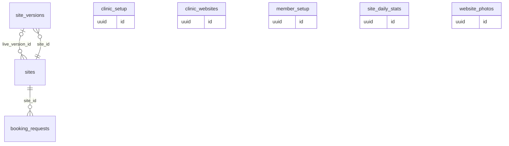

### `sites`

A clinic's generated website: template family, repository and live version.

*Clinic-scoped: org_id + row-level security · sensitivity: public · offline: server only*

| Column | Type | Notes |
|---|---|---|
| `family` | `text` | template family key |
| `template_version` | `text` |  |
| `repo_full_name` | `text?` | sakalyatechnologies/site-smilecatchers |
| `status` | `site_status` | draft, building, live, failed |
| `config` | `jsonb` | from onboarding answers |
| `live_version_id` | `uuid?` | → `site_versions` |

Referenced by: `booking_requests.site_id`, `site_versions.site_id`

### `clinic_websites`

A clinic's public website settings: layout, template, palette, fonts, owner-written content, published flag, custom domain.

*Clinic-scoped: org_id + row-level security · sensitivity: public · offline: server only*

| Column | Type | Notes |
|---|---|---|
| `layout` | `text` | one, multi |
| `template` | `text` | aurora, hearth, clinical, bold |
| `palette` | `text` | per template |
| `fonts` | `text` | font pairing |
| `content` | `jsonb` | section text, doctor profiles, hidden services, reviews |
| `published` | `bool` |  |
| `published_at` | `timestamptz?` |  |
| `custom_domain` | `text?` | claimed globally only once verified, in org_domains |
| `domain_status` | `text` | none, pending, verified, failed |
| `domain_token` | `text?` | TXT record value |
| `domain_checked_at` | `timestamptz?` |  |

Primary key (org_id): one row per clinic. Public content only.

### `clinic_setup`

Where the clinic stands in the first-run setup wizard: practice size, step statuses, dismissed or completed.

*Clinic-scoped: org_id + row-level security · sensitivity: public · offline: server only*

| Column | Type | Notes |
|---|---|---|
| `practice` | `text?` | solo, team, multi |
| `steps` | `jsonb` | step key -> done, skipped |
| `dismissed_at` | `timestamptz?` |  |
| `completed_at` | `timestamptz?` |  |

Primary key (org_id): one row per clinic. Clinics that existed before the wizard are dismissed.

### `member_setup`

Where an invited doctor stands in their one-screen setup.

*Clinic-scoped: org_id + row-level security · sensitivity: public · offline: server only*

| Column | Type | Notes |
|---|---|---|
| `membership_id` | `uuid` | → `memberships` |
| `steps` | `jsonb` | step key -> done, skipped |
| `dismissed_at` | `timestamptz?` |  |
| `completed_at` | `timestamptz?` |  |

Primary key (org_id, membership_id).

### `website_photos`

Pictures on the website: logo, hero, about, doctors, gallery. Bytes are in file storage.

*Clinic-scoped: org_id + row-level security · sensitivity: public · offline: server only · lifecycle: ephemeral*

| Column | Type | Notes |
|---|---|---|
| `kind` | `text` | logo, hero, about, doctor, gallery |
| `storage_key` | `text` | <org_id>/<id> |
| `mime_type` | `text` | image/jpeg, image/png, image/webp |
| `size_bytes` | `bigint` |  |
| `sha256` | `text` |  |
| `alt` | `text?` |  |
| `sort_order` | `int` |  |

### `site_versions`

Each publish of a site, so any version can be restored.

*Clinic-scoped: org_id + row-level security · sensitivity: public · offline: server only*

| Column | Type | Notes |
|---|---|---|
| `site_id` | `uuid` | → `sites` |
| `config` | `jsonb` |  |
| `commit_sha` | `text?` |  |
| `build_status` | `build_status` | queued, building, succeeded, failed |
| `built_at` | `timestamptz?` |  |
| `deployed_url` | `text?` |  |

Referenced by: `sites.live_version_id`

### `booking_requests`

Booking requests from the website, before they become appointments.

*Clinic-scoped: org_id + row-level security · sensitivity: personal · offline: server only*

| Column | Type | Notes |
|---|---|---|
| `site_id` | `uuid` | → `sites` |
| `name` | `text` |  |
| `phone_e164` | `text` |  |
| `practitioner_id` | `uuid?` | → `practitioners` |
| `preferred_at` | `timestamptz?` |  |
| `message` | `text?` |  |
| `status` | `booking_status` | new, contacted, booked, spam |
| `appointment_id` | `uuid?` | → `appointments` |

### `site_daily_stats`

Website visits and bookings per day, for the clinic and the console.

*Clinic-scoped: org_id + row-level security · sensitivity: internal · offline: server only*

| Column | Type | Notes |
|---|---|---|
| `day` | `date` |  |
| `visits` | `int` |  |
| `unique_visitors` | `int` |  |
| `booking_requests` | `int` |  |

Primary key (org_id, day). Imported from Cloudflare Web Analytics.

## Trust and audit (`trust`)

Patient consents, who viewed what, every change, and data-rights requests.

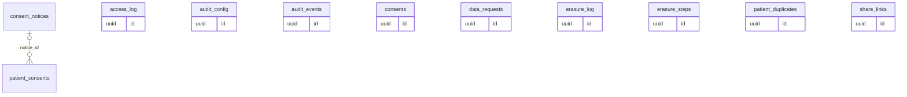

### `consents`

A patient's permission for a clinic or doctor to see records held elsewhere, for a purpose and time.

*User-scoped: rows belong to one signed-in user · sensitivity: health · offline: server only*

| Column | Type | Notes |
|---|---|---|
| `patient_link_id` | `uuid` | → `patient_links` |
| `grantee_org_id` | `uuid` | → `organizations` |
| `grantee_practitioner_id` | `uuid?` | → `practitioners` |
| `purpose` | `consent_purpose` | care, referral, insurance |
| `data_categories` | `text[]` | e.g. prescriptions, dental, lab_reports |
| `source` | `consent_source` | patient_app, clinic, abdm |
| `starts_at` | `timestamptz` |  |
| `expires_at` | `timestamptz?` |  |
| `revoked_at` | `timestamptz?` |  |

Every grant and revocation is audited. The clinic owns its record; the patient controls sharing across clinics.

### `consent_notices`

The clinic's own privacy notice text, one row per published version.

*Clinic-scoped: org_id + row-level security · sensitivity: health · offline: server only · lifecycle: append only*

| Column | Type | Notes |
|---|---|---|
| `version` | `int` | 1, 2, 3 per clinic |
| `label` | `text` | short, e.g. v2 2026-11 |
| `body` | `text` | up to 20,000 characters |
| `published_at` | `timestamptz` |  |
| `published_by` | `uuid` | → `memberships` |

Built (migration 0332). GET /consent-notices (patients.read), POST to publish the next version (settings.manage). The newest is the current notice: consents (desk, walk-in, check-in) record it as notice_id unless another is named. Never edited.

Referenced by: `patient_consents.notice_id`

### `patient_consents`

DPDP notice and consent record: the patient was shown the clinic's notice and agreed to a purpose; later withdrawn.

*Clinic-scoped: org_id + row-level security · sensitivity: health · offline: server only · lifecycle: finalizable*

| Column | Type | Notes |
|---|---|---|
| `patient_id` | `uuid` | → `patients` |
| `purpose` | `text` | care, reminders, promotional, sharing, research |
| `notice_version` | `text` | the label of the notice shown, e.g. v1 2026-10 (the notice's label when notice_id is set) |
| `notice_id` | `uuid?` | → `consent_notices`. the published notice text shown; null for consents recorded against a label only |
| `given_at` | `timestamptz` | when the patient agreed (may be earlier than the entry) |
| `method` | `text` | paper, verbal, app |
| `recorded_by` | `uuid` | → `memberships`. the staff member who recorded it |
| `status` | `text` | given, withdrawn |
| `withdrawn_at` | `timestamptz?` |  |
| `withdrawn_by` | `uuid?` | → `memberships` |
| `withdrawn_method` | `text?` | paper, verbal, app |
| `note` | `text?` | up to 500 characters; no clinical detail |
| `withdrawal_note` | `text?` |  |

At most one active (given) consent per patient and purpose. A withdrawal sets the withdrawn_* columns once and the row is then final; to consent again, record a new row. Every change is audited.

### `patient_duplicates`

Possible duplicate patients for the front desk: a self-registered online record whose phone matches an existing patient.

*Clinic-scoped: org_id + row-level security · sensitivity: health · offline: server only · lifecycle: mutable*

| Column | Type | Notes |
|---|---|---|
| `patient_id` | `uuid` | → `patients`. the self-registered record |
| `candidate_id` | `uuid` | → `patients`. the existing patient it may be |
| `reason` | `text` | phone |
| `status` | `text` | open, merged, dismissed |
| `resolved_at` | `timestamptz?` |  |
| `resolved_by` | `uuid?` | → `memberships` |

Built (migration 0331). Online booking matches only by verified email; a phone match makes a new self-registered record and a row here, never a merge. GET /patient-duplicates lists open ones; POST /patients/{id}/merge moves the self-registered record's appointments, tokens, links, identifiers and consents to the existing patient and marks it merged (refused when it has any clinical or billing record); dismiss marks it a different person.

### `share_links` (★ foundation)

Expiring links that let a patient open a prescription, bill or report on the clinic's host.

*Clinic-scoped: org_id + row-level security · sensitivity: health · offline: server only · lifecycle: mutable*

| Column | Type | Notes |
|---|---|---|
| `token_hash` | `text` | the link holds a 256-bit token; only its hash is stored |
| `pin_hash` | `text` | SHA-256 of token and the six-digit PIN printed on the paper |
| `resource` | `share_resource` | prescription, invoice, report, upload_request, records |
| `record_types` | `text[]?` | for resource records: a subset of chart, xrays, bills (migration 0387) |
| `prescription_id` | `uuid?` | → `prescriptions` |
| `invoice_id` | `uuid?` | → `invoices` |
| `patient_id` | `uuid` | → `patients` |
| `channel` | `channel` | whatsapp, sms, email, print |
| `failed_attempts` | `int` | five wrong PINs lock the link |
| `locked_at` | `timestamptz?` |  |
| `expires_at` | `timestamptz` | seven days; for records the clinic picks 1 hour, 24 hours or 7 days |
| `opened_at` | `timestamptz?` |  |
| `open_count` | `int` |  |
| `revoked_at` | `timestamptz?` |  |

Typed, tenant-aware foreign keys instead of a generic resource id: a check constraint requires exactly the column matching resource, so a link can only ever open a record of the same clinic and patient. Every open is written to access_log with purpose patient_self. A records link (POST /patients/{id}/record-shares) has no document column: it shows the patient's own chart, X-rays and issued bills as chosen, and writes access_log for the share, each open and each X-ray download.

### `access_log` (★ foundation, partitioned)

The access record: who opened which patient record, why, when and from which device. Patients can see it.

*Clinic-scoped: org_id + row-level security · sensitivity: health · offline: server only · lifecycle: append only · schema: `audit`*

| Column | Type | Notes |
|---|---|---|
| `actor_user_id` | `uuid?` | null when a patient opens a share link |
| `actor_kind` | `actor_kind` | staff, patient, support |
| `patient_id` | `uuid` |  |
| `share_link_id` | `uuid?` | when opened through a share link |
| `resource` | `access_resource` | chart, note, attachment, prescription, invoice, export |
| `resource_id` | `uuid?` |  |
| `action` | `access_action` | view, download, print, share, export |
| `purpose` | `access_purpose` | care, front_desk, billing, support, patient_self, export |
| `device_id` | `uuid?` |  |
| `at` | `timestamptz` |  |
| `request_id` | `text?` |  |

Primary key (org_id, at, id), partitioned by month. No foreign keys, so the ledger never blocks erasure and adds no lock cost; the ids refer to users, patients, devices and share_links. Append-only: the app role can insert but never update or delete. Views made offline are queued on the device and uploaded.

### `audit_events` (★ foundation, partitioned)

The change history: every insert, update and delete, written by triggers.

*Clinic-scoped: org_id + row-level security · sensitivity: health · offline: server only · lifecycle: append only · schema: `audit`*

| Column | Type | Notes |
|---|---|---|
| `table_name` | `text` |  |
| `row_id` | `uuid` |  |
| `action` | `audit_action` | insert, update, delete |
| `actor_user_id` | `uuid?` |  |
| `actor_kind` | `text?` | staff, patient, patient_account, support (reading under a grant), platform (the console), system |
| `changes` | `jsonb?` | changed columns only, as {column: [old, new]}, masked per audit_config |
| `at` | `timestamptz` |  |
| `request_id` | `text?` |  |

Primary key (id, at), partitioned by month; org_id is null for platform tables. Written by app.audit_row(), which skips updates that change nothing and records only metadata for inserts into append-only tables. No foreign keys.

### `audit_config` (★ foundation)

Per table: which columns the audit trigger leaves out or masks.

*Platform-wide: no tenant, written by Sakalya or the system · sensitivity: internal · offline: server only · lifecycle: mutable · schema: `audit`*

| Column | Type | Notes |
|---|---|---|
| `table_name` | `text` | unique, schema-qualified |
| `exclude` | `text[]` | not recorded, e.g. last_seen_at |
| `mask` | `text[]` | recorded as changed with the value hashed, e.g. pin_hash |
| `metadata_only` | `bool` | record only that the row changed |

### `erasure_steps`

What erasing a patient does to each table: how to find their rows and whether to delete, update or keep them.

*Platform-wide: no tenant, written by Sakalya or the system · sensitivity: health · offline: server only · lifecycle: mutable · schema: `audit`*

| Column | Type | Notes |
|---|---|---|
| `table_name` | `text` | primary key, schema-qualified |
| `step_order` | `int` |  |
| `action` | `text` | delete, update, keep |
| `set_clause` | `text?` | for update |
| `filter` | `text` | the patient's rows, $2 being the patient id; patient_id = $2 by default |
| `note` | `text` |  |

Owner only. A new table with patient data registers here in its own migration; a test fails while a table with patient_id isn't listed. The change history of every listed row is scrubbed whatever the action.

### `erasure_log`

Patients erased, by id, so a restore from backup can be replayed.

*Platform-wide: no tenant, written by Sakalya or the system · sensitivity: health · offline: server only · lifecycle: append only · schema: `audit`*

| Column | Type | Notes |
|---|---|---|
| `org_id` | `uuid` |  |
| `patient_id` | `uuid` |  |
| `run_id` | `uuid` |  |
| `erased_at` | `timestamptz` |  |

Primary key (org_id, patient_id). The job also appends each id to a log file kept outside the database, which is what `aarogyam erase --replay` reads after a restore.

### `data_requests`

Patients' DPDP requests: export, correction, erasure.

*Clinic-scoped: org_id + row-level security · sensitivity: health · offline: server only*

| Column | Type | Notes |
|---|---|---|
| `patient_id` | `uuid` | → `patients` |
| `kind` | `data_request_kind` | export, correction, erasure |
| `status` | `request_status` | received, in_progress, done, rejected |
| `requested_at` | `timestamptz` |  |
| `completed_at` | `timestamptz?` |  |
| `notes` | `text?` |  |

## Onboarding (`onboarding`)

First-login progress and data imports from old software.

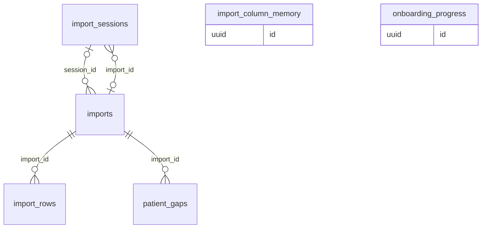

### `onboarding_progress`

Where a new clinic is in the first-login wizard, and its answers.

*Clinic-scoped: org_id + row-level security · sensitivity: personal · offline: server only*

| Column | Type | Notes |
|---|---|---|
| `steps` | `jsonb` | step key to answers |
| `completed_at` | `timestamptz?` |  |

One row per clinic.

### `imports`

A data import from a CSV or Excel file.

*Clinic-scoped: org_id + row-level security · sensitivity: personal · offline: server only · lifecycle: append only*

| Column | Type | Notes |
|---|---|---|
| `kind` | `import_kind` | patients |
| `source` | `text` | csv, xlsx |
| `mapping` | `jsonb` | our field to the file's column |
| `status` | `import_status` | done, failed |
| `total_rows` | `int` |  |
| `imported_rows` | `int` |  |
| `failed_rows` | `int` |  |
| `skipped_rows` | `int` | duplicates left out |
| `merged_rows` | `int` | duplicates merged into an existing record |
| `incomplete_rows` | `int` | imported with details missing |
| `session_id` | `uuid?` | → `import_sessions`. unique: committing a session twice finds this import |
| `file_name` | `text?` | as uploaded |
| `sheet_name` | `text?` | the workbook sheet read |

Smart import (CSV or .xlsx via import_sessions) records file, sheet and each row; the older CSV-text endpoint records only the mapping. Appointments and invoices are planned.

Referenced by: `import_rows.import_id`, `import_sessions.import_id`, `patient_gaps.import_id`

### `import_rows`

Each row of an import with its result: the source reference (file and sheet on the import, row here) of every imported record.

*Clinic-scoped: org_id + row-level security · sensitivity: personal · offline: server only · lifecycle: append only*

| Column | Type | Notes |
|---|---|---|
| `import_id` | `uuid` | → `imports` |
| `row_number` | `int` | row in the file, header row counted |
| `raw` | `jsonb` | the row's mapped values (CSV-text imports); empty for smart imports, whose rows live only in the session |
| `status` | `row_status` | imported, failed, skipped, merged |
| `error` | `text?` | why it failed or was skipped |
| `patient_id` | `uuid?` | → `patients`. the patient it became or was merged into |

### `import_sessions`

An uploaded file being mapped and previewed before import. Holds the parsed rows, never the file.

*Clinic-scoped: org_id + row-level security · sensitivity: personal · offline: server only · lifecycle: mutable*

| Column | Type | Notes |
|---|---|---|
| `file_name` | `text` |  |
| `file_kind` | `text` | csv, xlsx |
| `file_sha256` | `text` |  |
| `size_bytes` | `int` | at most 5 MB |
| `sheet_names` | `text[]` | a workbook's sheets |
| `sheet_name` | `text?` |  |
| `header_row` | `int` | found automatically below any title rows |
| `headers` | `text[]` |  |
| `cells` | `jsonb?` | the data rows; cleared on commit, discard or expiry, excluded from the audit log |
| `row_count` | `int` | at most 5,000 |
| `status` | `text` | open, committed, discarded, expired |
| `import_id` | `uuid?` | → `imports` |
| `expires_at` | `timestamptz` | 24 hours after upload |

Expired sessions are ended, and their cells cleared, when the clinic next uploads.

Referenced by: `imports.session_id`

### `import_column_memory`

Which field each column header meant last time, so the clinic's next file maps itself.

*Clinic-scoped: org_id + row-level security · sensitivity: personal · offline: server only · lifecycle: mutable*

| Column | Type | Notes |
|---|---|---|
| `header_key` | `text` | unique per clinic: the header in lower case, punctuation as spaces |
| `field` | `text` | full_name, sex, date_of_birth, age_years, phone, email, preferred_language, file_number, legacy_id, address, last_visit, balance |

### `patient_gaps`

The front desk's to-do list: patients imported without some details.

*Clinic-scoped: org_id + row-level security · sensitivity: personal · offline: server only · lifecycle: mutable*

| Column | Type | Notes |
|---|---|---|
| `patient_id` | `uuid` | → `patients` |
| `import_id` | `uuid` | → `imports` |
| `row_number` | `int` | their row in the file |
| `missing` | `text[]` | phone, sex, date_of_birth, as imported |
| `dismissed_at` | `timestamptz?` |  |
| `dismissed_by` | `uuid?` |  |

What is still missing is worked out from the patient's current record, so filling a detail clears it; dismissing says the details can't be had.
